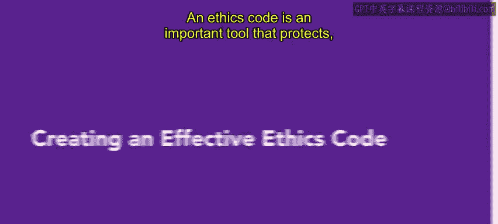
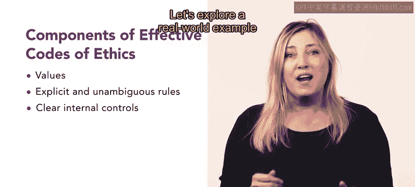
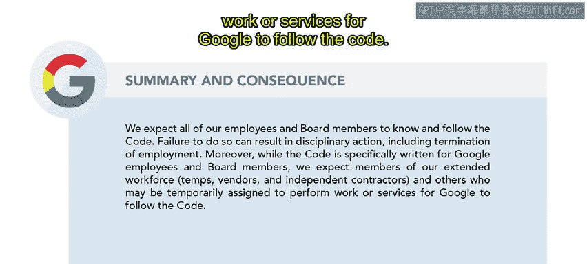

# 15：创建有效的道德准则

在本节课中，我们将要学习如何创建一份有效的道德准则。道德准则不仅是保护组织的重要工具，也为员工提供了行为指引。我们将探讨其核心组成部分，并通过一个现实案例来加深理解。

## 概述

道德准则是一份重要的工具，它不仅保护组织，也保护其员工。它还为可接受的行为提供指导，使每位员工都拥有如何行事的基础。本节视频将介绍如何创建一份有效的道德准则。

并非所有组织都有成文的道德准则。小型组织尤其可能没有成文的准则，因为他们可能觉得没有必要。但无论组织规模大小，一份有效的道德准则都包含三个主要组成部分。

## 道德准则的核心组成部分

上一节我们介绍了道德准则的重要性，本节中我们来看看构成有效道德准则的三个核心要素。

以下是构建有效道德准则的三个关键部分：

1.  **确立组织价值观**：道德准则应包含一套组织希望用以构建其文化的价值观。该准则不应与任何工会协议、政府法规或指令，或员工的公民权利相抵触或违背。
2.  **使用清晰的语言**：道德准则应使用清晰的语言，避免法律术语、行话和模棱两可的短语。对于允许和禁止的行为，应使用与组织及其运营相关的具体示例来说明。同时，应避免不合理或过于严苛的规定，例如“禁止拨打私人电话”。
3.  **建立可行的内部系统**：组织还应建立一个可行的内部系统，用于报告和调查违反准则的行为，并在必要时执行纪律处分。

## 案例分析：谷歌行为准则

了解了道德准则的基本框架后，我们通过一个现实世界的例子来具体看看一份优秀的道德准则应包含哪些元素。我们将以谷歌的行为准则为例进行解析。

首先，谷歌介绍了他们的价值观。谷歌行为准则是我们将谷歌价值观付诸实践的方式之一。它基于这样一种认识：我们在谷歌工作中所做的一切，都将且应该以最高标准的商业道德行为来衡量。我们设定如此高的标准，既是出于实际原因，也是出于理想追求。我们对最高标准的承诺，帮助我们招聘优秀人才、打造伟大产品并吸引忠实用户。尊重我们的用户、尊重机遇、彼此尊重，是我们成功的基础，也是我们每天都需要支持的事情。

接着，他们总结了谁应遵守该行为准则，以及不遵守的后果。我们期望所有员工和董事会成员了解并遵守本准则，未能做到这一点可能导致纪律处分，包括终止雇佣关系。此外，虽然本准则专门为谷歌员工和董事会成员编写，但我们期望我们的扩展劳动力成员、供应商、独立承包商以及其他可能被临时指派为谷歌工作或提供服务的人员遵守本准则。

行为准则的其余部分更详细地解释了规则和期望。文件以“请记住……不作恶。如果你认为某事不对，请大声说出来”结尾。

## 总结

本节课中，我们一起学习了如何创建有效的道德准则。我们了解到，一份好的道德准则应包含明确的组织价值观、使用清晰易懂的语言并辅以具体示例，同时需要配套可行的内部报告与执行机制。创建有效的道德准则能为员工提供重要的指导方针，从而保护组织及其员工。

接下来，你将学习关于社交媒体政策的内容。