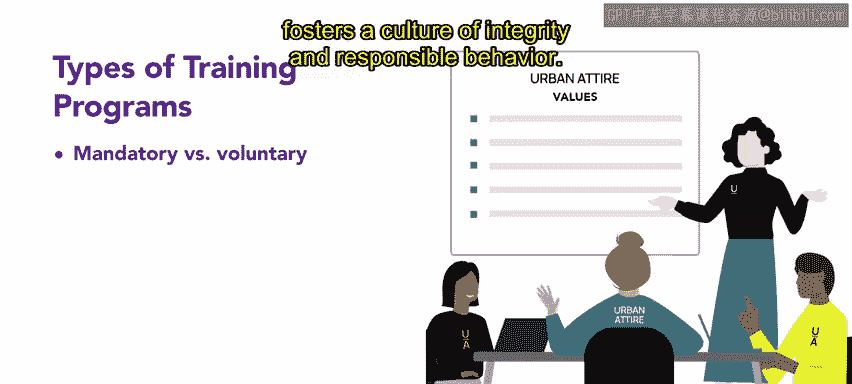
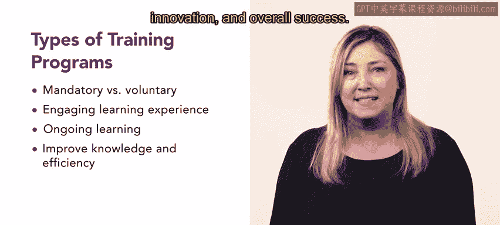

# 19：公司培训 📚

在本节课中，我们将要学习公司培训的重要性、主要类型以及如何设计和实施有效的培训项目。培训是组织向员工传达愿景、使命和价值观，并提升其技能的关键工具。

## 培训的重要性与目标 🎯

在当今的商业环境中，组织必须有效地向员工传达其愿景、使命和价值观。培训项目是实现这一沟通的有力方式，它们为吸引员工并将其与组织目标保持一致提供了独特的机会。

## 培训项目的类型：强制性与自愿性 📋

上一节我们介绍了培训的总体目标，本节中我们来看看培训项目的两种主要类型。

强制性培训项目确保所有员工都获得必要的知识，而自愿性培训项目则提供专业发展和成长机会。这两种项目都能提升员工的技能和理解，并最终使组织受益。

## 培训的核心内容：原则与道德标准 ⚖️

强制性培训和自愿性培训都涵盖许多关键领域，包括核心原则和道德标准。通过培训，员工可以扎实地理解组织的价值观和道德框架。专注于这些基础方面的培训有助于培养诚信和负责任行为的文化。

## 有效的培训方法：互动与参与 🎮

最有效的培训项目是互动且引人入胜的。以下是几种可以增强学习体验的方法：

*   **工作坊**
*   **角色扮演练习**
*   **游戏化**
*   **团队建设活动**

这些形式促进了员工的积极参与，并提高了知识的留存率。

## 培训的持续性：从一次性活动到持续学习 🔄

培训项目不应是一次性活动。相反，它们应该是持续进行的，以确保组织的长期成功。持续学习和强化对于维持组织的愿景和使命至关重要。

组织可以提供进修课程、在线学习和知识分享会，以保持员工的更新和参与度。当员工理解并代表组织的愿景和使命时，他们就能推动组织实现其目标。信息灵通的员工能驱动生产力、创新和整体成功。

## 案例分析：Connective公司的培训实践 🏢

这里有一个例子。领先的B2B数字通信品牌Connective的人力资源团队每月为所有员工提供培训。这些会议向员工传达组织的核心价值观，并提供行业最新趋势和发展的更新。

培训课程结合了各种实用方法，包括引人入胜的演示、互动讨论和案例研究。

通过参加这些培训课程，员工获得了最新的知识，这使他们能够提供卓越的服务，并为Connective的整体增长和成功做出有效贡献。

## 总结与展望 🌟

本节课中我们一起学习了公司培训的核心要素。

通过为员工提供相关且一致的培训，组织可以显著增强员工对组织的了解，并提升其整体绩效和效率。培训项目的力量在于其能够激励员工、协调他们的努力，并推动组织走向未来。