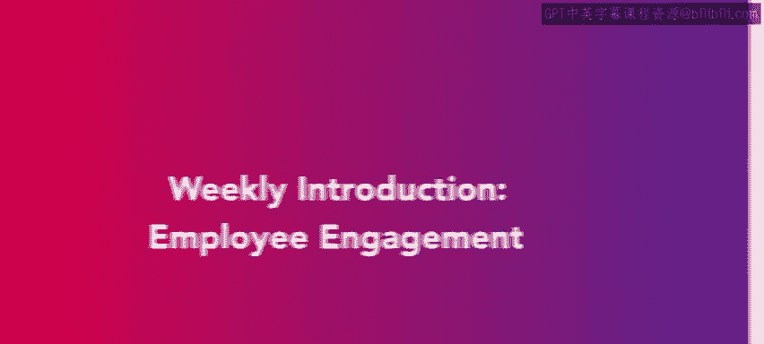
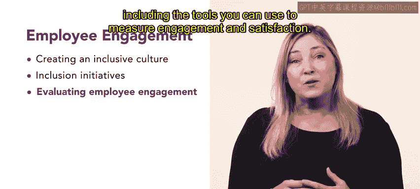

# HRCI人力资源助理专业认证课程：第4：员工敬业度周介绍

## 概述

在本节课中，我们将开始学习员工关系课程的第二周内容，核心主题是**员工敬业度**。我们将探讨如何营造更具包容性的职场文化，了解多样性与包容性举措，并学习如何评估员工的敬业度与满意度。

---

## 欢迎与本周主题介绍

欢迎来到人力资源助理专业认证课程中员工关系课程的第二周。

本周我们将深入探讨**员工敬业度**。

在第一课中，你将学习如何创建一个更具包容性的职场文化。同时，你也会了解到值得考虑的多样性与包容性举措。

---

## 本周课程内容概览

以下是本周课程将涵盖的核心内容：

*   **第一课：包容性文化** - 学习构建包容性职场文化的原则与方法。
*   **第二课：具体包容举措** - 探讨具体的员工参与、反馈机制以及工作与生活平衡等举措。
*   **第三课：敬业度评估** - 学习如何评估员工敬业度，包括可用的测量工具。

---

## 课程详细目标

上一段我们了解了本周的整体安排，接下来具体看看每一节课你将学到什么。

在第二课中，我们将专门讨论包容性举措。你将探索的一些举措包括**员工参与和反馈**，以及**工作与生活的平衡**。

最后，在第三课中，你将学习如何评估员工敬业度，包括可以用来衡量敬业度和满意度的工具。

---

## 总结与开始

本节课我们一起了解了员工关系课程第二周的核心主题——员工敬业度，并预览了创建包容性文化、实施具体举措以及进行评估的三个学习阶段。

现在，让我们从第一课开始，学习如何创建包容性文化。😊