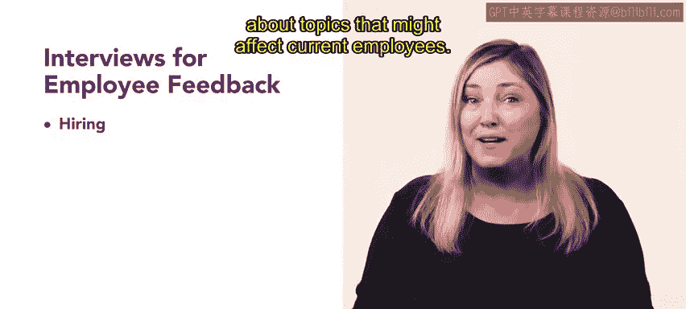
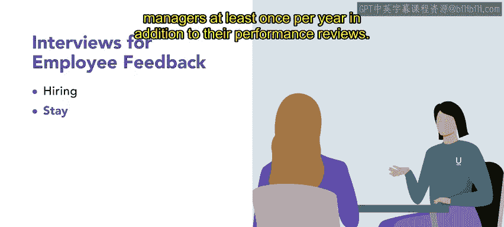
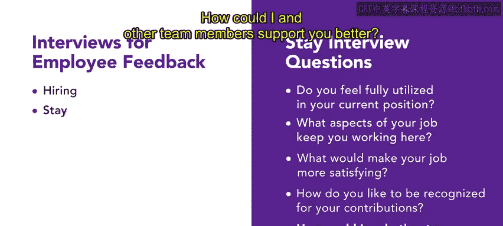
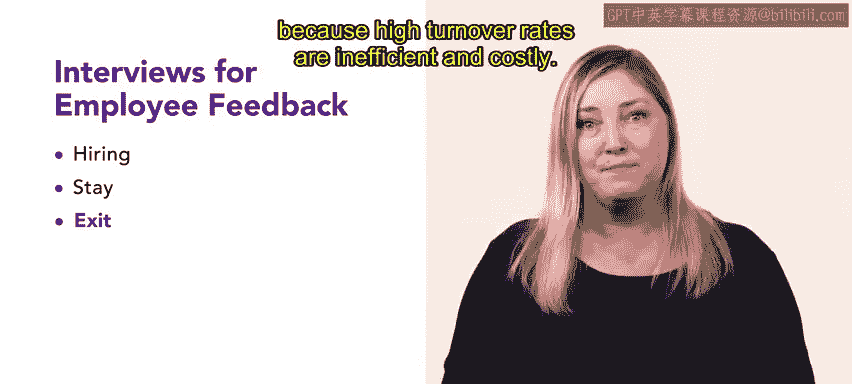
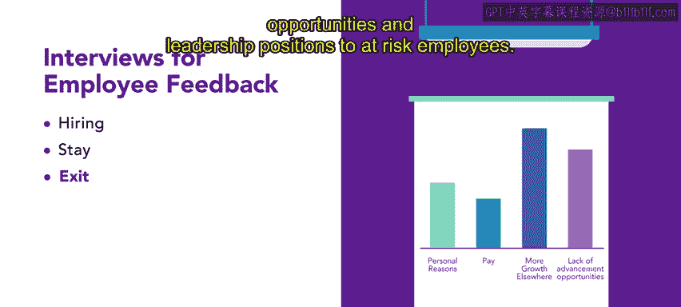
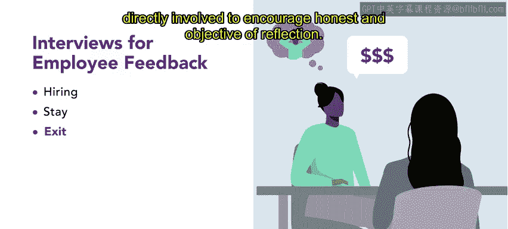
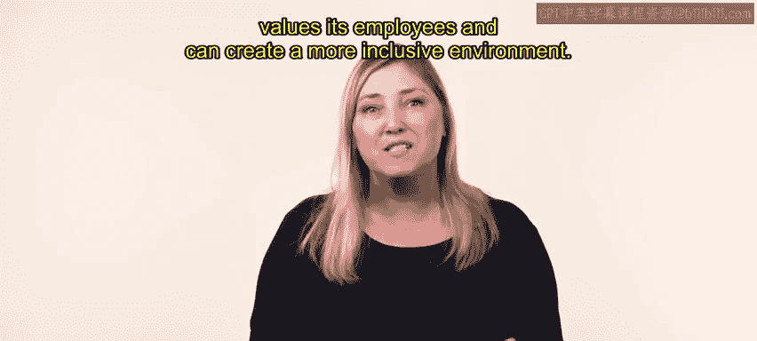

# 30：员工反馈

在本节课中，我们将要学习如何收集和分析员工反馈。员工反馈是了解员工对工作、同事及组织感受的重要信息来源，对于创建包容性工作环境至关重要。

人力资源管理者会从员工那里收集多种信息，这些信息包括员工的资质、证书和履历数据，也包括员工对其工作、同事和雇主的感受反馈。这种反馈是创建包容性工作环境的重要工具。

## 员工反馈的重要性

上一节我们介绍了员工反馈的基本概念，本节中我们来看看为何收集员工反馈如此重要。

员工反馈包含员工对其工作、同事、管理者和组织的感受信息。收集这些信息很重要，因为它表明组织关心员工及其满意度。

## 收集反馈的方法

由于员工满意度与人员流动率密切相关，组织总是渴望尽早识别出高风险员工，因此收集员工反馈有多种不同方式。

以下是几种常见的收集方式：
*   **社交媒体监测**：人力资源管理者甚至使用社交媒体来识别员工不满的早期迹象。然而，从社交媒体收集的数据会引发许多与员工隐私相关的问题，使用此类数据的管理者必须小心，不要因此违反任何法律或损害公司声誉。
*   **访谈**：让我们探讨一种更简单、更常见的收集员工反馈的方法——访谈。

## 访谈法收集反馈

访谈可以在员工在组织的不同阶段进行。访谈提供了关于员工想法和感受的定性信息。

有效的访谈必须经过结构化设计和规划，并且访谈者应接受培训。这些措施将确保访谈的公平性和一致性。此外，访谈数据和定性反馈的分析必须由客观且具备相应专业知识的人来完成。这在比较多次访谈数据以识别模式时尤为重要。

因为从访谈数据中得出有意义的结论可能比较困难，访谈法通常与其他（通常是定量的）调查方法结合使用。

让我们探讨三种主要的访谈类型及其如何提供员工反馈，首先从招聘面试开始。

### 1. 招聘面试

虽然从技术上讲，参加招聘面试的人还不是员工，但这种类型的面试仍然可以提供关于可能影响现有员工的话题的重要反馈。

例如，在Urban Attire公司，招聘团队接受培训，专注于面试候选人的资质，并考虑候选人可能如何适应组织的环境。然而，在最近一个招聘期，团队注意到许多候选人都来自同一所学校。反复面试甚至雇佣同一类型的候选人可能表明过程中存在偏见。这对人力资源团队来说是很有用的信息，他们利用这一见解来扩展招聘流程，以确保候选人库更加多元和包容。

### 2. 留任面谈

另一种可用于收集员工反馈的访谈类型是留任面谈。留任面谈帮助管理者理解员工为何继续为组织工作，或者员工为何可能选择离开当前职位。

理想情况下，这些访谈能指出为留住有价值的员工并给组织带来积极变化所需的改变。留任面谈也有助于识别员工表现出色或遇到困难的方式。

例如，在Urban Attire，人力资源团队鼓励管理者在新员工入职的头六个月内至少进行一次留任面谈。这次面谈是一个机会，可以了解员工的适应情况以及他们对工作、团队和组织的看法。对于老员工，尤其是在Urban Attire有长期工作历史的员工，除了绩效评估外，应至少每年与管理者会面一次。

以下是管理者在留任面谈中可以询问的一些问题：
*   你是否觉得在当前职位上能力得到了充分发挥？
*   你工作的哪些方面让你愿意留在这里？
*   什么会让你的工作更令人满意？
*   你希望如何因你的贡献得到认可？
*   我和其他团队成员如何能更好地支持你？

### 3. 离职面谈

最后一种访谈类型是离职面谈。离职面谈在员工表示将离开组织后进行。

离职面谈的目标是深入了解员工决定离开的原因。保留员工对任何组织的成功都至关重要，因为高流动率效率低下且成本高昂。

在Urban Attire，管理者利用离职面谈来确定员工离开的原因，以及是否需要做出改变以防止未来的人员流失。例如，一系列离职面谈揭示，高绩效员工离开是因为他们觉得在其他地方有更大的成长潜力。根据这一反馈，Urban Attire正在考虑为有离职风险的员工提供更多机会和领导职位。

离职面谈可以在员工决定离开后提供有用的信息。然而，不能保证员工会诚实地说明辞职的真实原因。如果员工担心面试官不会很好地接受真相，他们可能会隐瞒导致辞职的真实原因。例如，员工可能专注于外部因素，如另一家公司提供更高的薪水，而不是导致他们离开的内部因素，如管理不善。

虽然通常指派人力资源管理者或员工主管进行离职面谈，但一些雇主选择让不直接相关的人员来进行，以鼓励诚实和客观的反思。

## 总结

本节课中我们一起学习了员工反馈的收集与分析。收集员工反馈是识别组织内部模式或改进领域的重要工具。尽可能根据反馈采取行动，表明你的组织重视其员工，并能创造一个更具包容性的环境。