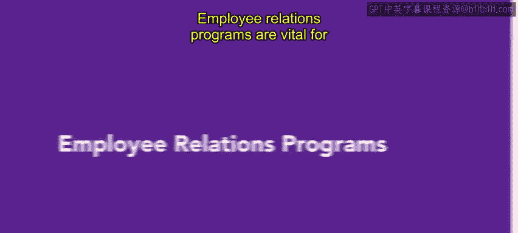

# 32：27_员工关系计划

在本节课中，我们将要学习员工关系计划的三种主要形式。员工关系计划对于营造员工感到受重视的氛围至关重要。当员工感受到赏识时，组织运作会更高效。因此，建立员工关系计划符合组织的最佳利益。

## 🏆 员工认可计划

上一节我们提到了员工关系计划的重要性，本节中我们首先来看看员工认可计划。认可员工的卓越表现有助于培养健康的工作环境。它能提高员工保留率和整体幸福感。缺乏员工认可通常会让员工感到不受重视，并可能导致人员流失。

需要明确的是，认可并不一定意味着物质奖励或激励。研究表明，与物质奖励相比，员工对积极的肯定回应更好。因此，最好将资金用于特殊活动，并通过口头方式认可员工。

员工认可可以简单到对一项出色工作的肯定，而员工乐于听到这种肯定。

以下是员工认可计划的一个具体例子：

*   在Urban Attire公司，经理每月会评选一名“月度最佳员工”。
*   到了年底，所有曾获评“月度最佳员工”的员工都有资格参选“年度最佳员工”奖项。
*   “年度最佳员工”由全体员工投票选出。

## 🎉 特殊活动计划

了解了认可计划后，我们来看看另一种形式：特殊活动。特殊活动是向员工展示他们受重视的有效方式。这些活动可以是内部或外部的。

内部特殊活动通常在职场举行，可以包括派对、提供餐饮的聚餐，甚至主题日，如睡衣日。

外部特殊活动则包括密室逃脱、体育赛事和集体观影等多种选择。特殊活动是保持员工参与度和热情的有趣方式。

将特殊活动纳入组织预算至关重要。

以下是特殊活动计划的一个具体例子：

*   在Urban Attire公司，每个门店都有用于夏季派对和假日派对的预算。
*   这些派对让员工有机会聚在一起、放松和娱乐。
*   每次活动都提供餐饮或在当地餐厅举行，并包含诸如知识问答竞赛等趣味活动。

## 🌈 多元化计划

最后，我们来探讨第三种员工关系计划：多元化计划。根据Teambuilding.com的定义，多元化计划是旨在培养一种职场文化的团体活动，在这种文化中，所有团队成员都因其独特的身份而感到被接纳和欣赏。

这些计划旨在促进平等、提高员工参与度并激发创新理念。

以下是多元化计划的一个具体例子：

*   由于Urban Attire身处时尚行业，公司会邀请多元化的艺术家和设计师举办研讨会和其他活动。
*   嘉宾会讨论他们的文化时尚、如何欣赏而非挪用文化艺术以及其他相关话题。

## 📝 总结

本节课中我们一起学习了三种关键的员工关系计划：**认可计划**、**特殊活动计划**和**多元化计划**。成功且周到的员工关系计划将帮助员工感到更受欢迎和被包容，从而提升组织整体效能。

