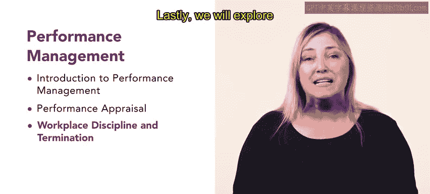
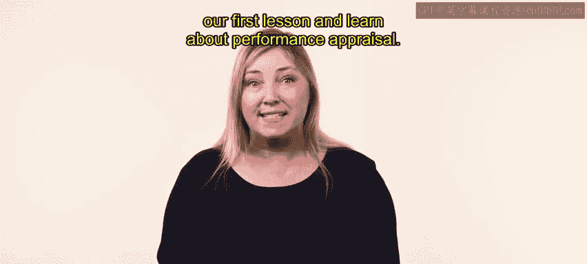

# 37：32_每周介绍：绩效管理

## 概述

在本节课中，我们将要学习绩效管理的核心内容。绩效管理涉及评估与监督员工工作、设定清晰的绩效期望、提供反馈以及识别改进领域。作为人力资源专业人士，你的角色至关重要，需要构建一个支持性的环境，使员工能够表现出色并保持敬业度。

## 课程内容

我们将首先介绍绩效管理，涵盖绩效管理系统、绩效管理周期和目标管理等概念。

接下来，我们会探讨绩效评估，即衡量员工在其岗位上的有效性。

然后，我们将探索评估绩效的不同方法。

在了解了绩效评估之后，我们将定义职场纪律与解雇，并审视人力资源专业人士遵循的各种纪律处分和程序。

最后，我们将探讨职场冲突，包括工会化、冲突解决以及进行富有成效且健康的职场对话的策略等概念。

## 核心概念与流程

以下是绩效管理周期的关键阶段，通常遵循一个循环流程：

1.  **计划**：与员工共同设定清晰、可衡量的目标（例如，采用**目标管理法**，即 `Management by Objectives (MBO)`）。
2.  **监控**：持续跟踪进展，提供非正式的反馈与辅导。
3.  **评估**：在特定周期结束时，进行正式的绩效评估。
4.  **发展**：基于评估结果，制定个人发展计划以提升技能与绩效。

## 总结

本节课中，我们一起学习了绩效管理的整体框架。我们从绩效管理的基础介绍开始，逐步深入到绩效评估的具体方法，然后探讨了与之相关的纪律、解雇程序，最后了解了如何处理职场冲突。掌握这些知识，将帮助你有效地支持员工发展，维护积极的职场关系。

现在，让我们开始第一课，深入学习绩效评估。

