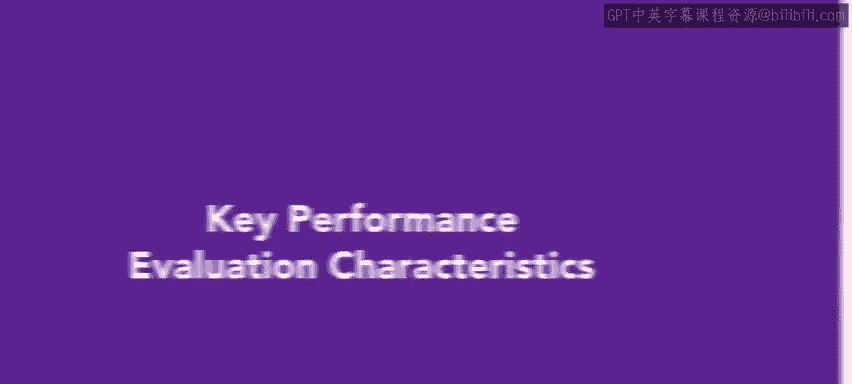
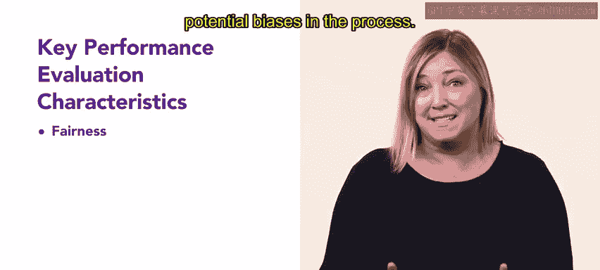
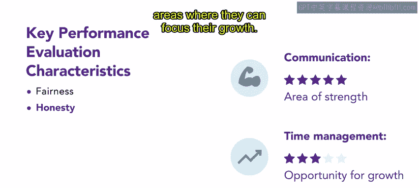
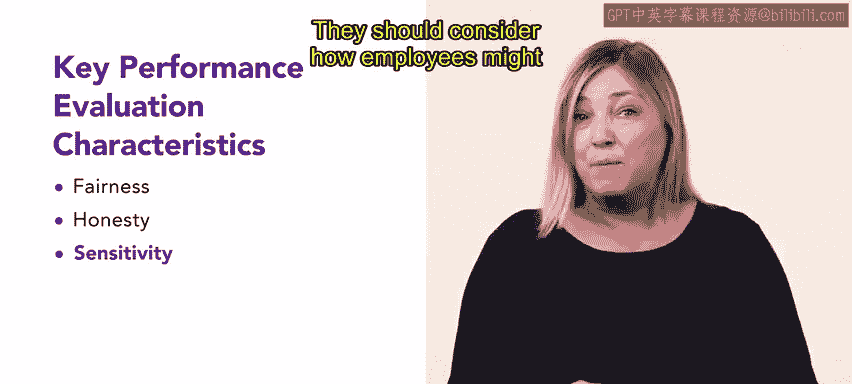
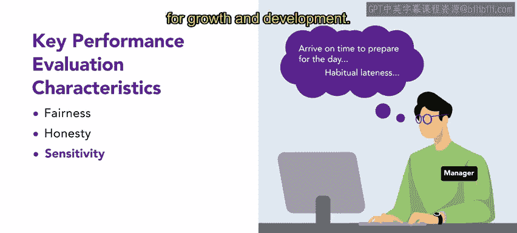
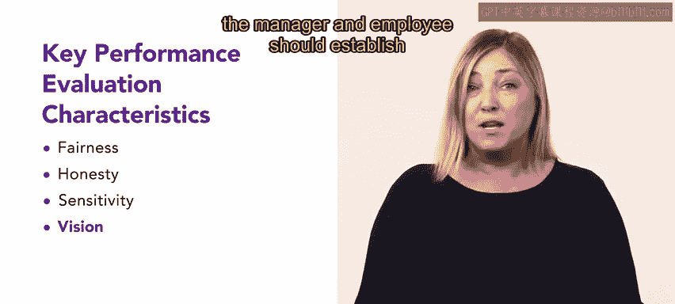

# 40：35_关键绩效评估特征

在本节课中，我们将探讨一个有效的绩效评估流程的重要性，并聚焦于其四个关键特征。绩效评估对组织至关重要，它衡量个人表现，促进专业成长，并推动组织成功。

## 公平性

上一节我们介绍了绩效评估的总体目标，本节中我们首先来看看第一个关键特征：公平性。

公平是绩效评估的一个关键方面。虽然组织可能设有客观目标，但考虑评估过程中可能存在的偏见至关重要。

管理者必须确保所有员工都得到公平的评审。无论个人偏好或意见如何，如果员工表现相似，他们应得到相同的评审结果。

如果一个员工在全年大部分时间表现优异，却突然收到一份糟糕的绩效评估，那么评审过程中可能存在偏见。

## 诚实性

在确保公平的基础上，绩效评估的另一个核心是诚实性。

在绩效评估期间，对员工表现进行诚实的评估至关重要。无论反馈是正面、负面还是中性的，虽然分享好消息可能更容易，但提供包含优点和改进领域的准确评估是必要的。

例如，一名员工收到一份绩效评估，认可其卓越的沟通技巧，同时指出需要改进时间管理技能。这种诚实的评估既肯定了其优势，也明确了其可以专注成长的领域。

## 敏感性

除了内容诚实，表达方式也极为重要。这就是我们要讨论的第三个特征：敏感性。

你可能听过这句话：重要的不仅是你说什么，还有你怎么说。这在传达绩效评估时尤其重要。

管理者应投入时间，以敏感的态度来计划和演练要说的话。他们应考虑员工对反馈可能产生的感受和反应。通过调整表达方式和谨慎措辞，管理者可以避免不必要的负面情绪，同时激励员工改进表现。

这种积极主动的方法确保管理者进行富有建设性和同理心的绩效评估，从而为成长和发展营造积极的环境。

## 前瞻性

最后，一个有效的评估不应只停留在过去，更要着眼于未来。这就是第四个特征：前瞻性。

前瞻性是有效评估的一个关键方面。虽然评估过去的表现很重要，但影响员工未来的表现才是此过程的关键因素。在讨论结束时，管理者和员工应为未来几个月建立一个清晰的愿景。

以下是制定前瞻性计划时应包含的要素：

*   **改进领域**
*   **方法上的改变**
*   **发展活动**
*   **审查进展的预定会议**

一个全面的计划能鼓励成长和改进。

## 总结

本节课中，我们一起学习了有效绩效评估系统的四个关键特征：公平性、诚实性、敏感性和前瞻性。通过理解这些基本属性，管理者可以培养一种透明、公平和持续改进的文化。