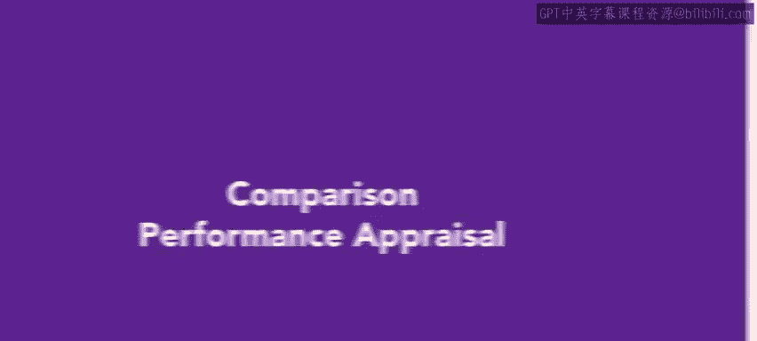
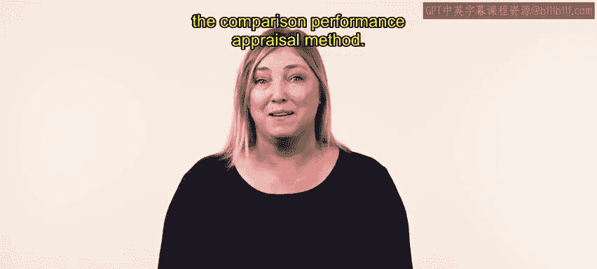
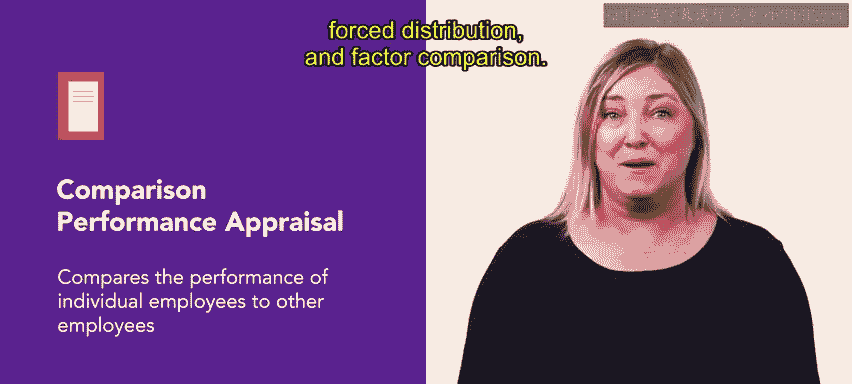
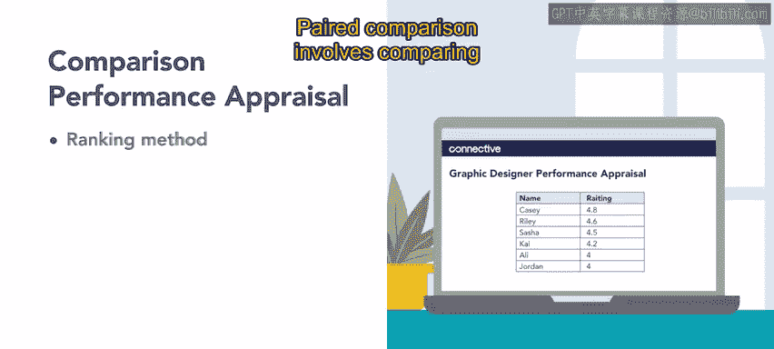
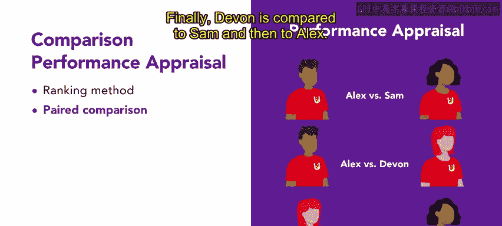
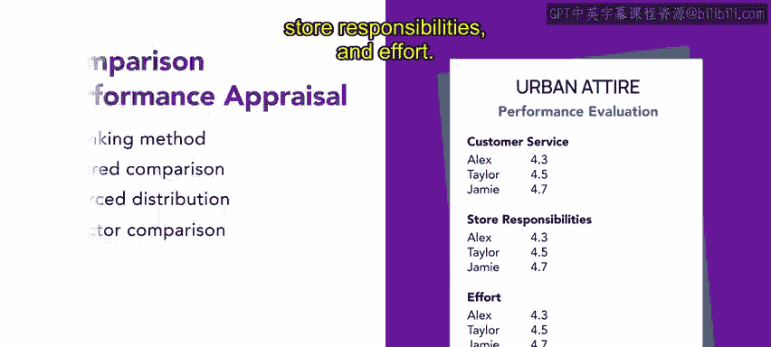

# 44：39_比较绩效评估方法 📊

## 概述
在本节课程中，我们将学习绩效评估中的**比较法**。上一节我们介绍了行为绩效评估法，本节中我们来看看如何通过比较员工之间的表现来进行评估。

比较法通过将员工的绩效与其他员工进行对比来评估其表现。最常见的比较评估方法包括：排序法、配对比较法、强制分布法和因素比较法。接下来，我们将逐一详细探讨这些方法。

## 主要方法介绍
以下是四种主要的比较绩效评估方法。

### 1. 排序法
排序法将所有员工按照绩效从高到低的顺序进行排列。这种方法最适合用于员工数量较少的小团队。

**示例**：
Connective公司的市场营销团队有六名平面设计师。人力资源团队和部门主管使用排序法，根据绩效对这六名设计师进行排序。

### 2. 配对比较法
配对比较法是指每次将一名员工与另一名员工进行两两比较。

**示例**：
Slicelice U披萨店老板用此方法评估他的三名披萨厨师：Sam、Alex和Devon。
- Sam 与 Alex 比较，然后与 Devon 比较。
- Alex 与 Sam 比较，然后与 Devon 比较。
- Devon 与 Sam 比较，然后与 Alex 比较。

### 3. 强制分布法
强制分布法，也称为强制排名法，按照钟形曲线（正态分布）对员工进行评级。绩效极高的员工占极少数，大多数员工处于中间水平，绩效极低的员工也占少数。

**示例**：
Connive公司在评估其销售团队时使用此方法。该公司拥有许多销售代表，并且他们都有可比较的绩效统计数据，适合用于强制分布。

这种方法的目的是减少或消除管理者在绩效评估中过于苛刻或过于宽松的偏见。

### 4. 因素比较法
因素比较法是基于绩效的各个具体因素，而非整体表现，来对员工进行评级。

**示例**：
Urban Attire服装店使用这种评估方法。每位销售助理都根据一份包含客户服务技能、门店职责和工作努力程度的清单进行评级。

## 总结
本节课中，我们一起学习了四种比较绩效评估方法：**排序法**、**配对比较法**、**强制分布法**和**因素比较法**。每种方法都有其适用场景和优势。在你的HR角色中，选择并使用哪种方法是一项需要不断运用和完善的技能。接下来，我们将探讨绩效评估的评级方法。