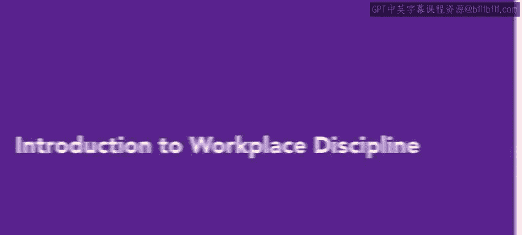
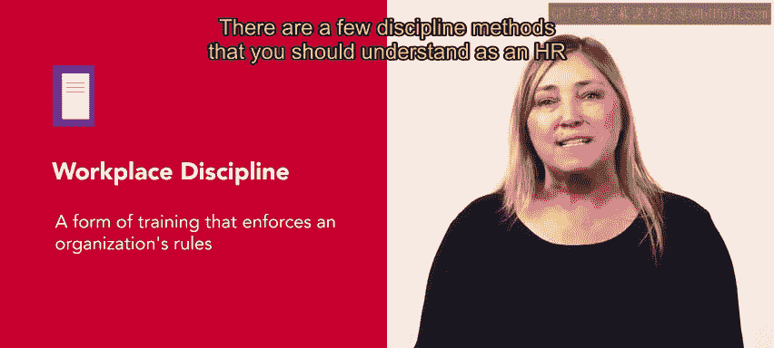
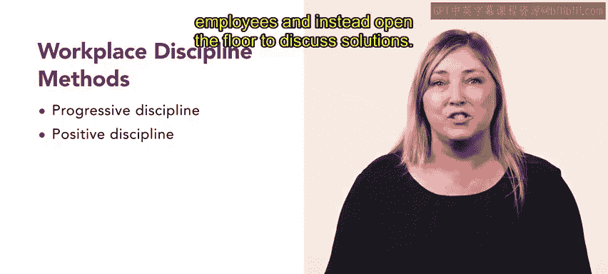

**第4：工作场所纪律介绍**

在本节课中，我们将学习工作场所纪律的概念、目的以及两种主要的纪律处理方法。理解这些内容对于维护组织秩序和引导员工行为至关重要。

上一节我们介绍了工作场所的绩效评估。本节中，我们来看看当员工违反工作场所的政策和程序时，组织可以采取哪些行动来帮助组织和员工。

工作场所纪律是一种强化组织规则的培训形式。它可以用来纠正问题员工或低效员工的行为。工作场所纪律可能相当复杂，因此一份概述组织政策的书面文件至关重要。

作为一名人力资源专业人士，您需要理解几种纪律处理方法。以下是两种主要方法：

**渐进式纪律**
这种方法包含一系列步骤，其严厉程度依次递增，旨在改变员工的不当行为。大多数渐进式纪律遵循以下顺序：口头警告 → 书面警告 → 停职 → 如有必要，解雇。

**积极式纪律**
积极式纪律在很大程度上依赖于通过团队合作来解决问题。它侧重于合作，并体现出对员工的信任、同理心和关怀。在应用积极式纪律时，管理者应避免指责员工，而是开放讨论以寻求解决方案。

制定政策来明确违反组织规则后的处理方式非常重要。尽管执行纪律可能困难或令人尴尬，但在需要时保持一致地应用纪律同样重要。

在本节课中，我们一起学习了工作场所纪律的定义及其作为行为修正工具的作用，并重点介绍了**渐进式纪律**和**积极式纪律**两种核心方法。理解这些方法有助于人力资源专业人士更有效地处理员工关系与合规问题。