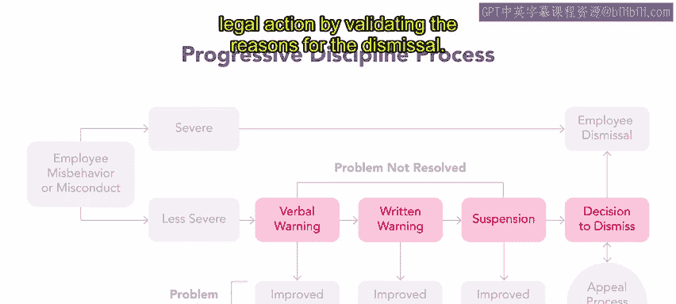
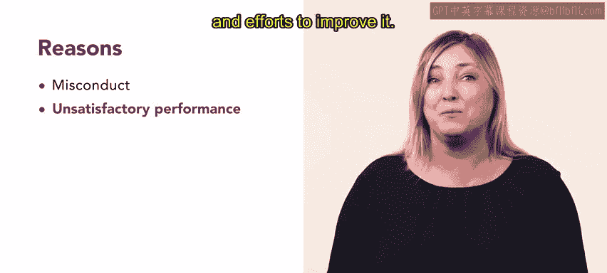

# 52：47_渐进式纪律处分

## 📋 课程概述
在本节课中，我们将要学习一种重要的工作场所纪律执行方法——**渐进式纪律处分**。我们将了解其定义、实施流程、适用场景以及优缺点，帮助你理解如何在实际工作中运用这一工具来管理员工行为。

---

## 🔍 什么是渐进式纪律处分？
上一节我们介绍了工作场所纪律的两种常见执行方法。本节中，我们来看看其中一种——渐进式纪律处分。

许多组织会选择采用一种被称为渐进式纪律的系统。渐进式纪律处分包含一系列**逐步升级、严重程度递增的步骤**，其设计目的是为了改变员工的不当行为。

最常见的渐进式纪律处分步骤包括：先是口头警告，然后是书面警告，接着是停职，最后在必要时予以解雇。一次为期三到五天的停职会向员工传递一个强烈的信号：他们工作中的不良行为必须改变，否则很可能被终止雇佣关系。

---

## ⚖️ 渐进式纪律与正当程序
渐进式纪律是组织内部**正当程序**的一种形式。正当程序是一个法律概念，但其核心理念可以应用于组织环境中。

一个采用正当程序的组织，承诺将依据预先制定的程序来做出与雇佣相关的决策并采取行动。根据正当程序原则，员工将被告知即将采取的行动，并且在任何雇佣决策做出之前，如有必要，将被允许为自己辩护。

---

## 📊 渐进式纪律处分流程
以下是渐进式纪律处分过程的流程图。

我们从员工的不当行为或失职开始。**严重失职**会立即导致员工被解雇。**非严重不当行为**则会导致渐进式纪律处分步骤。

以下是处分步骤：
1.  **口头警告**
2.  **书面警告**
3.  **停职**
4.  **解雇决定**

如果在任何步骤中，员工的行为得到改善，该流程即停止。如果流程最终导致解雇，员工可以对决定提出申诉。

拥有渐进式纪律处分系统的雇主在面对解雇引发的法律挑战时通常表现更好。因为纪律处分行动都有书面记录，渐进式纪律系统通过验证解雇的正当理由，有助于保护雇主免于法律诉讼。

---

## ⚠️ 解雇员工的常见原因
解雇员工通常有两个常见原因。

**第一个原因是行为不当**，通常指员工违反工作场所规则或行为准则。行为不当可能包括严重不当行为，即对他人有害的行为，或诸如盗窃等犯罪行为。

**第二个原因是绩效不达标**，当员工被证明不胜任或持续无法达到组织设定的绩效标准时，就构成了解雇的理由。组织必须保留关于绩效不佳以及为改进绩效所做努力的书面记录。

---

## 📝 渐进式纪律处分实例
让我们探讨一个例子。SlicU公司的一名员工经常上班迟到。

在第一次无故迟到时，其主管给予口头警告。第二次迟到时，主管发出书面警告。当员工第三次迟到时，主管继续遵循SlicU公司的政策，该员工收到书面警告并被停职。在第四次迟到时，该员工被解雇。

具体步骤可能因组织而异，例如在停职前增加一个最终警告步骤。对于任何组织而言，最佳实践是制定书面政策并确保所有员工都知晓。

---

## ✅ 渐进式纪律处分的优势
渐进式纪律系统有几个明显的优势。

首先，当主管遵循渐进式步骤时，他们向员工传达了问题的**性质和严重性**。

其次，主管始终知道下一步该采取的正确纪律步骤。这消除了猜测，减少了工作场所纪律处分常常伴随的压力和尴尬。

尽管如此，主管有时可能选择不遵循渐进式纪律系统的所有步骤。一些非常严重的违规行为，例如盗窃或在工作中酗酒或吸毒，可能是立即解雇的理由。但一般来说，如果组织有渐进式纪律政策，主管应该遵循它。一些法院判决已经裁定，未能遵循书面的渐进式纪律政策可能导致员工的解雇无效。

---

## 🎯 本节总结
本节课中，我们一起学习了**渐进式纪律处分**。我们了解到它是一种通过逐步升级的步骤（口头警告→书面警告→停职→解雇）来处理员工不当行为的系统性方法。它不仅是主管的重要管理工具，也是人力资源团队维护组织合规性和正当程序的关键。它有助于清晰沟通问题、规范管理流程，并在法律上为解雇决定提供支持。