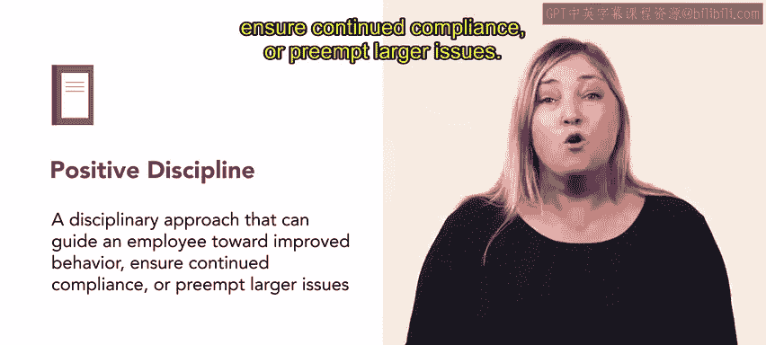
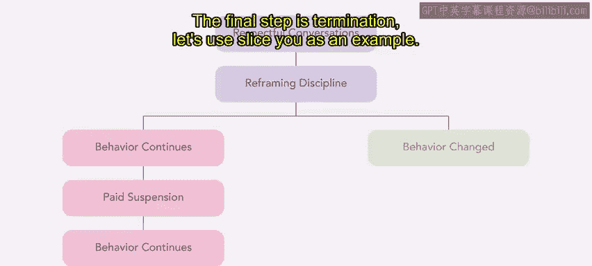
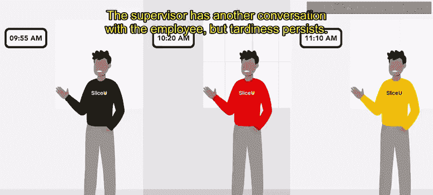
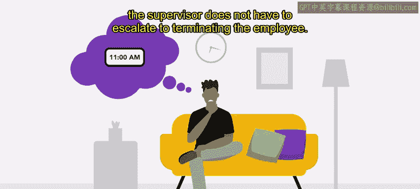

# 53：48_积极纪律处分

## 📚 课程概述
在本节课中，我们将要学习一种名为“积极纪律处分”的员工管理方法。我们将探讨其核心理念、实施步骤，并将其与传统的渐进式纪律处分进行比较，帮助你理解如何在实践中运用这一方法。

---

## 🔄 两种纪律处分方法回顾
上一节我们介绍了工作场所常用的两种纪律处分方法：渐进式纪律处分和积极纪律处分。本节中，我们将深入探讨积极纪律处分。

积极纪律处分在很大程度上依赖于通过团队合作来解决问题。它侧重于合作，并在应用过程中展现出对员工的信任、同理心和关怀。

在实施积极纪律处分时，主管应避免指责员工，而是开放讨论以寻求解决方案。这种方法可以引导员工改善行为，确保持续合规，或预防更大问题的发生。

---

## ⚖️ 积极纪律与渐进纪律的核心理念对比
以下是两种方法在核心理念上的主要区别：

*   **传统渐进式纪律**：其理念基于一种假设，即如果没有持续升级的惩罚威胁，不当行为将不会改变。其公式可概括为：**行为未改变 → 施加更严厉的后果**。
*   **积极纪律**：则采纳了心理学观点，认为人们对**积极强化**的反应更好。它更关注于引导和合作。

---

## 🛠️ 如何实施积极纪律处分
一些组织可能会选择转向积极纪律处分方法。这种转变始于就改善员工行为和绩效进行尊重的对话。

积极纪律处分向员工传递了积极的信息。其实施通常遵循一个清晰的流程。

以下是积极纪律处分的一个典型步骤示例：

1.  **初次沟通**：主管与员工会面，讨论问题行为的重要性及改进方法。
2.  **再次沟通**：如果行为复发，主管进行第二次沟通，提供进一步指导。
3.  **带薪停职反思**：若行为仍无改善，主管给予员工**带薪休假一天**，让其思考自身行为、如何改进以及是否愿意以恰当方式继续为组织效力。
4.  **终止雇佣**：如果以上所有步骤均无效，则进入最终步骤——解雇。

---

## 📖 实践案例：餐厅员工迟到
让我们通过一个具体案例来理解积极纪律处分的应用。

假设一名餐厅员工持续上班迟到。
*   **第一步**：主管与员工会面，讨论准时的重要性以及员工可以如何做到准时。此方法见效了几周。
*   **第二步**：员工再次开始迟到，主管进行了第二次谈话，但迟到问题依然存在。
*   **第三步**：主管没有给予无薪停职，而是让员工**带薪休假一天**进行反思。
*   **结果**：这种方法最终奏效，主管无需将问题升级至解雇员工。

---

## 🤝 积极与渐进方法的结合
积极纪律和渐进纪律并不一定是相互排斥的。

例如，如果员工的行为表明他们需要更多的提醒和管理支持，以积极态度进行的谈话可以增加频率或调整语气。换句话说，**纪律处分的过程仍然是渐进的，但框架是积极的，而非消极的**。

---

## 💡 积极纪律的益处
尽管某些行为和情况确实需要用到负面纪律，但首先采用积极方法可以激励员工持续改进，并能显著有益于职场文化。

---

## 🎯 课程总结
本节课中，我们一起学习了积极纪律处分方法。我们了解了其基于合作与信任的核心思想，掌握了从沟通到带薪停职反思的实施步骤，并通过案例看到了其实际应用。现在，你的工具箱里已经拥有了积极和渐进两种纪律处分方法，你可以根据具体情况、你的团队以及组织的需求，来决定哪种方法更为合适。

接下来，我们将探讨纪律处分记录的相关内容。