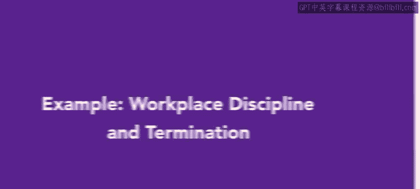
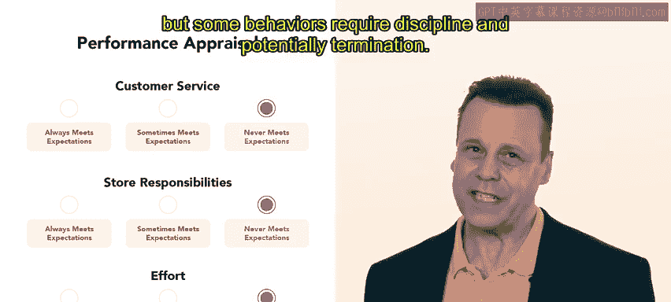
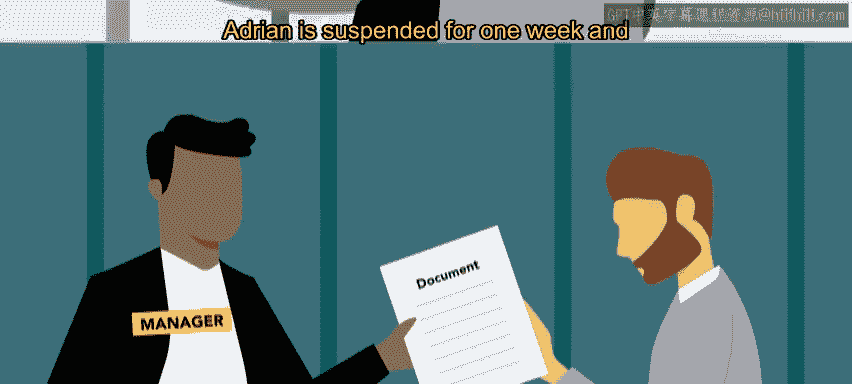
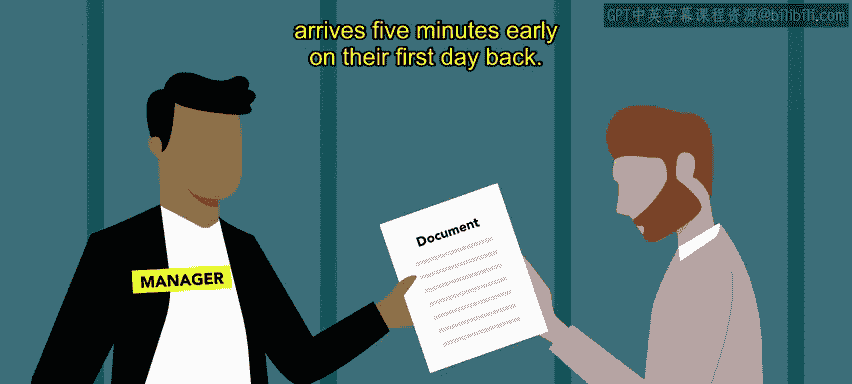
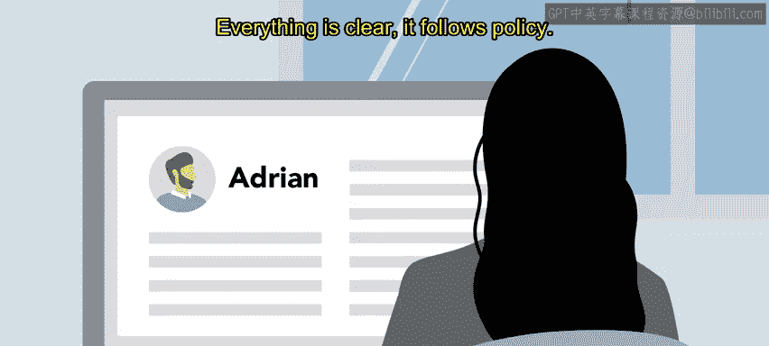
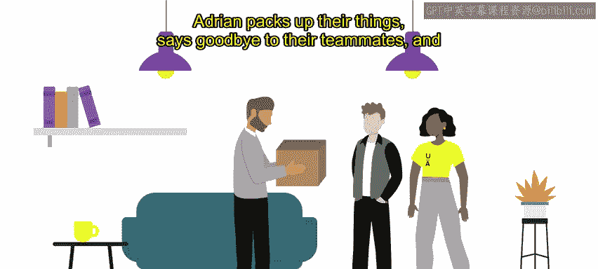

# 57：52_示例：工作场所纪律和终止雇佣

在本节课中，我们将通过一个真实世界的示例，来探讨工作场所的纪律处分以及最终的雇佣终止流程。我们将跟随一位人力资源专业人士的视角，了解如何处理员工行为问题，并确保整个过程符合公司政策与法律规定。

---

在这个示例中，我们将跟随妮瑞，她是Urban Attire公司的一名人力资源专业人士。Urban Attire是一家专注于现代休闲服装的中型企业。其业务包括一家工厂、实体零售店和总部办公室。多样化的地点和职位类型为人力资源部门带来了广泛的责任。

---

理想情况下，在Urban Attire工作的每位员工都能胜任其岗位。然而，现实并非总是如此。定期的评估和考核有助于告知员工他们的表现，但某些行为需要纪律处分，甚至可能导致雇佣终止。

---

妮瑞正在与一位工厂团队负责人会面。

这位团队负责人艾德里安，一直存在准时性问题。他/她的迟到行为已被其下属和其他团队负责人报告。这开始对团队的生产力产生影响。

Urban Attire遵循**渐进式纪律处分方法**，这意味着如果行为没有改变，纪律处分的步骤会逐步升级。

工厂经理已经就迟到问题向艾德里安发出了口头和书面警告。今天，妮瑞与艾德里安会面，告知他/她将被停职。停职是渐进式纪律处分流程中，继警告之后的下一步措施。

---

艾德里安感到沮丧，并承诺未来会做得更好。妮瑞对此表示理解，但指出艾德里安已经为此收到了多次警告，包括非正式和正式的，才导致这次停职。

艾德里安被停职一周，并在复工第一天提前五分钟到达。

---

接下来的六周没有出现问题。然而，之后艾德里安再次迟到。

工厂经理感到非常失望，并发出了一份关于其准时性的最终书面警告。与艾德里安共事的每个人都很喜欢他/她，但同时也对他/她的迟到行为感到沮丧。

在最终警告发出两周后，艾德里安迟到了20分钟。两天后，又迟到了35分钟。工厂经理与妮瑞商议后，决定下一步采取终止雇佣的措施。

---

妮瑞审查了关于艾德里安纪律处分的记录。她确认Urban Attire已记录了口头和书面警告，以及所采取的纠正措施，包括为期一周的停职。这些事实是客观的，并由记录员工工时的打卡软件验证。人力资源部门的文件还包括与艾德里安就迟到问题进行会议的谈话记录。一切都很清晰。

整个过程遵循了公司政策。妮瑞安排了与工厂经理和艾德里安的会议。解雇员工从来不是愉快的经历，但妮瑞确信Urban Attire已正确遵循了所有政策，不存在任何法律风险。

---

会议很简短，艾德里安并不感到意外。他/她感到懊悔，并对自己的行为感到沮丧。艾德里安向工厂经理道歉，并感谢妮瑞给予他/她这么多机会。艾德里安收拾好自己的物品，与队友道别，然后平静地离开了工作场所。

---

这次纪律处分过程进行得尽可能顺利，尽管妮瑞对艾德里安未能改善行为感到失望。妮瑞认为解雇过程相对顺利，主要是因为终止雇佣前进行了多次警告和沟通。没有人对遵循所有政策感到意外。

纪律处分和解雇是人力资源专业人士最不愉快的两项职责。以完全透明和一致的方式处理纪律和终止雇佣至关重要。传达所有适用的政策并平等对待所有员工，对于组织士气和员工个人行为都十分重要。

接下来，你将学习有关工作场所冲突的内容。

---

**总结**

本节课中，我们一起学习了通过一个具体案例来理解工作场所的渐进式纪律处分流程，从口头警告、书面警告、停职到最终的雇佣终止。我们看到了完整、客观的记录和遵循既定政策的重要性，这确保了处理过程的公平性，并最大程度降低了法律风险。