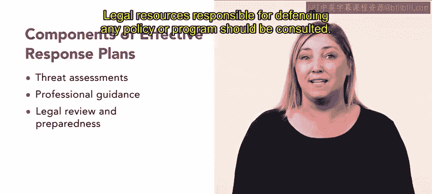

# 61：预防工作场所暴力 🛡️

在本节课中，我们将要学习如何预防工作场所暴力。我们将探讨工作场所冲突的正常范围，理解暴力行为的演变过程，并学习制定有效的预防与应对计划。

## 工作场所冲突与暴力

与任何环境一样，工作中存在一定程度的冲突是可以预见的。员工会犯错或状态不佳，因此有时管理者或人力资源专业人员需要介入，对员工进行再培训或提供帮助。

然而，危险的冲突，例如暴力行为，绝不应成为常态。本节中，我们将重点讨论如何预防工作场所暴力。

## 营造安全环境的重要性

营造一个以专业精神和相互尊重为预期的环境至关重要。管理层应定期进行冲突解决培训。

工作场所暴力预防计划和程序应能降低工作场所发生暴力的可能性，并详细说明事件发生时的系统性应对措施。例如，工作场所中的粗鲁行为和员工冲突，当骚扰和欺凌等行为被常态化时，可能会升级为骚扰和欺凌。负面的互动可能加剧为敌对或暴力行为。

## 预防措施与文化变革

预防工作场所暴力可能需要采取激进的步骤来推动文化变革。组织内部的文化问题，例如具有攻击性的管理者，会阻碍人力资源部门为解决和缓解工作场所暴力问题所做的任何实际努力。

组织内部缺乏信任可能需要最高级别的调解。尽管如此，人力资源专业人员仍可采取实际措施来应对工作场所暴力。

这些措施包括选择和制定缓解与应对计划。让我们更详细地探讨最后这一点。

## 制定有效的应对计划

做好准备，即使最坏的情况从未发生，也有助于在问题升级前解决它们。一个有效的应对计划可以包含许多组成部分。

以下是应对计划的关键组成部分：

*   **威胁评估**：让人力资源部门了解组织的需求。这些评估可以与当地执法机构或专业威胁评估师合作完成。
*   **专业咨询**：组织可以咨询持牌专业人士，以获取处理涉及武器、人质或恐怖主义威胁等严重事件的指导。
*   **法律意见**：汇编关于可能损失和责任的法律意见和关切。应咨询负责为任何政策或计划辩护的法律资源。
*   **书面政策与培训**：暴力预防工作应包括书面政策和员工培训。政策应确立行为预期，并详细说明禁止的行为，例如攻击性行为、口头或书面骚扰以及跟踪。

## 总结

本节课中，我们一起学习了预防工作场所暴力的核心内容。我们了解到，预防工作场所暴力需要一个包含多种组成部分的应对计划。现在你已掌握了这些工具，你将能够制定自己的计划。接下来，你将学习关于工会合同申诉的内容。