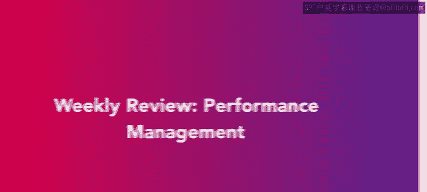
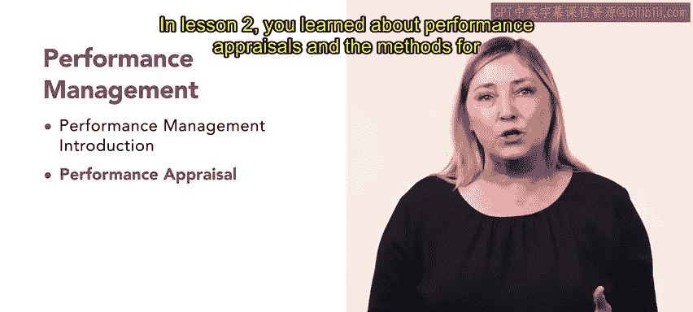
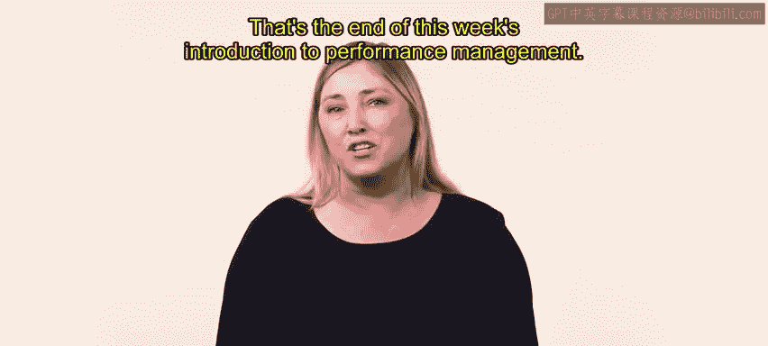

# 64：每周回顾：绩效管理 📊

在本节中，我们将对本周学习的绩效管理核心内容进行回顾与总结。

恭喜你完成本课程的第三周学习。本周你学习了大量关于绩效管理的知识。让我们回顾一下本周所涵盖的内容。

以下是本周课程的核心要点：

*   **第一课**：你学习了绩效管理的概念。
*   **第二课**：你学习了绩效评估及其执行方法。
*   **第三课**：你学习了职场纪律，包括如何实施纪律处分，以及在员工不遵守组织规则或期望时如何终止雇佣关系。
*   **第四课**：你探讨了职场冲突，以及如何预防或缓解冲突以避免其升级。

本节课中，我们一起回顾了绩效管理的四大核心模块：基本概念、评估方法、纪律执行与冲突管理。掌握这些知识对于有效管理员工绩效、维护健康的职场环境至关重要。本周的学习到此结束。😊