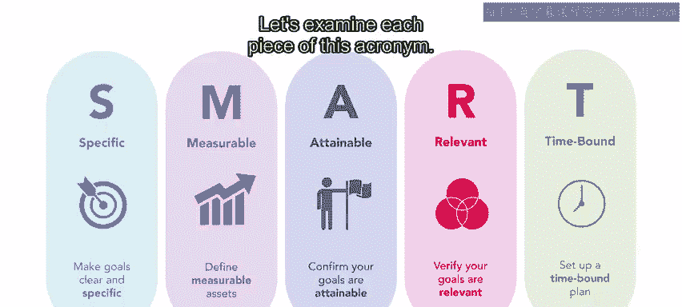
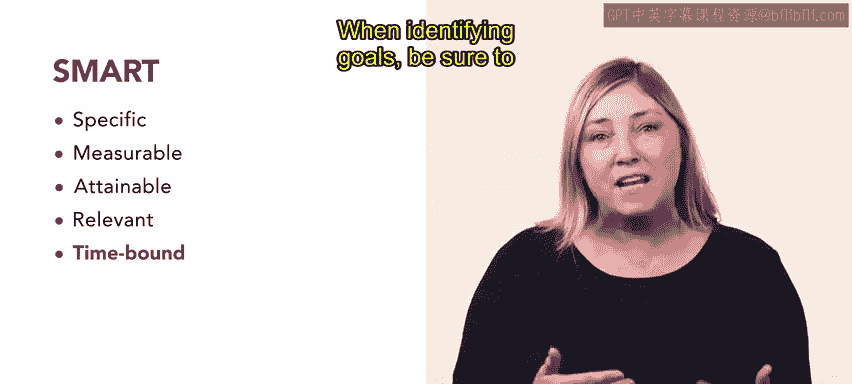

# 67：SMART目标法 🎯

在本节课中，我们将学习如何运用SMART目标法来制定清晰、可执行的人力资源目标。SMART目标法能确保你的目标与组织战略保持一致，并有效指导你的工作。

上一节我们探讨了人力资源专业人士作为组织战略伙伴的目标。本节中，我们来看看如何将这些目标具体化。

## 什么是SMART目标？ ✨

SMART目标法确保你的目标清晰、具体且可实现，从而有效地指导和激励你。在制定目标时，请记住SMART这个缩写词，它代表：

*   **S**pecific (具体的)
*   **M**easurable (可衡量的)
*   **A**ttainable (可实现的)
*   **R**elevant (相关的)
*   **T**ime-bound (有时限的)

接下来，让我们逐一解析这个缩写词的每个部分。

## 详解SMART原则 📝

以下是SMART原则中每个字母所代表的具体要求：

*   **S - 具体的**：目标应具体明确。你需要说明如何知道目标已经达成，以及可能通过何种途径实现它。
*   **M - 可衡量的**：目标应该是可衡量的。一个可衡量的目标允许你监控进度，并在达成时一目了然。
*   **A - 可实现的**：目标应该是可实现的。可实现的目标能保持你的积极性。不切实际的目标会打击士气并浪费时间。
*   **R - 相关的**：目标应与组织的长期愿景相关。
*   **T - 有时限的**：目标应有时限。在确定目标时，务必使用现实的时间限制。

## 案例分析：Urban Attire公司的目标制定 🏢

现在，我们通过一个案例来具体应用SMART原则。

假设Urban Attire公司的人力资源专员Rae了解到，门店经理在处理团队成员冲突方面需要更多培训。公司已经为此制作了网络研讨会式的培训内容，现在需要制定计划，为全国所有门店的经理实施这项培训。

Rae为此制定了以下SMART目标：
**“在四周内，25%门店的所有经理将通过预定课程完成关于冲突解决的虚拟培训。”**

让我们用SMART原则来检验这个目标：

*   **具体的**：目标是让25%门店的经理通过预定培训课程完成培训。这为实现目标提供了明确的方向。
*   **可衡量的**：它设定了“25%门店的所有经理”这一具体目标，便于跟踪和评估进度。
*   **可实现的**：它侧重于为门店经理安排和实施培训课程，这是一个可行的任务。
*   **相关的**：此前已确定门店经理未充分准备好处理团队冲突，这项新培训将为所有门店创造更好的工作环境，因此目标与组织需求高度相关。
*   **有时限的**：它明确了“四周内”这一实施培训的时间框架。

## 制定实现目标的步骤 🗺️

在Rae制定了总目标之后，就可以开始规划实现该目标所需的中间步骤或具体任务。

对Rae来说，其中一个步骤可能是：**与区域经理合作，为当地门店安排培训课程。**

在为你的SMART目标创建中间步骤时，“倒推法”会很有帮助。你可以从达成目标前最后需要做的事情开始思考，然后往前推一步，再往前推，直到确定当前应立即着手做什么。

## 总结 📚

本节课中，我们一起学习了SMART目标法。为你的组织制定人力资源目标可能很困难，因为有太多着手点。使用**SMART目标法**可以帮助你创建可实现且相关的目标。一旦目标确立，运用“倒推法”可以帮助你创建一个可衡量的时间线来实现它。