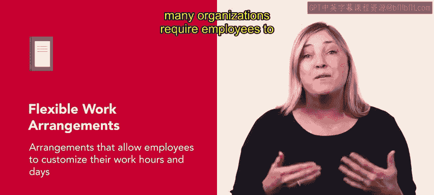
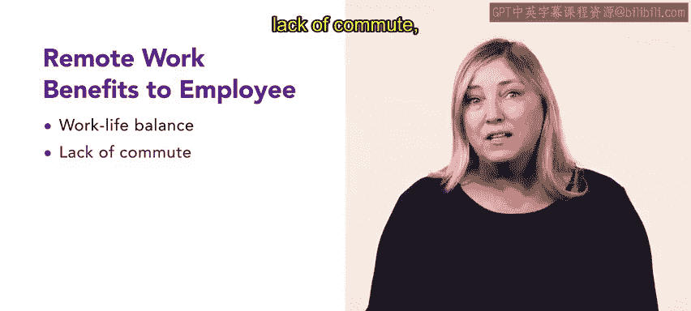
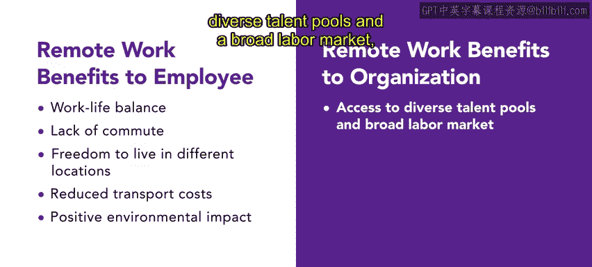

# 75：70_灵活工作策略

在本节课中，我们将探讨灵活工作项目的不同组成部分及其益处。实施灵活工作项目有两个重要步骤：首先，收集员工关于他们希望采用何种工作安排的反馈；然后，利用这些数据来构建既能满足员工需求，又与组织目标一致的、包容性的灵活工作项目。

😊

遵循这些步骤，组织可以为其员工量身定制灵活工作策略，并建立一个高效的工作环境。接下来，我们来讨论不同的灵活工作策略。

## 🕐 灵活工作时间安排

灵活工作安排通常允许员工自定义其工作时间和天数。虽然灵活排班可能包含每周工作少于五天的情况，但许多组织要求员工必须是全职员工才有资格享受这些选项。

提供灵活排班的组织通常要求员工在核心工作时间必须在岗，以便管理者可以与所有团队成员进行工作和沟通。

以下是几种常见的灵活工作时间安排类型：

*   **压缩工作周**：员工通过每天工作更长的班次来换取每周工作更少的天数。
    *   **例如**：一些员工可能在夏季选择周一至周四每天工作10小时，以获得周五的休息日。
*   **错峰上下班**：员工拥有不同的开始和结束时间，而非传统的朝九晚五。
    *   **例如**：根据政策，这些时间可以每周变化，或通过固定排班保持一致。一名员工可能从早上5点工作到下午1点，另一名从早上7点到下午3点，还有一名从上午11点工作到晚上7点。
*   **分段班次**：员工享受比通常更长的计划内休息时间（通常在下午），并通过提早开始工作或延迟下班来补足额外的工作时间。
*   **可变工作日**：组织要求全职员工每周工作40小时，但他们每天可以工作不同的小时数。
    *   **例如**：一名员工周一工作10小时，周二工作6小时，以此类推。

## 🏠 远程办公与远程工作

上一节我们介绍了灵活的时间安排，本节中我们来看看工作地点的灵活性。远程办公和远程工作是两种重要的策略。

**远程办公** 是一种灵活的工作安排，允许兼职或全职员工通过计算机在家工作。

😊

远程办公，连同远程工作，使组织能够突破地理障碍进行招聘，接触到更广泛的候选人库。

**远程工作** 是指员工可以在家或任何非现场地点工作。在某些情况下，组织会采用**地理薪酬差异**政策，即提供额外补偿以抵消不同地区之间劳动力或生活成本的差异。

远程工作安排对员工和雇主都有益处。

以下是远程工作对员工的主要好处：
*   改善工作与生活的平衡。
*   无需通勤。
*   可以自由选择居住地。
*   降低交通成本。
*   对环境产生积极影响。

另一方面，对组织的好处包括：
*   能够接触到多样化的人才库和更广阔的劳动力市场。
*   降低运营开销和办公室成本。
*   提高员工生产力。

## 🔄 兼职工作与工作分担

虽然灵活工作安排并不适用于所有组织，但在某些情况下，一些不太常见的政策可能行之有效。例如，有些员工无法承诺全职工作。

**兼职工作安排** 可以帮助这些员工，特别是自由职业者，以及那些需要协助承担特定职责但工作量不足以雇佣全职员工的雇主。

😊

有时，雇主可能会雇佣多名兼职员工来共同承担一个全职岗位的职责。

一种类似的安排是**工作分担**，即由两名或更多兼职工作者共同分担一份全职工作。例如，一名员工可能负责一周的前半部分工作，而另一名负责后半部分。这些安排非常适合无法完成整个工作周的员工，并且雇主通常无需为兼职员工提供福利。

## 🧩 其他灵活工作策略

除了刚才学到的灵活工作安排，还有其他方式可以提供灵活性、满足员工需求并提高参与度。让我们回顾一些选项。

😊

以下是几种补充性的灵活策略：

*   **宽松着装规范**：在保持专业商务形象的同时，为员工提供穿着舒适的机会和自由。
*   **分阶段退休**：允许员工在几年内逐渐减少工作时间。这种方法可以帮助年长员工更顺利地过渡离开组织。
*   **现场托儿设施**：大型组织可以考虑在办公地点提供托儿设施，让父母可以送年幼的孩子来此。
    😊 这个项目对在职父母非常包容，因为它减轻了上班前送孩子、雇佣保姆或将孩子独自留在家中的压力。
    
*   **错开产假/陪产假**：让新父母分开休产假和陪产假，可以帮助组织留住员工，并降低缺勤率和离职率。
    

## 📝 总结

本节课中，我们一起学习了多种灵活工作策略。通过根据不同的生活方式和需求，定制员工的工作时间和地点，组织可以提高员工的效率和参与度。这些策略促进了更健康的工作与生活平衡，提升了生产力，并有助于保留人才。

