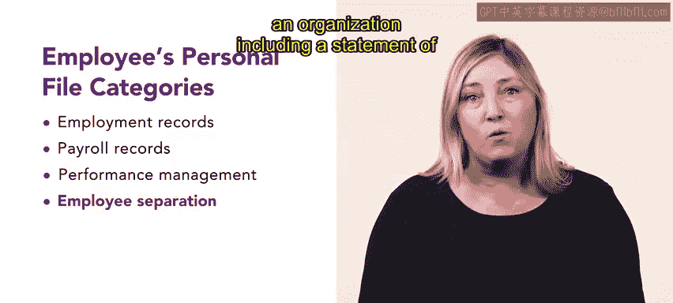

# 77：人力资源相关文件 📄

在本节课中，我们将讨论人力资源相关文件，并解释它们为何对人力资源专业人员至关重要。

## 概述

人力资源专业人员需要在员工任职期间收集其重要文件，这些文件存储在员工的个人人事档案中。雇主应在员工入职当天建立此档案。理解这些文件的分类和内容，是确保合规性和有效管理的基础。

## 员工个人档案的四大类别

员工的个人档案通常可分为四个主要类别：雇佣记录、薪酬管理、绩效管理和员工离职。此外，档案还可能包含紧急联系人信息、子女抚养及工资扣押令的详情，以及员工查阅档案的请求记录。

上一节我们介绍了档案的整体构成，本节中我们来看看每个类别的具体内容。

### 1. 雇佣记录

雇佣记录包含员工的基本必要信息。以下是该类别通常包含的文件列表：

*   职位描述
*   求职申请表与简历
*   已完成的入职文件
*   员工与雇主之间的合同记录

### 2. 薪酬管理

薪酬管理类别涵盖与员工薪酬相关的一切事宜。以下是该类别通常包含的文件列表：

*   薪资标准
*   税务表格
*   带薪休假申请

### 3. 绩效管理

绩效管理文件用于记录和评估员工的工作表现。以下是该类别通常包含的文件列表：

*   绩效评估
*   培训记录
*   表彰信
*   书面纪律处分通知

### 4. 员工离职

员工离职类别包含员工与组织终止雇佣关系所必需的文件。以下是该类别通常包含的文件列表：

*   辞职声明或裁员通知
*   最终薪资支付记录

## 总结

本节课中，我们一起学习了人力资源相关文件的四大核心类别：**雇佣记录**、**薪酬管理**、**绩效管理**和**员工离职**。充分理解这些文件及其所属类别，对于人力资源专业人员履行合规职责、维护准确的员工记录至关重要。