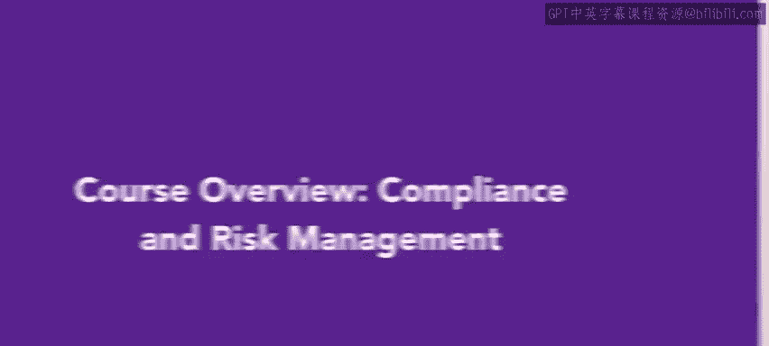
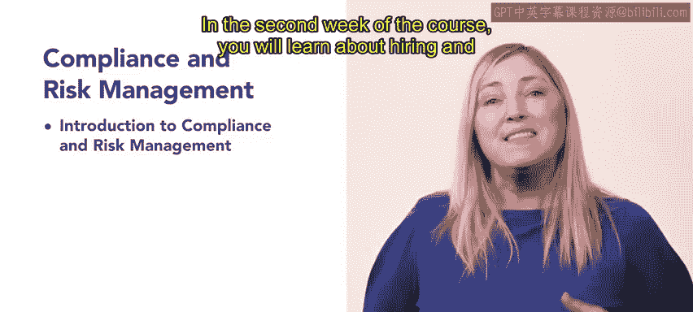

# 84：合规与风险管理 📋

## 课程概述

在本课程中，我们将要学习人力资源领域的合规与风险管理。这是人力资源助理专业认证项目的第五门，也是最后一门课程。合规与风险管理对于组织的长期成功至关重要，同时也是APHR考试的重要组成部分，约占考试内容的25%。

## 课程结构介绍

上一节我们介绍了课程的整体目标，本节中我们来看看课程的具体安排。本课程为期五周，每周聚焦于不同的核心主题，通过视频、阅读材料和实践活动相结合的方式，帮助您掌握相关知识。

以下是本课程五周的具体学习内容：

*   **第一周：合规与风险管理基础**
    *   本周将介绍合规与风险管理的核心概念，并学习如何专业且明智地应对相关问题。

*   **第二周：招聘与员工关系法规**
    *   本周将学习与人力资源职能相关的法律法规，特别是招聘和员工关系领域的合规要求。

*   **第三周：健康与安全法规**
    *   本周将深入了解健康与安全政策，包括OSHA（职业安全与健康管理局）标准、常见行为问题、工作场所危害与威胁，以及职场骚扰的应对。

*   **第四周：合规战略与实施**
    *   本周重点学习合规战略的制定与执行。内容包括组织重构（如离岸外包和业务外包），以及人力资源在业务连续性计划中的角色。

*   **第五周：合规与风险管理培训**
    *   在最后一周，我们将聚焦于风险管理政策与流程，学习正式的风险管理程序，这与之前课程中学习的方法类似。

## 学习方法与资源

本课程设计了多种学习材料来巩固您的知识。您将通过阅读和分析真实案例，理解未来HR职业生涯中可能遇到的合规与风险管理场景。

此外，课程还包含以下练习环节：

*   **测验**：用于检验您对知识点的掌握程度。
*   **练习**：帮助您应用所学概念解决具体问题。
*   **项目**：通过实践任务来提升您的人力资源专业技能。

## 总结

本节课中我们一起学习了《合规与风险管理》课程的整体框架和目标。在您未来的人力资源职业生涯中，处理合规与风险管理任务将是常态。现在，让我们开始学习，继续积累知识，为您的HR职业之旅建立信心。