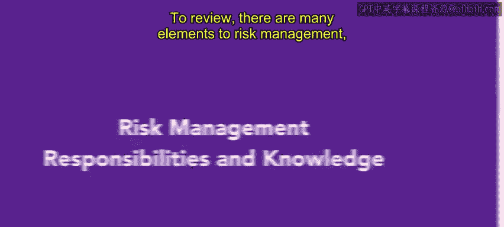
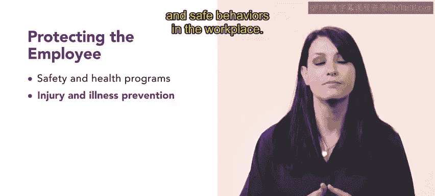
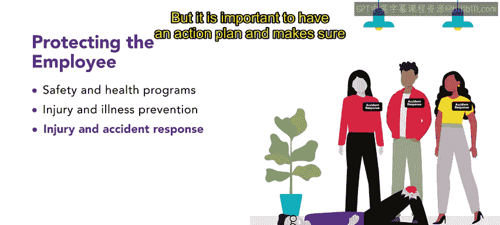
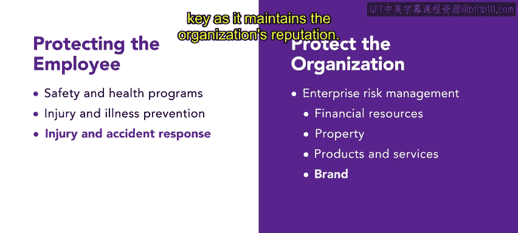

# 90：风险管理责任和知识

## 📋 课程概述
在本节课中，我们将要学习人力资源专业人员在风险管理中的核心责任与知识。风险管理包含两大范畴：保护员工与保护组织。我们将逐一拆解这两个范畴下的具体组成部分，帮助你理解如何有效地识别和减轻职场风险。

---

## 🛡️ 保护员工
上一节我们介绍了风险管理的两大范畴，本节中我们来看看如何保护员工。保护员工主要涉及三个核心组成部分：安全与健康计划、工伤与疾病预防，以及工伤与事故响应。

### 安全与健康计划
安全与健康计划的具体内容因行业和组织而异，但其核心通常聚焦于传达职场安全政策与实践，并对员工进行相关程序培训。

以下是确保计划有效性的关键参与方：
*   **美国国家职业安全卫生研究所**：该机构研究职场安全的趋势、模式与科学，并基于其研究与分析，向职业安全与健康管理局提出职场标准建议。
*   **州政府与地方政府**：这些机构通过立法确保工人安全，例如要求为在高温条件下工作的员工提供特定培训或饮水。
*   **工会**：工会也致力于保障工人的安全权益。

### 工伤与疾病预防计划
实施工伤与疾病预防计划是保护员工的另一重要方式。事实上，职业安全与健康管理局的一份白皮书指出，此类计划为突破性变革奠定了基础，能帮助雇主识别和控制危险源，从而显著改善职场健康与安全环境。

根据职业安全与健康管理局的标准，一个成功的工伤与疾病预防计划包含四个要素：
1.  **管理层承诺与员工参与**：组织领导层必须展现承诺，并鼓励员工参与职场安全与健康工作。
2.  **工作场所危害分析**：组织必须定期进行工作场所危害分析。
3.  **危害预防与控制**：组织需要建立危害预防与控制程序，以便在风险发生前进行识别。
4.  **安全与健康培训**：组织应定期举行安全培训会议，让员工了解职场中的危害和安全行为。

### 工伤与事故响应
当风险确实发生时，例如工作中发生严重伤害，应启动工伤与事故响应计划。

这些计划明确规定在发生伤害或事故时应采取的措施，包括在必要时向职业安全与健康管理局报告。你将在后续视频中了解更多关于强制性报告的内容，但重要的是要有一个行动计划，并确保所有员工都知道在事件发生时自己的角色。

---

## 🏢 保护组织
在了解了如何保护员工之后，我们来看看人力资源团队在保护组织方面的角色，这主要通过企业风险管理来完成。企业风险管理的目标是发现、检查并预防可能干扰组织目标的潜在损失、危害及其他风险。

企业风险管理涉及组织的多个方面：
*   **保护财务资源**：保护组织的财务资源极其重要，以避免陷入债务或不良财务状况。财务风险可能导致声誉受损或破产，这两者都会对运营产生负面影响。
*   **保护财产**：这包括组织的建筑和办公室，也包括技术、设备等。
*   **保护产品与服务**：通过保障其产品与服务来保护组织也至关重要。
*   **保护品牌与声誉**：保护组织的品牌是关键，因为它维系着组织的声誉。

---

## ✅ 总结与展望
本节课中我们一起学习了人力资源专业人员在风险管理中的双重职责：**保护员工**与**保护组织**。理解如何有效地履行这些职责，可以减少或消除工作场所中的风险。

在下一个视频中，你将学习更多关于风险评估的知识，这是管理风险的另一个重要方面。