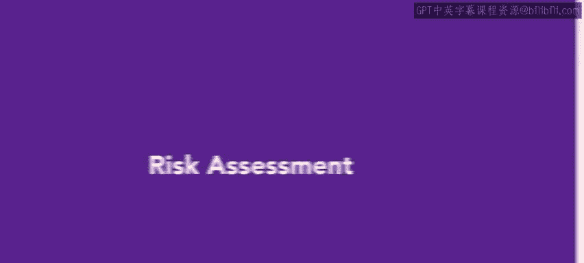
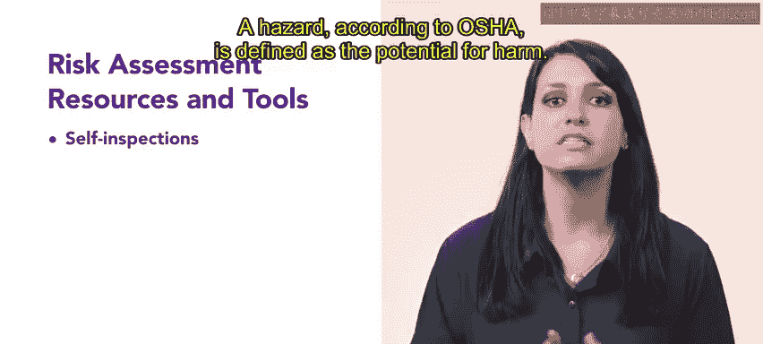
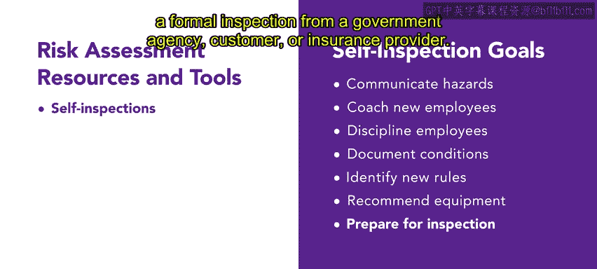
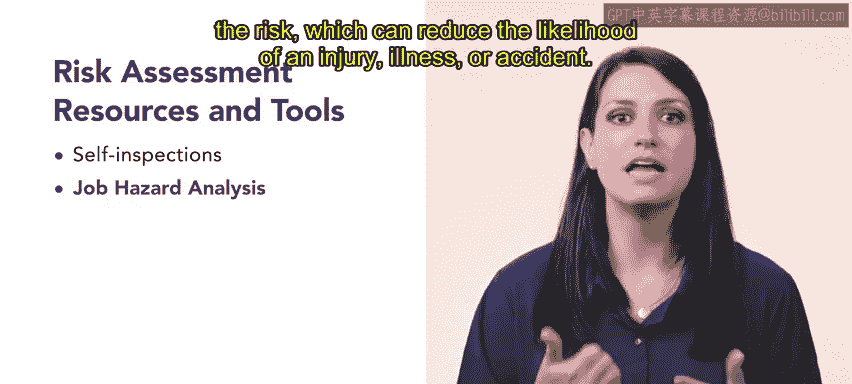
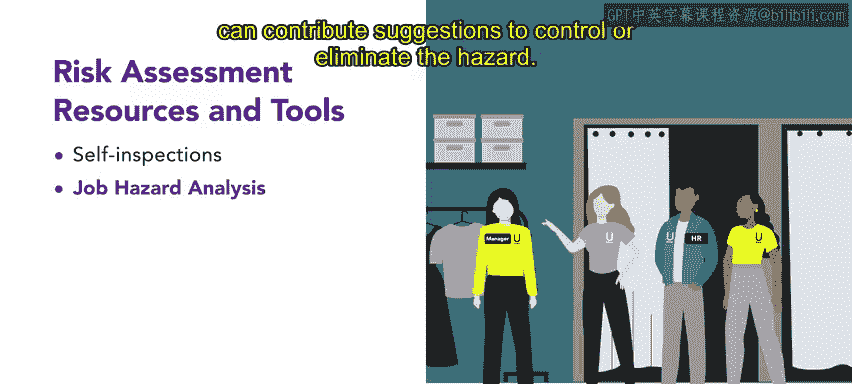
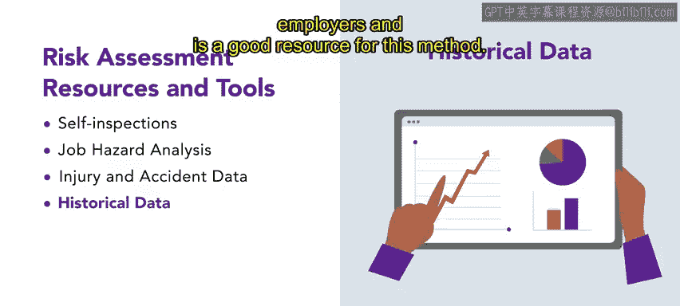
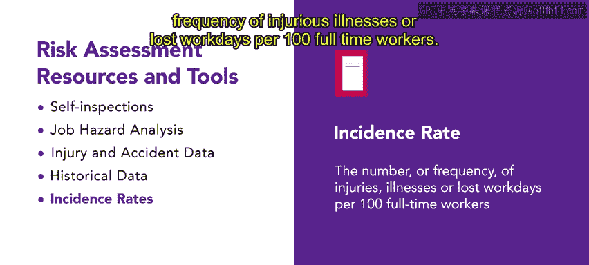
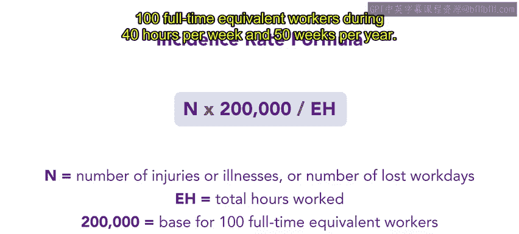

# 91：8_风险评估

在本节课中，我们将要学习风险评估。风险评估与缓解技术有助于营造一个安全、可靠且合规的工作场所。我们将了解如何为组织评估风险。

## 风险评估概述

组织可能会遇到多种类型的风险。例如，一个组织可能需要针对野火的紧急疏散程序，而另一个组织则可能需要针对导致其通信系统中断数日的大雪的业务连续性计划。

## 风险评估方法

组织基于深入的风险评估来制定这些计划。风险评估，也可称为需求分析或威胁评估，是一种分析类型，允许组织考虑可能遇到的风险类型及其发生的可能性。组织可以利用分析来制定缓解风险的计划。

风险评估可以采用不同的方法，包括自我检查、伤害与事故数据、历史数据和事故率。

### 自我检查

安全自我检查文件帮助组织识别危险并采取纠正措施。该评估的目标是纠正危险并防止事故发生。根据OSHA的定义，危险是指造成伤害的可能性。

自我检查的发现可用于实现多个目标。以下是其主要用途：

*   向受影响的员工传达危险。
*   用于指导新员工了解安全工作实践和程序。
*   用于因不安全操作或未遵守安全程序而对员工进行纪律处分，或记录不安全状况和整改工作。
*   识别是否需要新的或修改的安全程序或规则。
*   协助雇主推荐个人防护装备。
*   为组织接受政府机构、客户或保险公司的正式检查做准备。

### 工作危害分析

雇主也可以将工作危害分析作为风险评估的一部分。这种分析评估特定于工作的危险。危害分析使雇主能够采取必要步骤来控制风险暴露，从而降低受伤、生病或事故的可能性。

在进行工作危害分析时，让定期执行任务的员工及其主管参与进来非常重要。这些员工最了解与环境或设备相关的潜在风险，并能提出控制或消除危险的建议。

### 伤害与事故数据分析

风险评估的第三个工具是收集和分析伤害与事故数据。这些数据记录了所有事件，包括伤害、事故和未遂事故。审查这些数据是人力资源部门识别组织内所有员工面临的威胁和风险暴露的好方法。

事故调查通常由主管或安全委员会成员进行，重点在于确定不安全行为或状况是否导致了伤害、事故或未遂事故。收集到的信息随后用于实施预防措施。这些措施可以侧重于消除不安全状况，或通过培训、指导和必要的纪律处分来解决不安全行为。

### 历史数据审查

另一种评估风险的方法是审查历史数据。通过过去的事件，往往会显现出一些模式。OSHA收集了有关雇主最常违反标准的数据，是这种方法的一个良好资源。

### 事故率分析

风险评估的最后一项策略是分析事故率。根据OSHA的定义，事故率是指每100名全职员工中发生伤害性疾病或损失工作日的数量或频率。

您可以使用以下公式计算事故率：

**公式：`事故率 = (N × 200,000) / EH`**

其中：
*   **`N`** 代表伤害和疾病的数量，或损失工作日数。
*   **`EH`** 代表所有员工在一个月、一个季度或一个财政年度内的总工作小时数。
*   **`200,000`** 是基准数，代表100名全职等效员工每年工作50周、每周工作40小时的总工时。

## 风险评估实例

让我们以Connective公司为例进行风险评估。人力资源团队决定进行一次工作危害分析，因此他们组建了一个风险评估团队，由来自每个部门的员工及其直属主管组成。

该团队创建了一份风险清单。由于Connective是一家技术型组织，他们容易受到黑客攻击，以及员工和客户私人信息、知识产权和商业秘密泄露的风险。

计算机和其他设备等物品的盗窃也是一个重大风险。财产损坏，包括故意破坏、正常磨损或自然灾害，是风险评估团队最后关注的问题。

接下来，团队决定哪种风险最有可能影响他们，并制定缓解风险的计划。Connective团队认为数据泄露是他们最紧迫的威胁。这些行为可能导致利润损失、声誉受损以及员工和客户的信任丧失。

团队知道他们可以通过实施数字安全措施来降低风险，例如防火墙、身份验证和强密码要求。他们还决定通过购买保险来保护其财产。

## 后续步骤

在组织完成风险评估后，下一步是设计和制定预防与应对方案。这一步将在后续视频中进一步解释。

## 总结

本节课中，我们一起学习了风险评估。我们了解了风险评估对于创建安全工作场所的重要性，并探讨了五种主要的评估方法：自我检查、工作危害分析、伤害与事故数据分析、历史数据审查以及事故率计算。最后，我们通过一个实例，看到了如何识别风险并制定相应的缓解计划。掌握这些方法，有助于人力资源专业人员系统地识别和管理组织面临的各种风险。