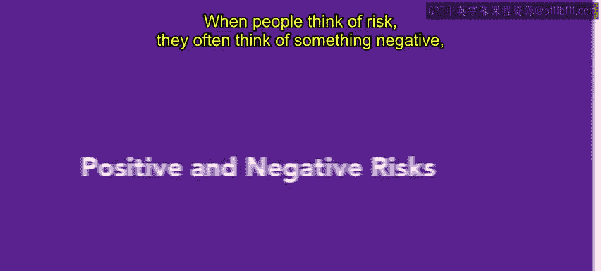
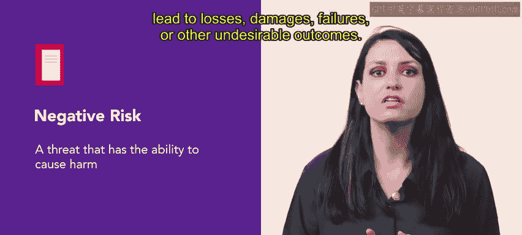
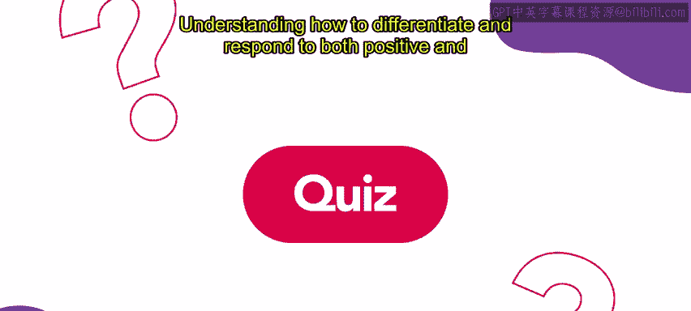

# 92：9_积极和消极风险

## 概述 📋

在本节课中，我们将要学习风险管理中的两个核心概念：**积极风险**与**消极风险**。人们通常将风险视为负面事件，但并非所有风险都是有害的。理解这两种风险的区别，对于在人力资源领域做出平衡的决策至关重要。

## 什么是积极风险？😊

上一节我们提到了风险不全是负面的。本节中，我们来看看什么是积极风险。

积极风险是一种可能为组织带来成功的**机会**。它有可能创造价值、获得优势或实现机遇。如果这类风险发生，它可能对组织的目标产生积极影响，例如推动创新、节约成本和时间、提升绩效、获得竞争优势等。

以下是一个具体例子：

> 例如，Connective公司近期对其可靠、用户友好的视频通话系统需求高涨。

> 因此，他们投入大量资金用于一个新的软件安全程序，以防止数据泄露。

这项投资就是一种积极风险。因为它有潜力保护公司免受黑客及其他试图损害组织的行为的侵害。引入新软件总会伴随风险（如技术故障或影响员工生产力的培训），但它也可能带来益处。

Connective公司认识到该软件有几个潜在优势：

*   降低法律费用
*   减少劳动力成本
*   保护公司声誉

这些优势超过了潜在的负面风险，因此Connective公司对其选择感到满意。

## 什么是消极风险？⚠️

了解了积极风险后，我们再来看看更为人熟知的消极风险。

消极风险被称为**威胁**，它有能力造成损害。消极风险存在于组织的日常运营中，通常很容易被察觉。消极风险可能影响项目、组织或个人，并导致损失、损害、失败或其他不良后果。

我们继续使用上面的例子：

> 因为Connective投资了新软件，他们决定放弃为用户增加密码功能来保护视频通话。

> 由于新安全系统很强大，他们认为此功能没有必要。

不要求密码就是一个消极风险。因为即使软件现在很强大，技术也在不断变化。未来，黑客可能能够攻破该软件，这可能损害Connective的声誉、因法律费用产生财务诉讼、降低生产力等。

## 风险管理中的平衡考量 ⚖️

在管理风险时，必须同时考虑积极风险和消极风险。

两者都能支持平衡的决策制定，并最大化组织成功的机会。

## 总结与展望 🎯

本节课中，我们一起学习了：

1.  **积极风险**：可能带来积极结果的机会，公式可表示为 **`积极风险 = 机会 + 潜在收益`**。
2.  **消极风险**：可能造成损害的威胁，公式可表示为 **`消极风险 = 威胁 + 潜在损失`**。

在人力资源专业中，懂得如何区分并应对这两种风险极其重要。这将帮助你更好地为组织评估和缓解风险。

在下一个视频中，你将学习管理心态如何影响你处理风险的方式。

