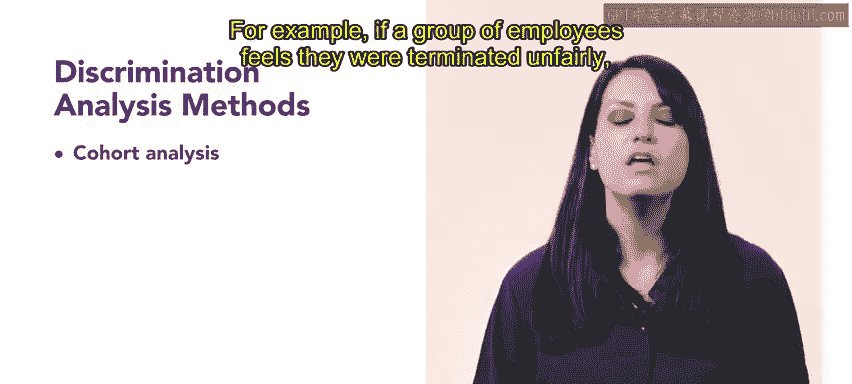
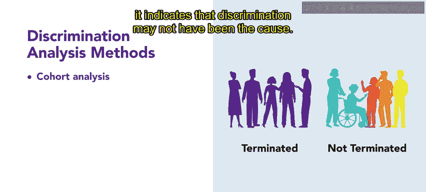
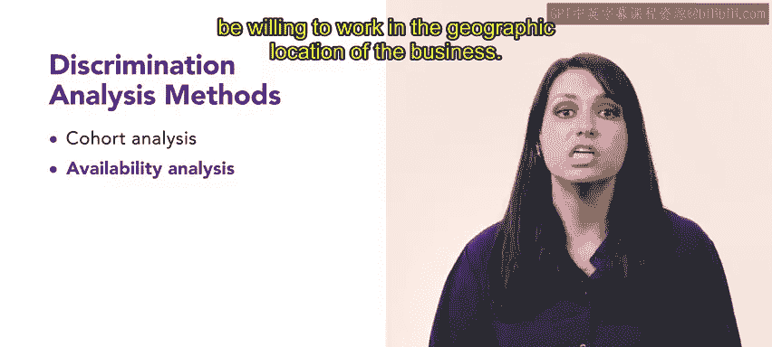

# 107：识别歧视 👁️

在本节课中，我们将学习歧视的定义，并探讨组织可以用来识别歧视的几种分析方法。理解这些概念对于创建公平、包容的工作环境至关重要。

无论是有意还是无意，歧视都可能对员工和组织产生重大影响。理解歧视并分析其成因，对于创造公平和包容的环境至关重要。

---

## 系统性歧视

上一节我们提到了歧视的影响，本节中我们来看看一种危害性更强的歧视形式：系统性歧视。

当歧视性做法系统性地发生时，其危害性尤其严重。**系统性歧视**指的是以不公平方式对待员工的**模式和实践**，而非单一的、孤立的不公平待遇事件。

它可能发生在招聘、培训、晋升等多个阶段。由于系统性歧视及其影响，美国平等就业机会委员会（EEOC）将识别和解决系统性歧视作为优先事项。

---

## 识别歧视的分析方法

识别歧视性做法可能具有挑战性。然而，组织可以使用以下三种分析方法来检查其员工队伍中是否存在无意识的歧视。

以下是三种核心的分析方法：

*   **同期群分析**
    *   这是一种通过比较个人或群体与处于类似情况下的其他人所受待遇，来判断歧视是否发生的方法。
    *   例如，如果一组员工认为自己被不公平解雇，并声称这是歧视所致，他们必须证明担任类似职位的其他人未被解雇，才能证实其主张。如果从事相同工作的同事都未被解雇，则表明解雇决定可能存在歧视性。反之，如果类似职位的员工都被解雇，则表明歧视可能不是原因。

*   **可获得性分析**
    *   该分析旨在考察有多少来自受保护阶层（如少数族裔、女性、残障人士）的个体有资格获得雇佣。
    *   要具备雇佣资格，一个人必须拥有该职位所需的技能和资质，居住在本地，并且愿意在该企业所在的地理位置工作。
    *   例如，美国劳工部下属的联邦合同合规项目办公室（OFCCP）就要求身为联邦承包商或分包商的雇主进行可获得性分析。

*   **影响比率分析**
    *   该分析评估组织中受保护员工群体的代表比例，是否与整体劳动力市场中的比例相符。
    *   如果组织中属于受保护群体的员工比例很低，则可能表明存在对这些员工的潜在歧视。
    *   如果分析显示特定职位中来自受保护阶层的员工过多或过少，这些职位会被标记为“重点关注岗位”，并被视为潜在问题。与可获得性分析一样，OFCCP也要求联邦承包商或分包商进行影响比率分析。

---

## 总结

本节课中，我们一起学习了歧视，特别是**系统性歧视**的概念。我们重点探讨了组织可用于识别潜在歧视的三种分析方法：**同期群分析**、**可获得性分析**和**影响比率分析**。

通过运用这些技术，组织可以识别潜在的歧视实例，并帮助人力资源专业人员采取适当措施加以解决。这些方法直接支持组织在其招聘和培训全过程中，优先考虑公平性和合规性。