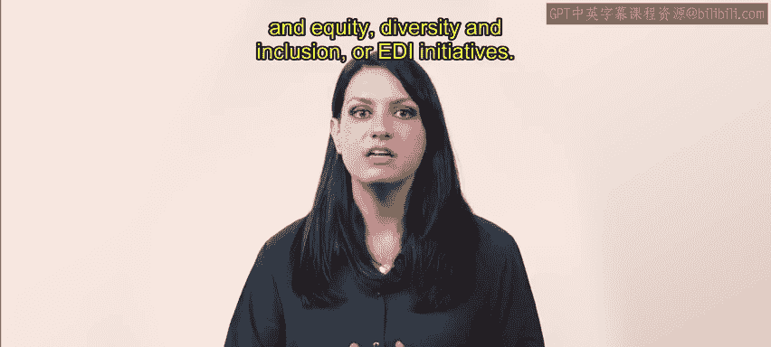
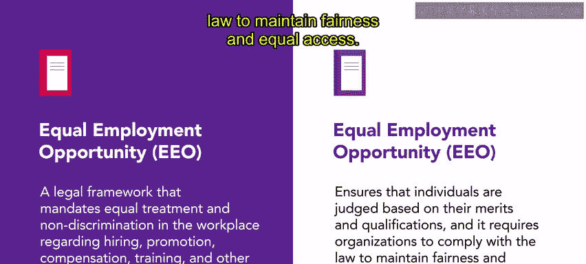
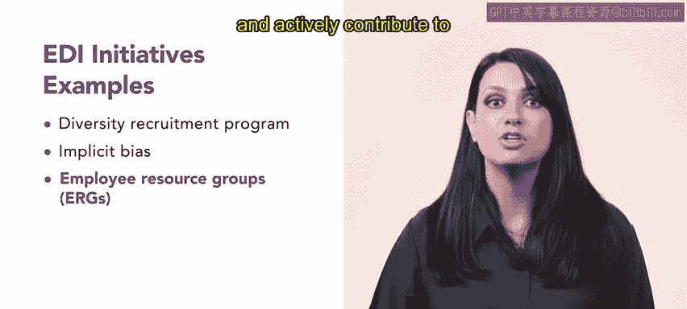
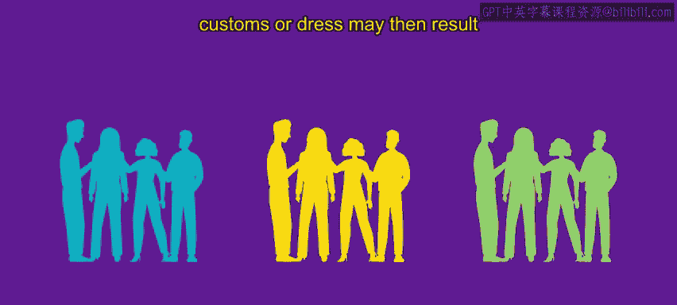

# 4-5：公平、多元化与包容（EDI）🏢

在本节课中，我们将学习公平、多元化与包容（EDI）的概念，并探讨其在职场中的重要性。我们将比较平等就业机会（EEO）的法律框架与EDI主动倡议之间的区别与联系，帮助初学者理解如何构建一个公平且包容的工作环境。

---

你可能对EDI、DEI和DNI这些术语感到熟悉，它们经常互换使用，指向同一个核心概念。这些术语代表了一个组织在劳动力队伍中对**公平、多元化与包容**的承诺。本节视频中，我们将探讨两种旨在实现职场公平的途径：**平等就业机会**和**公平、多元化与包容**倡议。

---

## 平等就业机会（EEO）的法律框架⚖️

上一节我们介绍了EDI的基本概念，本节中我们来看看其法律基础——平等就业机会。

平等就业机会是一个法律框架，它强制规定在工作场所的招聘、晋升、薪酬、培训和其他就业机会方面，必须实现平等待遇和非歧视。EEO确保个人根据其**优点和资历**被评判，并要求组织遵守法律以维持公平和平等机会。

除了法律合规，组织还必须履行EEO报告义务。这包括向监管机构（如美国平等就业机会委员会，EEOC）提交组织劳动力的人口统计摘要。值得注意的是，直到最近，法律并未要求多元化与包容倡议。然而，2011年通过的第13583号行政命令，要求所有联邦机构制定多元化和包容性计划，这凸显了职场中多元化与包容日益增长的重要性。

虽然EEO为公平奠定了基础，但EDI倡议在这些法律要求之上进一步构建。EDI倡议旨在创造一种**颂扬多元化、促进包容并接纳不同观点**的职场文化。

---

## EDI主动倡议示例🌟

了解了EEO的法律要求后，我们来看看组织可以采取哪些具体的EDI主动倡议来补充EEO的努力。以下是几个常见的EDI倡议示例：

*   **多元化招聘计划**：积极寻找来自代表性不足群体的候选人，以增加候选人库的多样性，并解决招聘过程中的偏见。
*   **隐性偏见培训**：为员工和招聘经理提供培训，旨在提高对无意识偏见的认识，并学习公平决策的策略。
*   **员工资源小组**：代表组织内不同人口统计或亲和群体的团体。它们旨在提供支持、培养包容性，并积极为组织决策做出贡献。

---

## 缺乏多元化与包容的风险⚠️

实施这些倡议至关重要，因为未能遵守EEO政策或实施EDI倡议可能导致劳动力队伍的同质化。

员工可能共享相似的特征，如种族、性别、年龄或背景。这种同质性通常会导致**缺乏多样性**，或不同观点和经验的代表性不足。

EEOC已经识别出与组织内缺乏多样性相关的风险因素。例如，占多数的员工可能因为感知到的差异而对来自代表性不足群体的员工感到不适。这种由语言、习俗或着装等因素引起的不适，可能导致那些来自代表性不足群体的员工被排斥。

---

## 促进多元化与包容的必要性🤝

为了缓解组织内的风险，促进多元化和包容是必要的。一些组织选择将**多元化培训**和**骚扰预防培训**结合起来，以进一步促进一种相互接纳、尊重和理解的文化。

---

## 总结📚

本节课中，我们一起学习了公平、多元化与包容（EDI）的核心概念。我们了解到，EEO和EDI倡议都旨在创造一个让代表性不足群体被包容并拥有平等就业机会的工作场所。作为人力资源专业人士，在积极促进包容性职场的同时，确保法律合规至关重要。拥抱EDI原则不仅使个人受益，也有助于组织的整体成功。