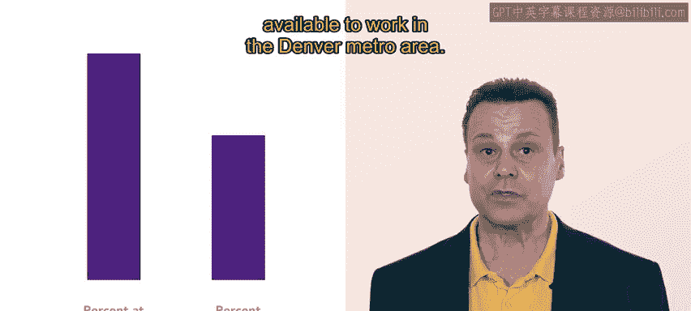

# 109：26_示例：识别歧视

在本节课程中，我们将通过一个具体案例，学习如何在组织的薪酬或招聘流程中识别潜在的歧视问题。我们将跟随人力资源专员亚历克斯，了解他如何运用数据分析方法来评估公司的员工构成。

## 案例背景介绍

让我们跟随亚历克斯。亚历克斯是康奈克蒂夫公司的人力资源员工。

他负责分析康奈克蒂夫公司的员工人口统计数据。请记住，康奈克蒂夫是一家现代化的通信组织，致力于帮助企业保持联系，因此得名。该公司专门帮助分布式劳动力通过一系列软件工具（如视频会议和基于云的电话系统）进行协作。

康奈克蒂夫拥有大量完全远程办公的员工。人力资源团队希望分析公司的员工队伍，并确定在那里工作的人员是否代表了他们运营所在的社区。

## 薪酬队列分析

首先，亚历克斯使用队列分析方法来审查来自代表性不足群体和受保护阶层的个人，其薪酬是否与其角色和职责相匹配。

亚历克斯比较了自我认定为受保护阶层成员的员工与不属于受保护阶层的员工的薪资数据。

亚历克斯发现了一两个可能需要进一步研究的问题。但总体而言，薪资似乎得到了适当的调整，员工是根据其职责和技能获得报酬的。

亚历克斯认为，康奈克蒂夫公司实施薪资禁令和进行工作评估的努力促成了这种平衡。

## 晋升队列分析

上一节我们分析了薪酬公平性，本节中我们来看看晋升情况。亚历克斯运行了另一次队列分析，这次是审查有关晋升的数据。

这项分析确实揭示了一个可能令人担忧的趋势。

数据显示，康奈克蒂夫公司中自我认同为女性的员工获得晋升的可能性略低于自我认同为男性的员工。

这是一个意想不到的结果。亚历克斯亲自管理了确保晋升公平进行的举措，但看来还有更多工作要做。

## 可用性分析

最后，亚历克斯尝试进行可用性分析，以检查有多少来自受保护阶层的个人有资格就业。

康奈克蒂夫的远程员工队伍使这项分析变得复杂。

亚历克斯决定首先审查科罗拉多州丹佛市的可用劳动力。

康奈克蒂夫的创始人居住并在丹佛工作，并且在该大都市区有大量康奈克蒂夫的员工聚集。

以下是亚历克斯进行分析的步骤：
*   使用来自美国人口普查局和劳工部的数据。
*   审查有多少人具备在康奈克蒂夫担任某些职位所需的技能和资格。

分析得出了令人惊讶的结果。康奈克蒂夫的员工队伍中，来自受保护阶层的员工比例远高于丹佛大都市区可供工作的劳动力中的比例。

亚历克斯认为这些结果是一个好迹象，表明康奈克蒂夫的招聘外展和招聘计划在实现员工队伍多元化方面运作良好。

亚历克斯的分析暂时到此为止。分析可用劳动力、现有员工以及各自的多样性是一项重要的人力资源技能。正如你所了解的，多元化的员工队伍是更健康、更具创新力的员工队伍。

发现可能存在歧视的领域是使组织更具包容性的重要一步。

接下来，你将总结本周关于平权措施和员工关系的信息。

## 课程总结

本节课中我们一起学习了如何通过**队列分析**（比较不同群体在薪酬、晋升等方面的数据）和**可用性分析**（比较公司内部受保护阶层比例与外部劳动力市场可用比例）来识别组织内潜在的歧视问题。这些分析是确保招聘、薪酬和晋升实践公平、合规的重要工具。