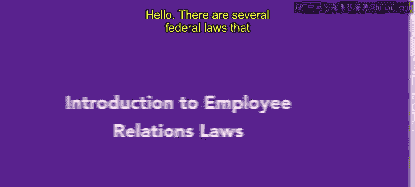
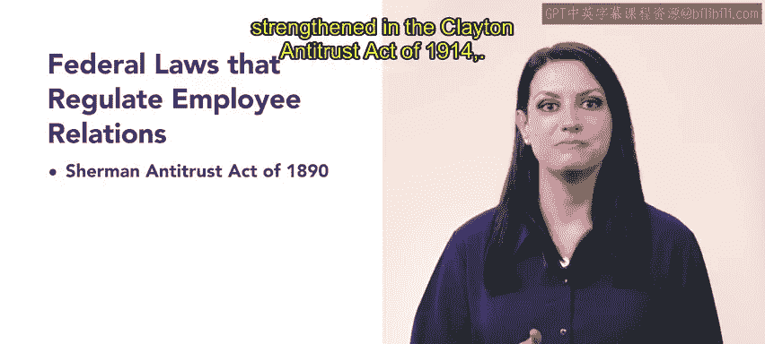

# 112：29_员工关系法简介

在本节课中，我们将要学习美国联邦层面规范雇主处理员工关系的几项重要法律。这些法律构成了员工关系管理的基础框架。

上一节我们概述了课程目标，本节中我们来看看最早影响有组织劳工的联邦法律。

**《1890年谢尔曼反托拉斯法》** 是第一部影响有组织劳工的联邦法律。该法案旨在防止组织抑制自由贸易。法院还裁定，该法律同样适用于工会罢工和抵制活动。

到了1914年，这些条款在 **《1914年克莱顿反托拉斯法》** 中得到澄清和加强。

了解了早期的反托拉斯法后，我们接下来看几部专门针对劳工关系的法律。

**《铁路劳工法》** 于1926年通过，并于1936年修订。该法案旨在防止铁路和航空业罢工导致重大的贸易和运输问题。它要求这些行业的员工在发起劳工罢工前，必须先寻求替代性争议解决方法。

另一部重要的联邦法律是 **《1932年诺里斯-拉瓜迪亚法案》**。该法案保护了组建工会的权利。它还禁止雇主强迫员工签署承诺不加入工会的合同，并禁止雇主干涉非暴力的工会活动。

随后在1935年， **《国家劳工关系法》** 赋予了工人组织工会、进行集体谈判和参与集体活动的权利。该法案定义了不公平劳动行为，规定了无记名投票和工会选举，并成立了国家劳工关系委员会（NLRB）。

一部更为人熟知的法律是 **《1938年公平劳动标准法》**。该法案确立了最低工资标准、每周最长工作时间和加班费要求。它还禁止16岁以下的童工。

**《劳资关系法》（LMRA）** 也被称为 **《1947年塔夫脱-哈特莱法案》**。该法案明确了构成不公平劳动行为的工会行为。

最后， **《1988年工人调整与再培训通知法》（WARN法）** 要求大型雇主在大规模裁员或工厂关闭前，必须提前60天通知其员工。该法适用于拥有100名或以上全职员工，或100名及以上全职兼职工人（每周总工时合计达到或超过4000小时）的雇主。

该法将“大规模裁员”定义为裁减500名员工或组织总劳动力的33%。它还将“工厂关闭”定义为单个设施的永久性或临时性关闭。

在接下来的视频和阅读材料中，您将更深入地了解这些法律。

本节课中，我们一起学习了从《谢尔曼反托拉斯法》到《WARN法》等一系列关键的美国联邦员工关系法律，了解了它们的基本目的和核心规定，为理解员工关系的法律框架奠定了基础。