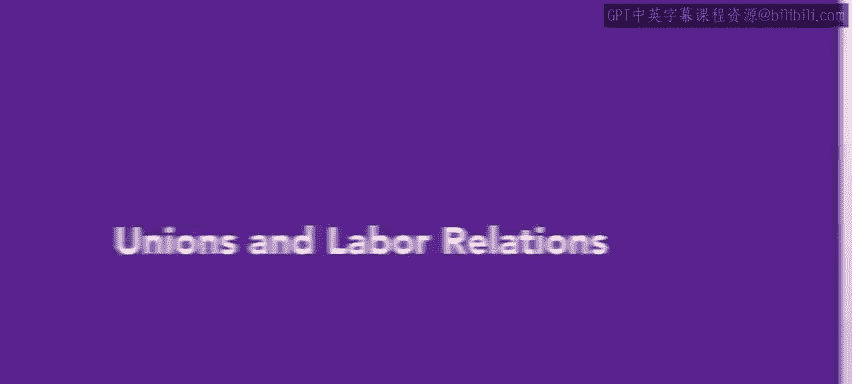
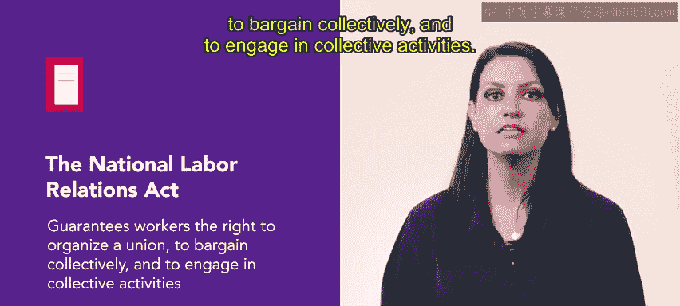
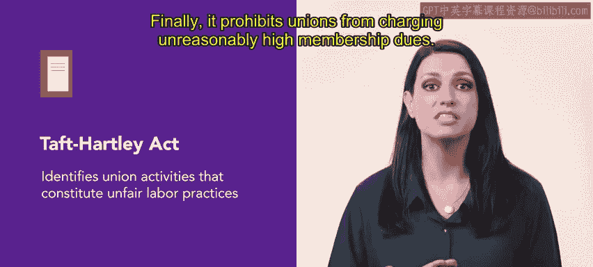
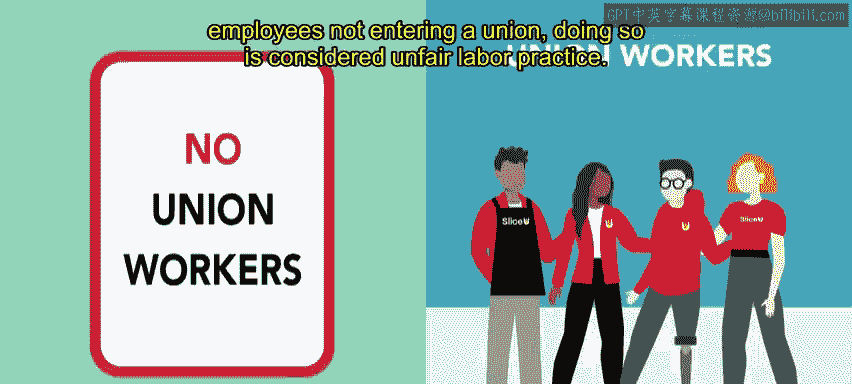
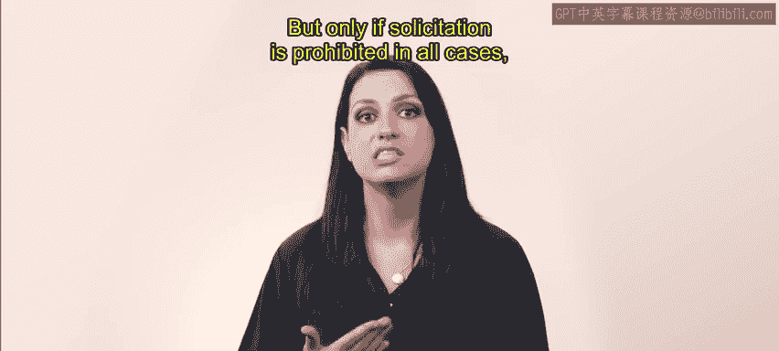

# HRCI4：工会和劳资关系 👥

在本节课中，我们将要学习工会和劳资关系。作为人力资源从业者，理解如何在工会环境中开展工作至关重要，因为工会对经济和劳动力的某些领域具有重大影响力。

## 核心法律框架 📜

上一节我们介绍了工会的重要性，本节中我们来看看规范劳资关系的两项重要法律。

与劳资关系相关的两项重要法律是1935年的《国家劳资关系法》（NLRA）和《塔夫脱-哈特莱法》。

*   **《国家劳资关系法》（NLRA）**
    *   该法案保障了工人组织工会、进行集体谈判和参与集体活动的权利。
    *   它定义了**不当劳动行为**。
    *   它规定了**无记名投票**和工会选举。
    *   它设立了**国家劳资关系委员会（NLRB）**，该委员会负责确保对NLRA的遵守。

*   **《塔夫脱-哈特莱法》（又称《劳资关系法》，LMRA，1947年）**
    *   该法案明确了构成不当劳动行为的工会活动。
    *   员工不能被强迫加入工会或参与工会活动。
    *   它禁止工会要求会员歧视非工会同事。
    *   它禁止工会收取不合理的过高会费。

## 工会环境下的平等原则 ⚖️

理解法律框架后，我们需要关注一个核心原则：无论员工是否属于工会，所有员工都应得到平等和公平的对待，获得清晰的沟通，并基于其表现获得奖励或惩罚。

对于那些在工会化环境中工作的人，行为受到合同协议和大量劳动法规的密切监督。如果雇主未能遵守这些合同和协议，很可能导致冲突、额外开支和管理精力分散，同时员工的精力也会从旨在帮助组织成功的活动中被转移。

## 预防工会化的策略 🛡️

基于上述原则，一些雇主出于各种原因希望防止员工成立工会。防止工会化的最佳方法是创造一个积极的工作环境，让员工感到受欢迎、被公平对待、受到赏识，并且他们的成就得到认可。

以下是创造一个积极工作环境的关键点：

*   在积极的工作环境中，员工更愿意与管理层沟通，这反过来又创造了信任和相互尊重的氛围。
*   在这种情况下，员工不太可能觉得有必要通过成立工会来保护自己的利益。

## 雇主行为的界限 🚧

同样重要的是，要理解如果员工决定成立工会，雇主能做的事情并不多。这是员工的权利。雇主不能威胁或审问员工以试图控制工会化进程。同样，雇主不应监视员工，或做出以员工不加入工会为前提的承诺。这样做被视为不当劳动行为。

然而，雇主确实有权与员工沟通，了解他们考虑成立工会的愿望和原因。雇主也可以禁止工会代表在公司财产上进行招揽活动，但前提是招揽活动在所有情况下都被禁止，而不仅仅是针对工会代表。

## 总结 📝

本节课中我们一起学习了工会和劳资关系。最终，是否成立工会取决于员工，他们有权这样做。然而，雇主可以通过创造一个充满相互尊重的积极、信任的环境，来降低员工成立工会的可能性。