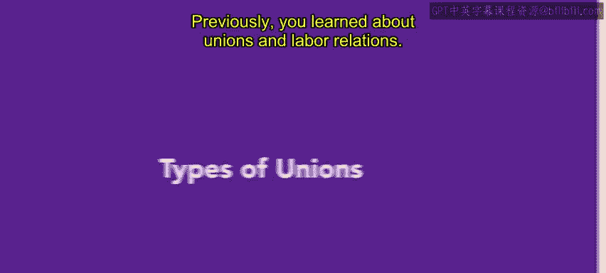
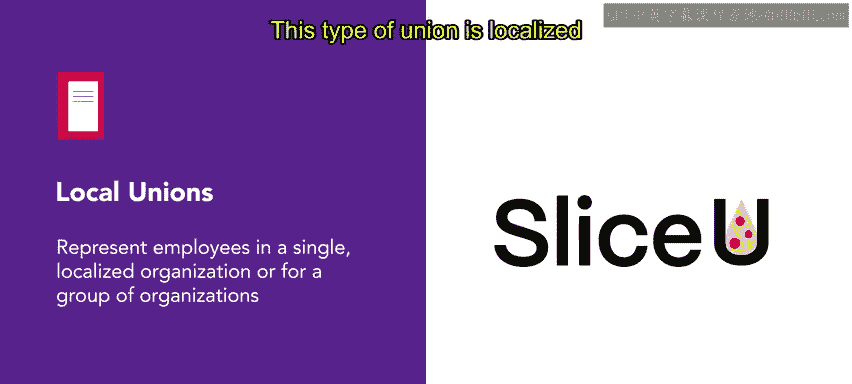
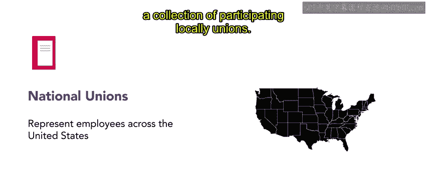
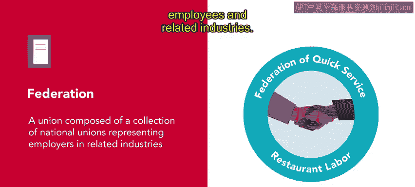
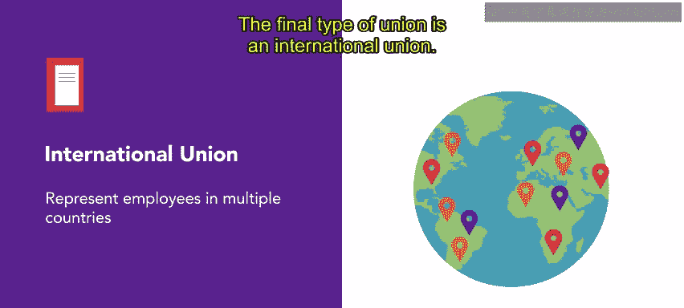
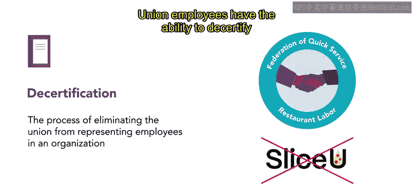
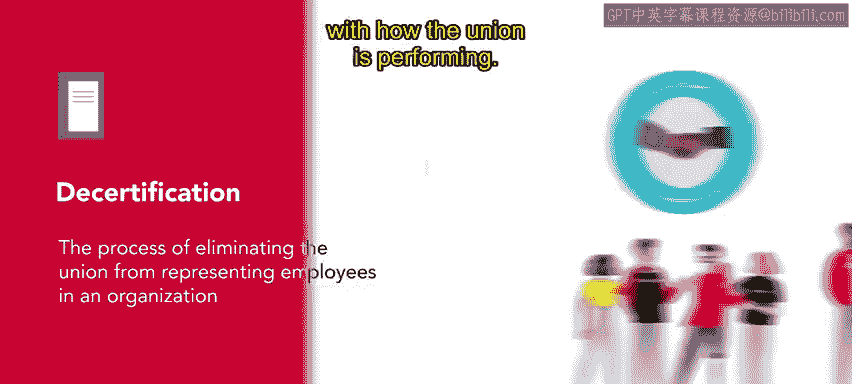
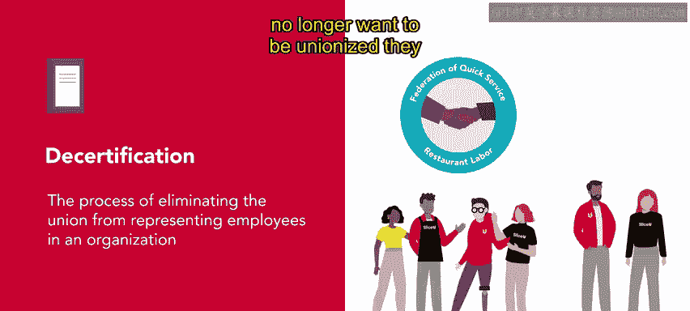
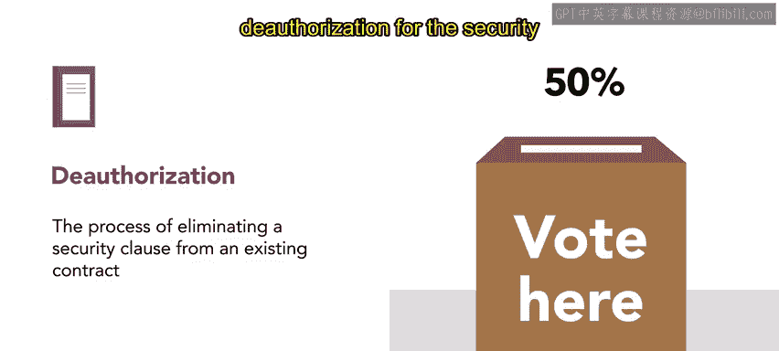
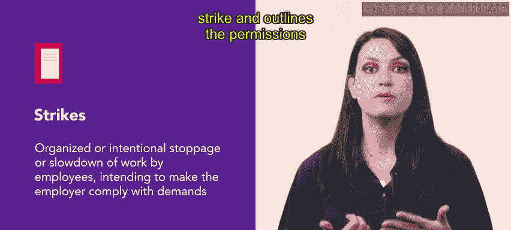

# 115：工会类型 🏛️

在本节课中，我们将要学习工会的四种主要类型，以及员工如何通过特定程序改变或终止工会代表权。我们还将了解与工会相关的关键概念，如“黄狗合同”和罢工。

---

## 工会的四种类型

上一节我们介绍了工会与劳资关系的基础知识，核心是必须平等对待所有员工，无论他们是否加入工会。本节中，我们来看看工会的四种主要类型。

以下是四种工会类型的定义：

*   **地方工会**：这种工会代表单一组织或一组组织内的员工。其活动范围通常是地方性的，例如在一个城市或城镇内。
*   **全国工会**：这种工会代表全美范围内的员工，由多个参与其中的地方工会组成。
*   **工会联合会**：这种工会由代表相关行业员工的多个全国性工会集合而成。
*   **国际工会**：这种工会代表多个国家的员工。

---

## 工会的去认证与授权撤销

如果员工对工会的表现不满意，例如工会未能代表员工的意见或诉求，员工希望由其他工会代表，或者员工不再希望有工会代表，他们可以启动特定程序。

以下是员工可以采取的两种主要程序：

1.  **去认证**
    *   **条件**：工会获得认证并运行至少12个月后。
    *   **流程**：
        *   首先，获得至少**30%** 员工的请愿签名。
        *   随后，由国家劳资关系委员会进行审查。
        *   NLRB将组织投票。如果至少**50%** 的员工投票支持去认证，则该工会将不再代表该组织的员工。

2.  **授权撤销**
    *   **定义**：这是一项决定是否从现有合同中保留或移除**工会保障条款**的选举。
    *   **工会保障条款**：该条款要求所有员工必须是工会成员，或至少为工会通过集体谈判代表他们而支付费用。它通常在合同谈判期间由工会协商达成。
    *   **流程**：与去认证类似，至少需要**30%** 的员工投票支持才能将撤销事宜提交给NLRB。此后，至少需要**50%** 的员工投票支持撤销，该保障条款才会被视为无效。授权撤销选举在合同有效期内任何时间点都可以进行。

**重要提示**：雇主，包括人力资源专员和管理者，**不得**参与去认证或授权撤销过程。这样做可能使组织面临不公平劳动行为指控的风险。

---

## 相关概念：黄狗合同与罢工

除了工会类型和程序，还有两个重要的相关概念需要了解。

*   **黄狗合同**
    *   根据康奈尔法学院的定义，这是一种员工同意不加入工会或不参与工会活动的协议。这类协议存在于雇主和员工之间，常作为雇佣的前提条件。
    *   **关键点**：必须理解，这类合同是**非法**的，被视为有害公共福利。《诺里斯-拉瓜迪亚法案》赋予了工人组建工会而不受雇主干涉的权利。

*   **罢工**
    *   康奈尔法学院将罢工定义为：员工为了迫使雇主满足其要求而组织或故意进行的停工或怠工。例如，罢工工人可能寻求更高的薪酬、更好的福利或更安全的工作条件。
    *   **法律依据**：《国家劳资关系法》保护工人的罢工权，并规定了罢工的许可与限制。

---

## 总结 📝

本节课中我们一起学习了：
1.  工会的四种类型：**地方工会**、**全国工会**、**工会联合会**和**国际工会**。
2.  员工改变工会代表权的两种程序：**去认证**（更换或取消工会）和**授权撤销**（移除工会保障条款）。
3.  两个关键相关概念：非法的**黄狗合同**以及受法律保护的**罢工**权。

接下来，你将学习关于法律法规以及薪酬福利的内容。