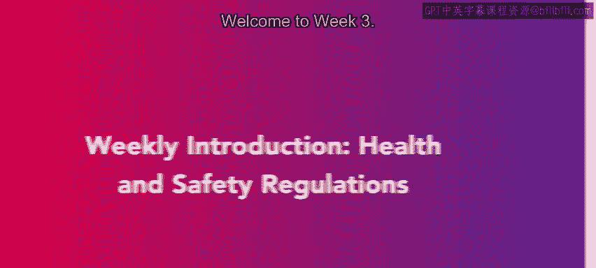
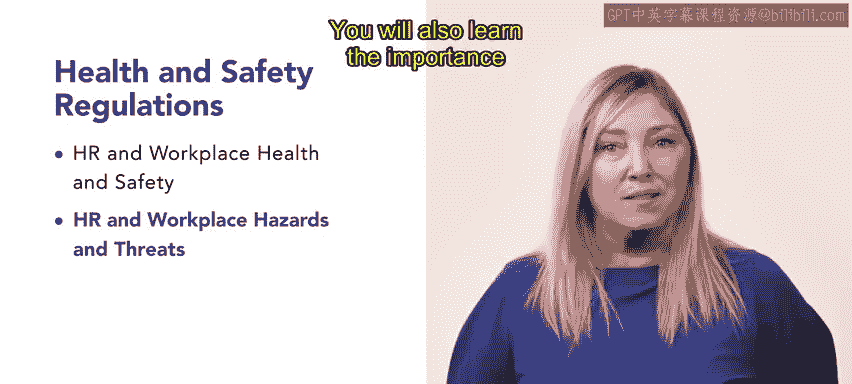

# 118：健康与安全法规

在本节课中，我们将要学习工作场所的健康与安全法规。我们将了解相关管理机构、常见的安全与健康问题，以及如何应对工作场所的骚扰行为。这些知识对于人力资源专业人员至关重要，有助于确保工作环境的安全与合规。

## 欢迎来到第三周

欢迎来到第三周。本周，你将学习工作场所的健康与安全法规。

## 人力资源与工作场所健康安全

在第一课“人力资源与工作场所健康安全”中，你将了解职业安全与健康管理局，即 **OSHA**。

我们将讨论OSHA的法规与调查。我们还将探讨作为人力资源团队成员可能需要处理的常见工作场所安全、健康和行为问题。

## 工作场所的健康与安全法规

上一节我们介绍了OSHA，本节中我们来看看工作场所的健康与安全法规。

这包括工作场所的危险与威胁，以及人力资源专业人员为保障安全与健康应制定的相关计划。

你还将学习保密与隐私的重要性。

以下是本部分涉及的核心概念：
*   **工作场所危险**：指可能导致伤害或疾病的物理或环境因素。
*   **安全计划**：指为预防事故和伤害而制定的系统性措施。

## 工作场所的骚扰

在最后一课“工作场所的骚扰”中，我们将重点关注工作场所的性骚扰。

你将了解不同类型的骚扰、各种预防方法，以及如何调查性骚扰投诉。

以下是处理骚扰问题的关键步骤：
1.  **制定明确政策**：建立并传达关于禁止骚扰的公司政策。
2.  **提供培训**：对全体员工进行预防骚扰的培训。
3.  **建立报告机制**：设立保密、安全的投诉渠道。
4.  **及时调查**：对所有投诉进行迅速、公正、彻底的调查。
5.  **采取适当行动**：根据调查结果，对违规者采取相应的纪律处分。

本周内容涵盖了你作为人力资源专业人员可能遇到的一些严肃问题。围绕这些问题有许多你需要熟悉的法规。

本节课中我们一起学习了工作场所健康与安全的核心法规框架，包括OSHA的作用、如何识别与管理工作场所危险，以及处理性骚扰投诉的标准流程。掌握这些内容对于维护安全、合规的工作环境至关重要。