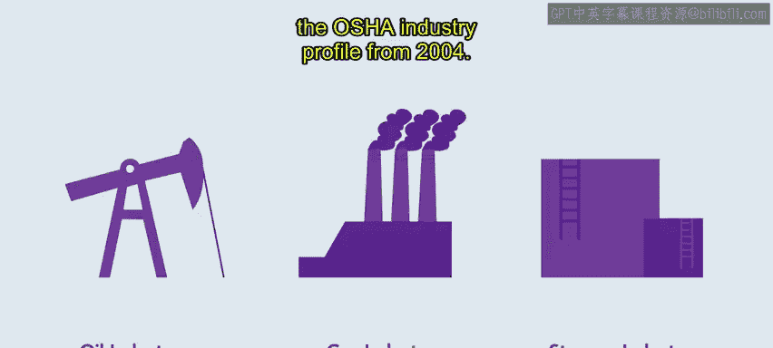
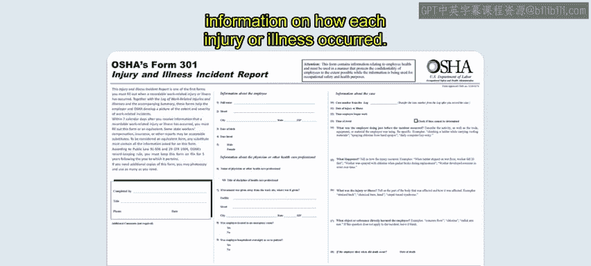
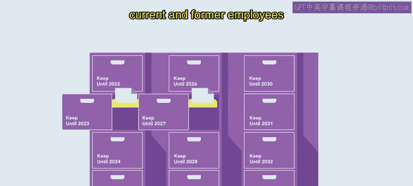

# 120：37_职业安全与健康管理局（OSHA）🏢

在本节课中，我们将学习美国职业安全与健康管理局（OSHA）的相关知识。我们将了解OSHA的设立目的、工作场所的潜在危险、常见的违规行为，以及雇主如何记录和报告事故。通过学习，您将对OSHA的职责、法规和流程有一个全面的认识。

## OSHA概述与使命 🎯

上一节我们介绍了本节课的学习目标，本节中我们来看看OSHA是什么。

职业安全与健康管理局是美国劳工部下属的一个重要机构。其主要目标是在联邦层面执行健康与安全法规，并与雇员和雇主合作。OSHA成立于1971年，自成立以来，已使与工作相关的死亡人数减少了**60%**，与工作相关的伤害减少了**40%**。

OSHA为雇主提供有价值的帮助，以实现法规合规。他们提供资源、海报和各种工具，以支持组织创建安全的工作环境，例如安全指南、培训材料或在线课程。

此外，OSHA还实施了“举报人保护计划”，以保护那些帮助识别员工健康和安全违规行为的雇员免遭报复或解雇。

大多数组织都受OSHA标准的约束并接受检查。然而，特定的低风险组织，或雇员人数在**10人及以下**的组织，可能豁免于OSHA的要求。

OSHA致力于教育雇员和雇主遵守行业要求和标准，特别是在石油和天然气、服务和存储行业。

## 工作场所潜在危险 ⚠️

了解了OSHA的基本情况后，本节中我们来探讨工作场所中可能存在的几种潜在危险及其来源。以下是基于OSHA行业概况（2004年）概述的几种潜在危险：

*   **被撞击危险**：指在工作场所被各种物体撞击的风险。例如，坠落或移动的管道、钳子、旋转链条以及可能在工作时撞击员工的高压软管连接故障。
*   **被夹住危险**：指员工或其衣物被机器或设备夹住的情况。例如，衣领、钳子和旋转链条缠住衣物，以及转盘或钻柱的风险。
*   **火灾、爆炸、高压释放危险**：指工作场所发生火灾、爆炸或高压释放的可能性。例如，井喷、钻井或抽汲作业释放的气体，如果在地表未得到控制，可能会被点燃。

## 常见OSHA违规行为 🚫

上一节我们介绍了工作场所的几种危险，本节中我们来看看雇主需要注意的几种常见OSHA违规行为。

以下是几种常见的违规情况：

*   **未使用个人防护装备**：组织必须确保员工使用提供的防护装备，即使员工觉得不舒服。强制执行其使用是雇主的责任。
*   **消防设备维护不当**：在小型企业中，必须确保灭火器已充装，其他消防和逃生设备就位。
*   **危险材料记录不完整**：处理危险材料的组织必须依法保持细致的记录。
*   **因便利造成危险**：许多OSHA违规并非有意为之，而是由于物品未妥善处理，或设备和家具因图方便而被移动到危险位置造成的。

## 事故记录与报告流程 📋

现在我们已经探讨了OSHA识别的潜在危险和常见违规，接下来让我们讨论当发生伤害或疾病时，雇主应遵循的流程。

OSHA的记录保存要求规定，雇员人数超过**10人**的雇主必须记录严重的与工作相关的伤害和疾病。例如，如果员工在工作场所火灾中受伤，需要超出急救范围的医疗护理，雇主必须记录该事件。

如果员工在工作中死亡，雇主必须在**8小时**内通知OSHA。如果员工因与工作相关的伤害、截肢或失明而住院，雇主必须在**24小时**内通知OSHA。

要报告此类事件，请联系最近的OSHA办公室或热线，或在线报告事件。在报告过程中，您必须提供重要细节，包括：企业名称、员工姓名、事件发生地点和时间、联系人以及有效电话号码。

## OSHA记录表格详解 📝

上一节我们介绍了事故报告的基本流程，本节中我们来看看记录工作相关伤害和疾病的具体表格。

记录工作相关伤害和疾病有三种表格：**表格300**、**表格300A**和**表格301**。

以下是每种表格的用途：

*   **表格300（工作相关伤害和疾病日志）**：雇主必须使用此表格记录工作场所所有需要报告的伤害或疾病。
*   **表格300A（工作相关伤害和疾病摘要）**：雇主必须每年填写并认证此表格。该表格是对整个日历年内工作场所发生事件的全面总结，应由公司高管认证。表格完成后，必须与其他通知一起在工作场所张贴**三个月**，从**2月1日**到**4月30日**。
*   **表格301（伤害和疾病事件报告）**：雇主使用此表格记录每次伤害或疾病是如何发生的详细信息。

人力资源专业人员需要知道的另一件事是，雇主应将这些记录保存多久。雇主有责任在现场将记录保存至少**五年**。

除了保存和张贴这些记录外，雇主还必须在收到请求时，向当前和前任员工或其代表提供副本。

## 总结 📚

本节课中我们一起学习了美国职业安全与健康管理局（OSHA）的核心知识。我们了解了OSHA的使命是减少工作场所伤害，探讨了被撞击、被夹住、火灾爆炸等潜在危险，并列举了未使用防护装备、消防设备维护不当等常见违规行为。我们还详细学习了事故报告的时间要求（死亡8小时内，住院24小时内）以及必须填写的三种记录表格（300、300A、301），并明确了记录需保存至少五年。

通过理解潜在危险、常见违规以及合规的重要性，雇主可以创造更安全的工作环境，保护员工免受伤害。请记住，每个人都有责任优先考虑工作场所的职业安全与健康。