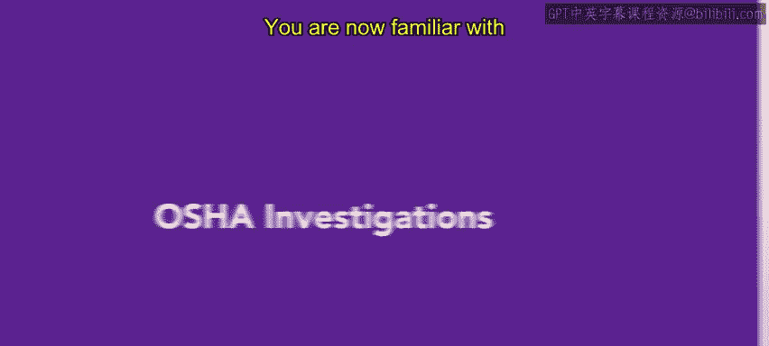
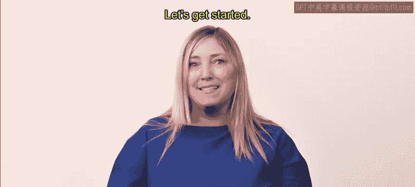
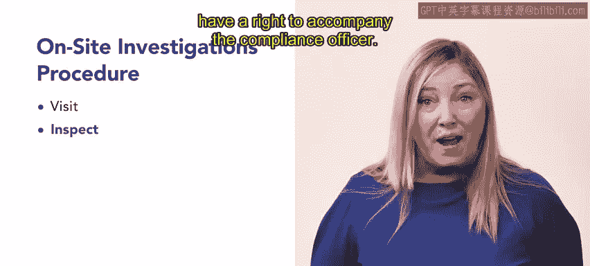
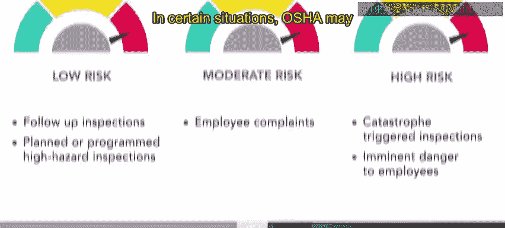
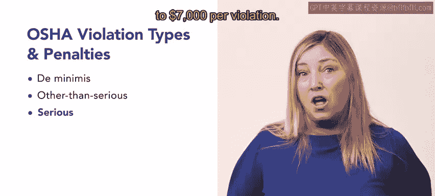
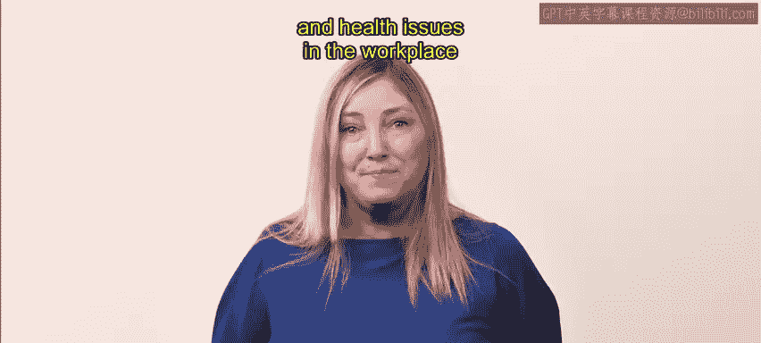

# 122：39_OSHA调查

## 📚 课程概述

在本节课中，我们将学习美国职业安全与健康管理局（OSHA）的调查流程。我们将了解现场与非现场调查的具体步骤，并详细解析OSHA定义的六种违规类型及其对应的处罚措施。

---

## 🏢 OSHA现场调查流程

上一节我们介绍了OSHA的基本职能，本节中我们来看看OSHA如何进行现场调查。

当OSHA认为有必要对特定工作场所的状况进行调查时，就会启动现场调查。这些调查遵循特定的程序。

以下是现场调查的标准步骤：

1.  **出示证件与通知**：合规安全与健康官员（CSHO）抵达工作场所，并告知相关负责人调查即将开始。
2.  **雇主核实**：雇主可以核实合规官员的证件、调查范围及原因。
3.  **现场检查**：合规官员在管理层代表和一名员工的陪同下检查工作场所。
4.  **告知违规情况**：检查过程中，合规官员会告知发现的任何违规行为。

需要注意的是，由于合规官员数量有限，员工没有权利全程陪同检查。因此，OSHA会优先调查风险最高的工作场所。

那么，OSHA如何确定哪些场所风险最高呢？

---

## 🎯 OSHA调查的优先级

OSHA根据五个重要性级别来确定调查的优先顺序。

以下是调查优先级的五个级别，从低到高排列：

*   **最低优先级：后续检查**。在发现违规行为后，合规官员会进行后续检查，以核实雇主是否已采取措施消除违规并符合相关法规和标准。
*   **较低优先级：计划性或程序性高危检查**。对于涉及危险行业或活动的常规工作场所进行的例行检查。
*   **中等优先级：员工投诉引发的检查**。因员工投诉而启动的检查。
*   **最高优先级：灾难或紧急危险引发的检查**。发生灾难或存在对雇员的紧迫危险时启动的检查。**灾难**的定义是导致三名或以上员工住院，或一名及以上员工死亡的事件。

---

## 📞 OSHA非现场调查

在某些情况下，OSHA可能会放弃现场调查，转而进行非现场调查。

合规官员通过电话进行非现场调查。在非现场调查中，合规官员会告知雇主正在调查的违规类型。雇主最多有五天时间以书面形式（通过邮件或传真）说明将如何解决这些违规问题。

以下是可能进行非现场调查的条件：

*   违规行为没有迹象表明员工处于危险之中。
*   工作场所未被认定为高风险行业。
*   雇主没有违规历史。
*   雇主过去遵守了OSHA的要求。

---

## ⚖️ 违规类型与处罚

目前，OSHA调查六种不同类型的违规行为。我们来逐一回顾每种类型及其相应的处罚。

以下是六种违规类型及其处罚：

1.  **微小违规**：当标准被违反，但该违规目前不影响员工的健康或安全时发生。雇主会被告知，但不会收到传票。
2.  **非严重违规**：当违反的标准确实影响员工的健康和安全，但危害并不紧迫时发生。处罚是向组织发出传票，并可能被要求支付**每项违规最高7，000美元**的罚款。
3.  **严重违规**：当存在员工即将受到伤害或死亡的紧迫风险时发生。雇主将因违规被传票，并可能被要求支付**每项违规最高7，000美元**的罚款。
4.  **未能整改违规**：如果雇主在先前OSHA调查确定的整改日期后继续违反标准，则会发出此违规通知。雇主将被传票，并可能被要求在整改日期之后**每天支付最高7，000美元**的罚款。
5.  **重复违规**：在OSHA调查后，雇主再次违反相同或类似标准时发生。雇主将被传票，并可能被要求支付**每项违规最高70，000美元**的罚款。
6.  **故意违规**：当雇主故意忽视或违反OSHA标准时发生。雇主将被传票，并被要求支付**5，000至70，000美元**的罚款。

如果违规导致员工死亡，雇主可能面临额外的处罚和监禁。

---

## 📝 课程总结

本节课中，我们一起学习了OSHA为确保工作场所合规而进行的现场与非现场调查流程。我们了解到，违规行为可能导致从微小违规到故意违规等不同严重程度的传票和罚款，处罚力度逐级递增。

接下来，我们将深入探讨工作场所中的安全与健康问题。