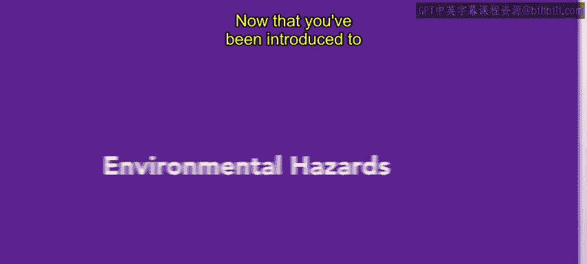
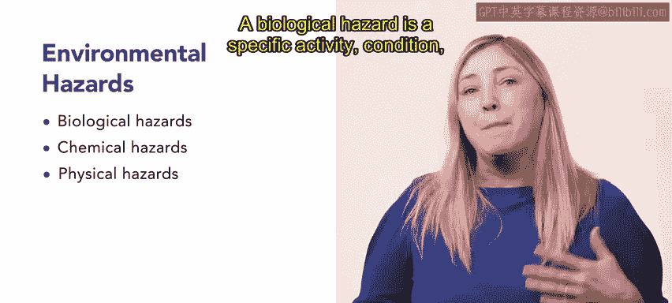
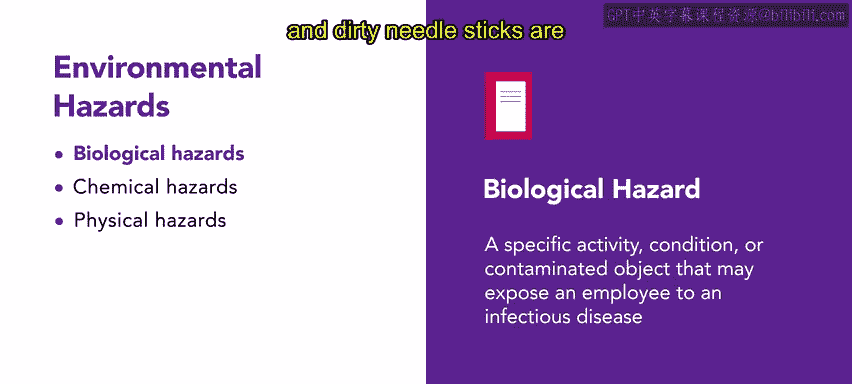
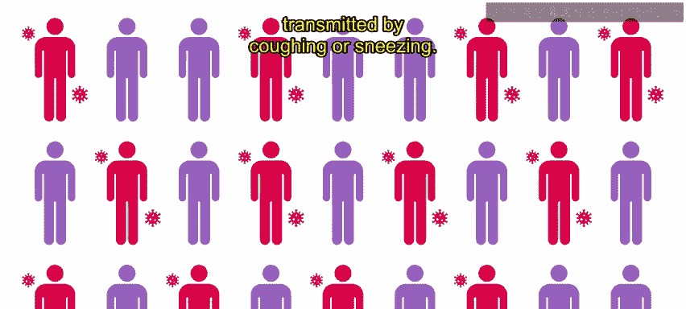
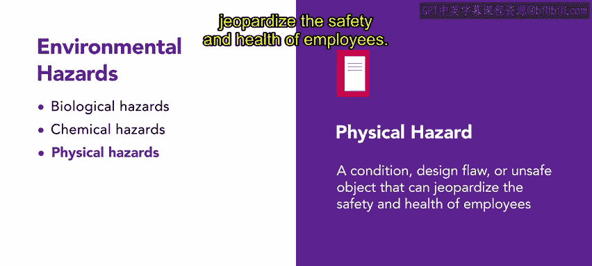
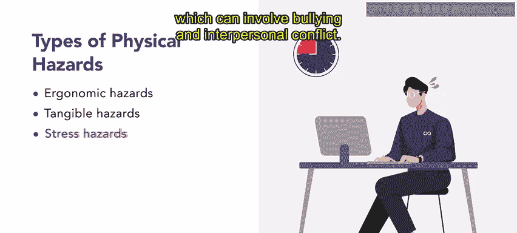
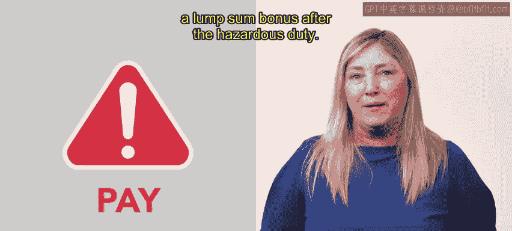
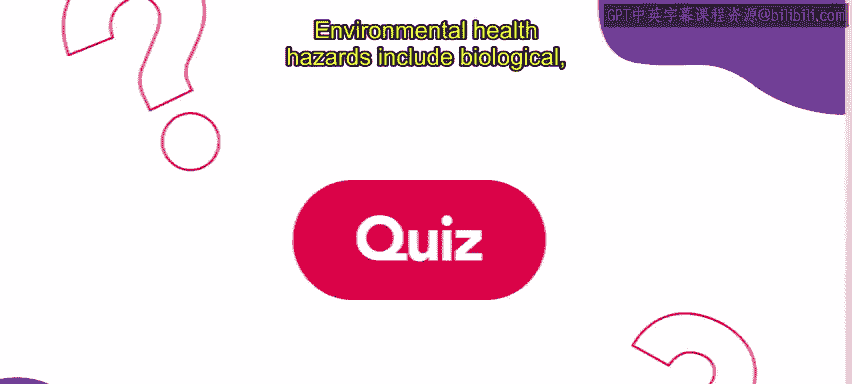

# 127：44_环境危害

在本节课中，我们将要学习工作场所中的环境健康危害。我们将了解这些危害的主要类型、具体例子以及它们对员工健康的影响。

上一节我们介绍了人力资源在工作场所健康与安全中的角色，本节中我们来看看人力资源专业人员应了解的工作场所危害与威胁。之前，您已经了解了根据OSHA标准可能在工作场所出现的不同健康与安全问题，例如“被撞击”和火灾爆炸等危害。本视频将探讨另一种工作场所危害：环境健康危害。

😊

**环境健康危害**是指存在于员工工作环境中、可能对员工健康产生负面影响的一切事物。

环境危害主要有三种类型：**生物危害**、**化学危害**和**物理危害**。我们来逐一讨论。

以下是生物危害的定义与例子。

*   **生物危害**：指可能使员工暴露于传染病的特定活动、状况或被污染的物品。
*   例子包括：受污染的食物和不卫生的条件、被污染的针头刺伤。
*   员工最常接触的传染病包括：
    *   **HV（乙型肝炎）**：一种肝脏疾病，通常通过被污染的针头或不当处理体液传播。
    *   **HIV（人类免疫缺陷病毒）**：导致艾滋病，可通过被污染的针头或不当处理体液传播。
    *   **TB（肺结核）**：一种肺部疾病，通常通过咳嗽或打喷嚏传播。

接下来，我们看看化学危害。

*   **化学危害**：指员工经常处理或存在于工作环境中、可能导致疾病或死亡的物质。
*   例子包括：有毒化学品、放射性材料、爆炸物，以及致病污染物（如煤尘）。

最后，我们来了解物理危害。

*   **物理危害**：指可能危及员工安全和健康的状况、设计缺陷或不安全的物体。

以下是三种主要的物理危害类型。

*   **人体工程学危害**：由重复或不自然的动作引起，可能导致肌肉骨骼损伤或腕管综合症等状况。
*   **有形危害**：涉及可能导致工作场所事故或其他安全隐患的不安全物体、状况或程序。例子包括：无防护装置的机械、湿滑的地板、不足的安全规程。
*   **压力危害**：源于极度的情绪或身体压力，可能导致焦虑、恐慌发作、精疲力竭和心脏问题。例子包括：长时间或不可预测的工作时间、紧迫的截止日期、员工之间的紧张关系（可能涉及欺凌和人际冲突）。

正如您在本课程前面所学到的，**危险津贴**用于补偿员工在工作中遇到的生理和心理风险。危险津贴通常是一种额外的小时费率，尽管有些雇主会在危险任务完成后支付一笔一次性奖金。

本节课中我们一起学习了工作场所中的环境健康危害。环境健康危害包括生物、化学和物理风险。识别并应对这些危害有助于确保安全的工作环境，并促进员工福祉。

