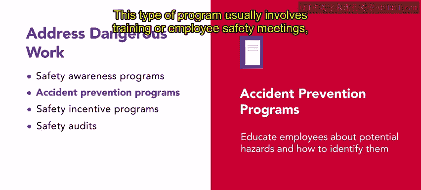
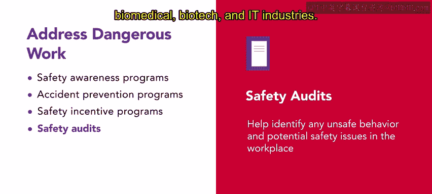

# 128：安全运动与计划

## 概述
在本节课中，我们将要学习人力资源部门为保障员工安全、营造安全工作环境而实施的各种安全运动与计划。我们将探讨不同类型的项目，并了解管理者在其中扮演的关键角色。

---

确保员工安全对任何组织都至关重要，安全运动和计划在实现这一目标中发挥着关键作用。本视频将探讨人力资源部门为促进安全工作环境而实施的不同安全举措。

《职业安全与健康法案》要求组织就工作场所中的任何危险材料以及如何确保其安全提供培训。无论培训是虚拟进行还是在教室进行，组织都必须教育员工了解危险，以及如何避免因接触危险材料或情况而受伤或患病。

除了强制性的培训计划，组织还可以考虑实施安全认知计划、事故预防计划、安全激励计划和安全审计，以应对潜在的危险工作。

让我们逐一讨论这些计划，以及管理者在这些实践中的角色。

### 安全认知运动
安全认知运动对于提高员工对现有和潜在危险的意识至关重要。该计划使用各种沟通工具，如海报、出版物、影片、公告、小册子、通讯和展示，来吸引并告知个人有关工作场所的安全实践和潜在风险。

### 事故预防计划
事故预防计划教育员工了解潜在危险以及如何识别它们。这包括如何以及何时报告潜在危险和伤害、在紧急情况下该做什么、急救箱的位置、如何离开工作场所以及防护设备的正确使用和保养。

这种类型的计划通常涉及培训或员工安全会议，以及书面工作辅助工具，这些工具可作为紧急情况下该做什么的即时提醒。

### 安全激励计划
组织可以选择实施安全激励计划。一个有效的计划将奖励与安全相关的行为，例如报告安全违规行为、提出安全建议、预防不安全情况以及鼓励员工自愿加入安全委员会。其目标是教育员工保持健康和安全，并鼓励他们经常思考安全问题。

### 安全审计
确保工作场所安全的另一种方法是进行自愿性安全审计。这些审计有助于识别工作场所中的任何不安全行为和潜在安全问题。它们通常通过调查来评估合规性并发现任何问题。

组织将安全审计整合到现有的移动平台和可穿戴设备中，以使流程更高效。这种整合可以提醒员工休息或维护工具，特别是在制造、运输、物流、生物医学、生物技术和IT行业。

### 管理者的角色
组织可能实施这些计划，但谁来维护它们呢？这就是管理者参与的地方。他们应该以身作则，促进员工的健康和安全。管理者是确保组织达到并超越合规法规的关键。

为了促进安全和认知，管理者应实施各种部门计划，例如培训、定期检查、员工安全委员会以及寻求员工的反馈和观察。监控潜在危险并主动解决它们至关重要。

当员工提出健康或安全问题，管理者应认真倾听、处理投诉，并鼓励他们提出改进建议。让员工参与健康计划也是管理者优先考虑员工安全和福祉的有效策略。

通过实施健康和安全计划，管理者可以减少与病假、生产延误、工伤赔偿索赔、法律问题等相关的成本。

---

## 总结
本节课中，我们一起探讨了人力资源部门为确保安全工作环境可以实施的不同安全运动和计划。通过优先考虑安全并实施这些举措，组织可以教育员工、预防事故并创建安全文化。这些努力共同促成了一个更安全、更健康的工作场所。