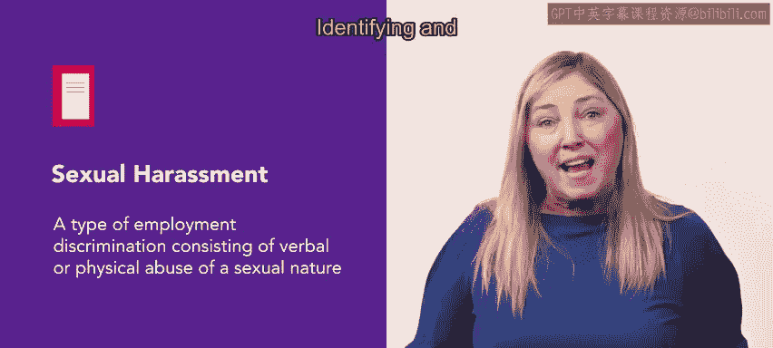
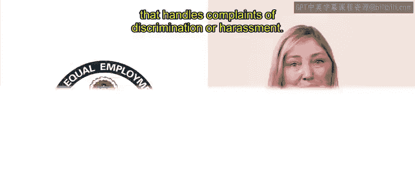
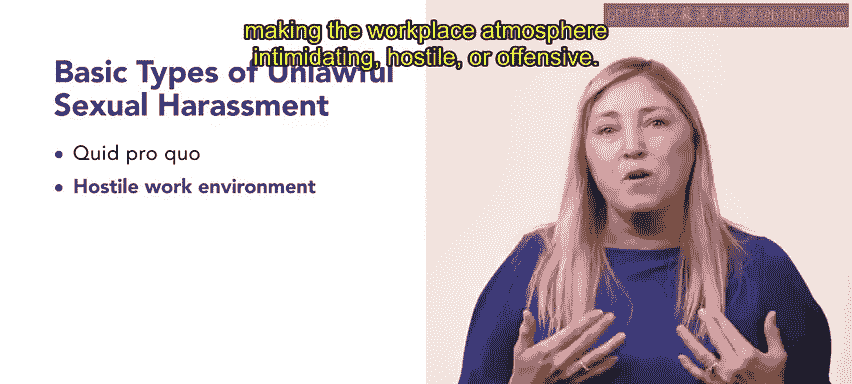
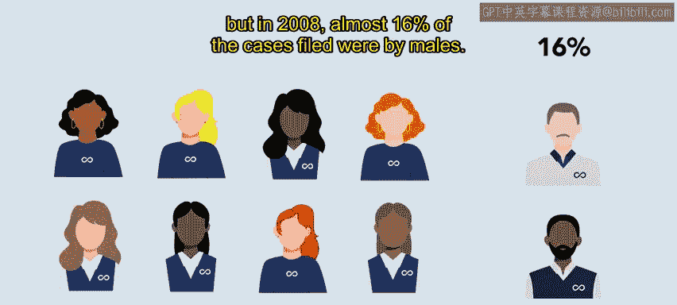

# 134：骚扰与敌意工作环境

在本节课中，我们将要学习工作场所中的骚扰问题，特别是性骚扰。我们将了解骚扰的定义、主要形式、法律依据，以及它与组织多元化和包容性工作的关系。

## 骚扰的定义与形式

上一节我们介绍了工作场所中的危害与威胁，本节中我们来看看一种特定的威胁形式——骚扰。

骚扰被定义为基于个人种族、宗教或性别的不受欢迎的行为。

骚扰可以表现为多种形式，其中最常见的一种是性骚扰。

## 性骚扰详解

性骚扰是一种就业歧视，包含具有性本质的言语或身体虐待。遗憾的是，性骚扰是组织内部可能发生的问题。

《民权法案》中的条款保护员工免受性骚扰。当处理性骚扰的工作场所程序失效时，州和联邦机构会保护并强制执行个人的权利。识别和调查此类骚扰是您在未来HR角色中需要掌握的一项技能。

美国平等就业机会委员会（EEOC）是处理歧视或骚扰投诉的联邦机构。EEOC将工作场所的性骚扰定义为不受欢迎的性挑逗、性好处请求，以及其他具有性本质的言语或身体行为。当这种行为明确或隐含地影响个人的就业、不合理地干扰个人的工作表现，或造成一种胁迫性、敌意性或冒犯性的工作环境时，即构成性骚扰。

以下是两种基本的非法性骚扰类型：

*   **交换条件性骚扰**：拉丁语“Quid pro quo”意为“以此换彼”。在这种骚扰中，一个有权威的人（通常是主管）以获取或保住工作利益为条件，向下属要求性好处。
*   **敌意工作环境性骚扰**：这种骚扰描述的是同事或主管从事不受欢迎的、带有性色彩的行为，使得工作场所氛围变得胁迫、敌对或冒犯。

工作场所的性骚扰最常见的是针对女性员工，但在2008年，近16%的投诉案件是由男性提起的。

## 骚扰的界定

并非工作场所中的所有示好都构成性骚扰。例如，一名员工邀请同事约会并不一定是骚扰行为。然而，如果同事表明对建立关系不感兴趣，而不受欢迎的示好行为仍在继续，那么该行为将构成工作场所性骚扰。

## 骚扰与多元化、包容性的关系

在关注骚扰、工作场所多元化和包容性时，常常存在重叠。乔什·伯森在《聚焦骚扰、工作场所多元化和包容性，新工具现已提供帮助》一文中写道：“我做过许多关于多元化与包容性（D&I）项目的研究，虽然教育和培训显然是重要的解决方案，但最有效的公司将包容性、多样性和公平性视为安全项目。换句话说，他们将每一次违规都视为可预防的事故，并建立衡量系统、追踪和培训来防止此类事故。”

在多元化、包容、无歧视和骚扰的工作场所中，安全是首要任务。以下是确保安全环境的关键要素：

*   员工必须感到可以安全地展现真实的自我。
*   来自代表性不足群体的员工必须感到可以安全地表达意见，尤其是当这些意见与多数群体员工的普遍意见相左时。
*   人们必须在身体和情感上感到安全，免受歧视和骚扰。
*   员工必须感到可以安全地报告工作场所中因歧视和骚扰而产生的违规行为。

## 总结

本节课中我们一起学习了工作场所骚扰，特别是性骚扰的核心概念。我们明确了骚扰的定义，区分了**交换条件性骚扰（Quid pro quo）**和**敌意工作环境骚扰（Hostile work environment）**这两种主要非法类型，并探讨了骚扰行为与多元化、包容性工作环境建设之间的关系。理解这些内容是履行人力资源合规与员工关系职责的重要基础。