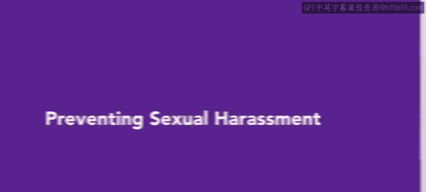
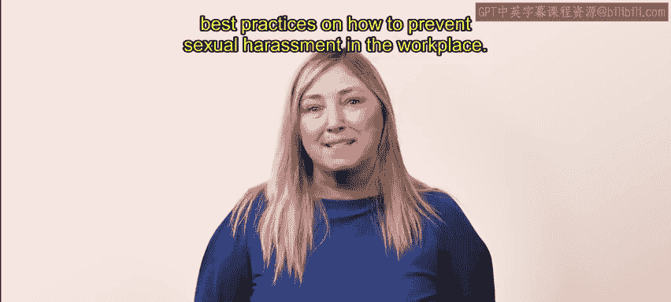
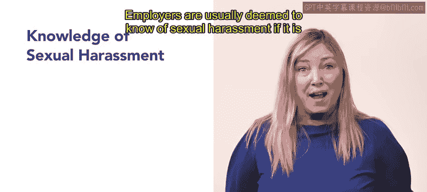
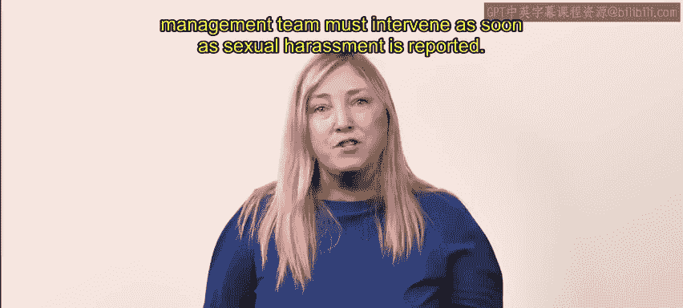
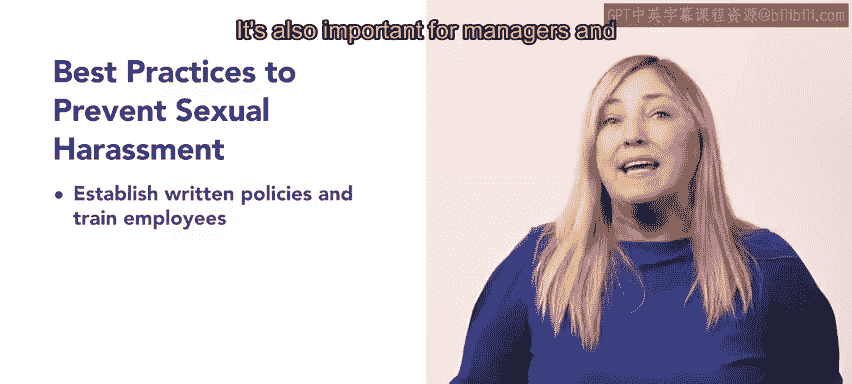
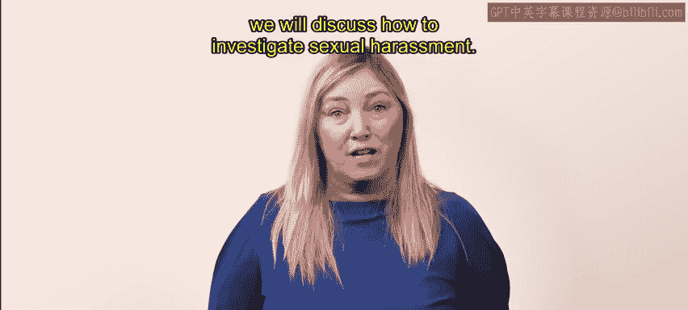

# 4-5：预防职场性骚扰 🛡️

在本节课中，我们将学习职场性骚扰的定义、雇主的责任，以及如何通过最佳实践来预防和处理性骚扰事件，以维护一个安全、专业的工作环境。

---

上一节我们探讨了职场中不同类型的骚扰及其示例。作为人力资源专业人士，这些情况都可能在你的职业生涯中遇到。本节中，我们将重点讨论性骚扰，以及如何在职场中预防性骚扰的最佳实践。

## 性骚扰的定义与雇主责任

美国平等就业机会委员会将性骚扰定义为：不受欢迎的性挑逗、性好处请求，以及其他具有性本质的言语或身体行为。

性骚扰可以是言语的或身体的，并可能造成一个**敌对的工作环境**。任何类型的职场性骚扰都不应被容忍。

雇主在以下情况下需承担责任：他们知晓存在敌对工作环境的性骚扰事件，但未采取行动。雇主可以通过在骚扰发生时立即采取行动来保护自己和公司，而不是等待员工提出投诉。通常，如果性骚扰在职场中公开进行、在员工中广为人知，或当受害者提出指控时雇主已获知，则视为雇主已知晓。

## 人力资源专业人士的角色

作为人力资源专业人士，你需要知道如何应对性骚扰，以避免惩罚并维持一个安全、受欢迎的环境。人力资源部门或管理团队必须在性骚扰被报告后立即介入。

法律体系认为，如果组织的领导层知晓或本应知晓性骚扰的存在却未能采取行动，则需对由此造成的敌对工作环境负责。处罚可能包括高额罚款。在**交换条件性骚扰**（quid pro quo）的情况下，雇主始终负有责任。

## 预防与应对性骚扰的最佳实践

以下是可用于预防和应对性骚扰的一些最佳实践。

首先，制定书面政策并培训员工识别、避免和预防性骚扰。这些政策也应涵盖技术使用方面。管理者和主管以身作则并进行干预同样重要。

他们应避免任何带有性暗示的行为，并制止任何明显冒犯的行为或报复。任何关于冒犯行为或性骚扰的投诉或报告都应被认真对待并迅速调查。

组织应设立指定的报告和调查流程，该流程既要促进与各方的沟通，也要保护他们的隐私。避免草率下结论至关重要，并需记录调查期间收集的所有信息。

除了这些最佳实践，人力资源专业人士还可以通过以下几个问题来评估职场中潜在的性骚扰风险。如果对以下任何一个问题的回答是“是”，那么权威人士应立即介入。

*   该行为是否违反了组织的骚扰政策，冒犯了目击者，或促成了敌对的工作环境？
*   发起者是否对另一名员工拥有权力，或者该行为是否使员工的工作变得不愉快？
*   是否存在敌对工作环境的视觉迹象，例如在工作场所张贴或分发带有性暗示的图片、电子邮件或其他通讯内容？

## 总结

本节课中，我们一起学习了职场性骚扰的明确定义与雇主的法律责任。我们了解到，人力资源部门的关键职责在于立即干预和建立有效的预防机制。核心措施包括：**制定明确的书面政策**、**实施全员培训**、**管理层以身作则**，以及**建立保密的报告与调查流程**。通过主动提出“该行为是否违反政策？”、“是否滥用权力？”、“环境是否被污染？”这三个关键问题，可以更有效地识别风险。下一节，我们将探讨当性骚扰事件确实发生时，应如何进行具体调查。