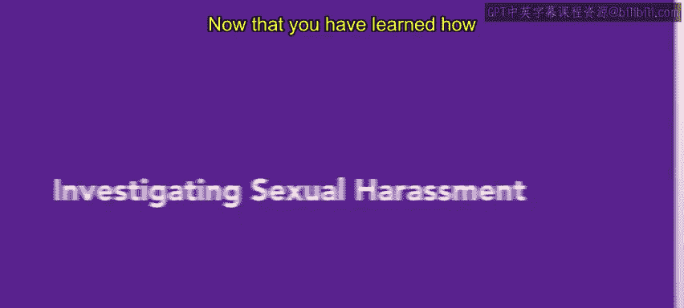
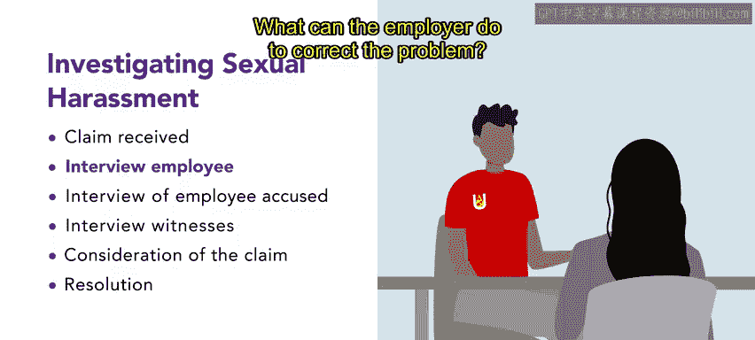

# 138：调查性骚扰指控

## 概述

在本节课中，我们将学习当组织内发生性骚扰指控时，应如何进行正式调查。了解并遵循正确的调查步骤对于维护职场安全、确保合规以及保护组织免受法律责任至关重要。

---

上一节我们介绍了如何预防性骚扰。本节中，我们来看看如果指控真的发生，应如何展开调查。

当组织制定了预防性骚扰的政策，但事件仍然发生时，就需要对指控进行调查和处理。组织对性骚扰事件负有法律责任，尤其是在知晓情况后未立即采取纠正措施的情况下。

管理者、主管或人力资源专业人员应遵循六个步骤来调查性骚扰案件。

以下是调查的六个核心步骤：

1.  **接收投诉**
    当人力资源经理被告知可能存在性骚扰的情况时，调查即开始。第一步是接收投诉，并初步评估指控的可信度。

2.  **与投诉员工面谈**
    人力资源经理应与提出投诉的员工进行面谈，通过一系列问题记录其对事件的陈述。

    面谈应涵盖的关键问题包括：
    *   投诉员工与涉嫌骚扰者之间是否存在任何关系？关系性质如何？
    *   是否有其他员工可能目睹或听闻了相关行为？
    *   是否有其他员工可能有过与涉嫌骚扰者类似的经历？
    *   每个事件是何时、何地发生的？
    *   如果投诉有延迟，为何没有更早报告事件？
    *   雇主可以采取什么措施来纠正问题？

3.  **与涉嫌骚扰者面谈**
    第三步，人力资源经理需面谈被指控性骚扰的员工。被指控者将被问及关于事件的一系列问题，人力资源经理必须认真记录其回答。应告知涉嫌骚扰的员工，不得与组织内其他员工讨论此事。

4.  **与证人面谈**
    接下来，人力资源经理将面谈任何可能目睹了性骚扰事件的其他员工。同样，在面谈任何证人时，人力资源经理必须记录他们的陈述和发现。

5.  **审查证据并做出判定**
    在第五步中，人力资源经理审查所有记录和证据，以判定投诉是否有效。经理可能得出以下结论之一：
    *   **有效**：即性骚扰确实发生。
    *   **无效**：即性骚扰并未发生。
    *   **无法定论**：调查未能得出明确结论。

    需要注意的是，人们对同一事件可能有不同的认知，在性骚扰指控中有时难以确定客观事实。

6.  **决定并执行解决方案**
    调查过程的最后一步是确定合适的解决方案。管理层将决定是否应采取纪律处分，包括口头警告、降职、停职或终止雇佣关系。

    如果投诉员工对结果不满意，他们可以向美国平等就业机会委员会（EEOC）提出投诉或提起诉讼。

---

**重要原则**：对任何提出性骚扰投诉的人进行报复是非法的，对帮助他人投诉或提供投诉信息的人进行报复同样违法。

## 总结

本节课中，我们一起学习了调查性骚扰指控的六个关键步骤：接收投诉、与投诉员工面谈、与涉嫌骚扰者面谈、与证人面谈、审查证据并做出判定、以及决定并执行解决方案。作为人力资源专业人士，掌握这一调查流程至关重要，因为在组织中很可能需要运用它。接下来，你将学习关于组织重组的知识。请继续保持良好的学习状态。