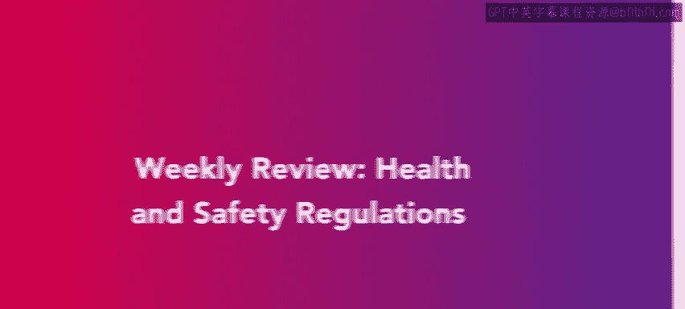
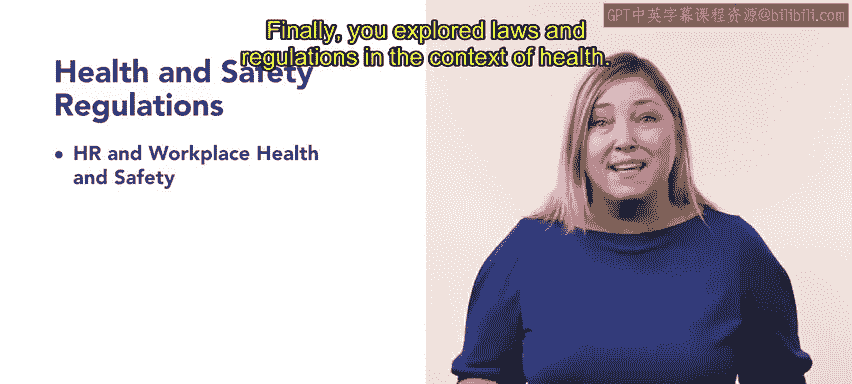

# 139：56_每周回顾：健康与安全重组

在本周的回顾中，我们将总结第三周课程的核心内容。本周我们重点学习了工作场所的健康与安全法规。接下来，我们将分三个部分回顾所学知识。

## 一部分：人力资源与工作场所健康安全法规

上一部分我们完成了课程介绍，本节中我们来看看人力资源在健康与安全方面的具体职责。

首先，我们探讨了人力资源与工作场所健康安全的关系。我们深入了解了**职业安全与健康管理局（OSHA）** 在确保工作场所安全方面的角色，学习了其标准、调查程序以及与健康安全风险管理相关的联邦法律。

此外，我们研究了工作场所中的安全与健康问题。以下是几个关键议题：

*   常见的员工行为问题。
*   酒精及合法药物使用对工作的影响。

最后，我们在健康背景下探讨了相关的法律与法规。

## 二部分：工作场所危害、威胁与骚扰

在了解了基础法规后，本节我们将关注具体的风险类型及其应对。

接下来，我们探讨了人力资源与工作场所的危害和威胁。涵盖的主题包括环境危害、安全计划、物理安全漏洞以及隐私保密性。我们获得了关于识别风险、实施安全措施、确保员工福祉和数据安全方面的宝贵见解。

最后，我们探讨了工作场所中的骚扰问题。我们学习了不同类型的骚扰，包括**交换条件骚扰（quid pro quo harassment）**，即用好处交换某种利益。我们还深入了解了预防性骚扰的最佳实践，以及调查此类事件所涉及的步骤。

## 总结与展望

本周关于健康与安全法规的回顾到此结束，我们涵盖了大量内容。

在接下来的第四周课程中，我们将学习人力资源在合规战略制定与实施中的角色。我们将探索最佳实践，使人力资源专业人员能够有效应对组织重组并确保持续运营。第四周旨在加深您对人力资源合规这些关键领域的理解和专业知识。

请为第四周的学习做好准备。