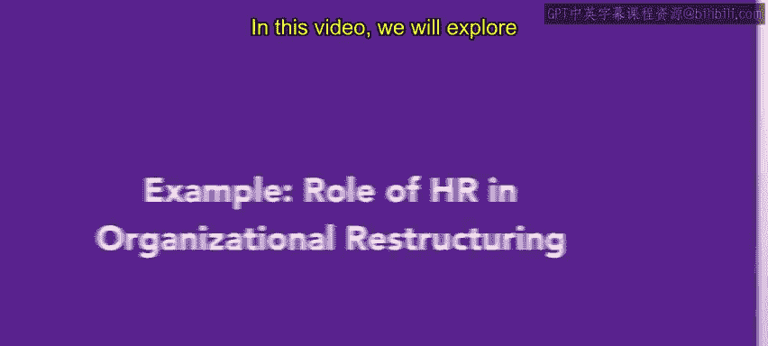
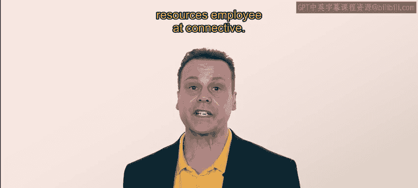
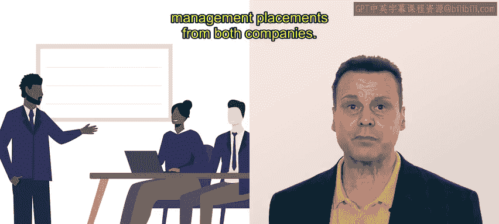
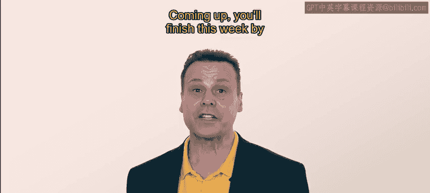

# 144：61_示例：人力资源在组织重组中的角色

在本节课中，我们将通过一个真实世界的示例，探讨人力资源在组织重组过程中所扮演的角色。我们将跟随人力资源专员亚历克斯，了解他在公司并购项目中的具体工作。

## 🏢 案例背景：Connective公司与Wire Grand公司

首先，我们来了解一下案例背景。Connective是一家现代化的通信组织，其业务是帮助企业保持互联互通。该公司专注于通过一系列软件工具（如视频会议和基于云的电话系统）帮助分布式团队进行协作。

Connective拥有一支庞大的完全远程办公的员工队伍。公司业务扩张迅速，新增了大量客户。在数字通信市场，虽然存在许多竞争对手，但Connective通过为客户提供个性化解决方案取得了成功。

然而，其竞争对手之一Wire Grand公司却未能取得同样的成功。Wire Grand公司规模增长非常迅速，急需支持其远程员工，但一直无法满足市场需求。该公司的客户服务沟通质量很差，导致客户正将业务转向Connective。

## 🤝 并购意向与人力资源的介入

基于上述情况，Connective的高管团队有意收购Wire Grand，以获取其员工、技术和品牌知名度。Connective的首席执行官与Wire Grand的首席执行官进行了一次富有成效的会议，后者透露了出售公司的意向。

随后，Connective邀请人力资源部门的亚历克斯来帮助确保此次收购顺利进行。

## 📊 人力资源在并购中的核心工作

亚历克斯在并购过程中开展了一系列关键工作，以下是具体步骤。

### 一步：绘制流程地图

首先，亚历克斯绘制了一张**流程地图**，用以识别Connective和Wire Grand两家公司的各个部门，并说明它们之间实际上是如何相互关联的。

这张流程地图向亚历克斯清晰地表明，两家公司在许多方面存在重叠，整合团队应该是相当直接的。然而，亚历克斯注意到，Wire Grand的客户服务团队规模远小于Connective的团队。

因此，亚历克斯建议在收购的同时推动招聘，以确保所有客户都能获得Connective闻名的高水平支持。

### 二步：研究管理层并提出建议

在绘制流程地图后，亚历克斯研究了Wire Grand的高管和管理团队。基于研究，他有信心就两家公司的董事会和管理层人员安排提出建议。

### 三步：分析并融合企业文化

最后，亚历克斯花费了大量时间了解Wire Grand的**工作文化**。他发现两家公司文化有相似之处，但Wire Grand在业务上采取一种更为随意、即兴解决问题的模式，这与Connective更缓慢、更审慎的做法存在冲突。

为此，亚历克斯起草了一套建议，旨在调和两种文化。目标是让新加入的Connective员工感到受欢迎，同时也让他们充分了解未来的日常运营将如何开展。

具体措施包括提供新培训，以及举办一系列非正式的“认识你”活动，让这个新的、更大的团队能够愉快地融合。

## ✅ 总结与展望

亚历克斯的研究和规划为两家公司成功完成收购做好了准备。

支持兼并与收购是您未来作为人力资源专业人员可能被要求执行的任务。在并购之前、期间和之后，都有大量的人力资源工作需要完成，人力资源团队可以为任何组织的重组带来巨大益处。

接下来，您将通过了解人力资源与业务连续性来结束本周的学习。