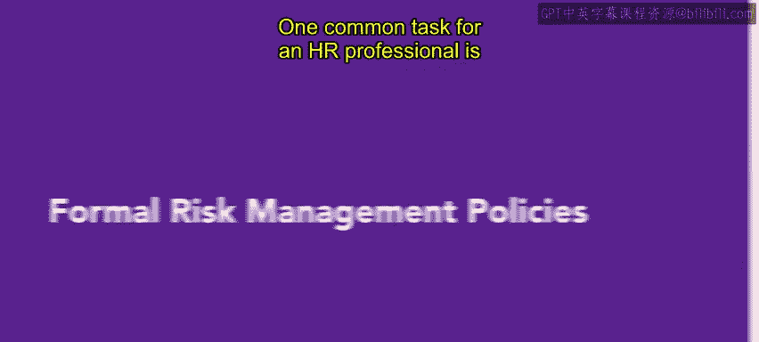
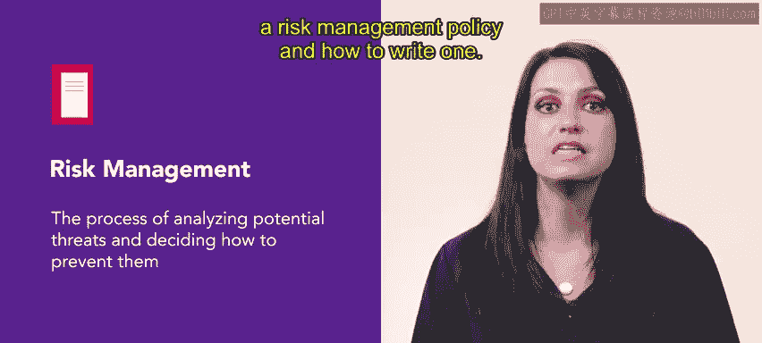
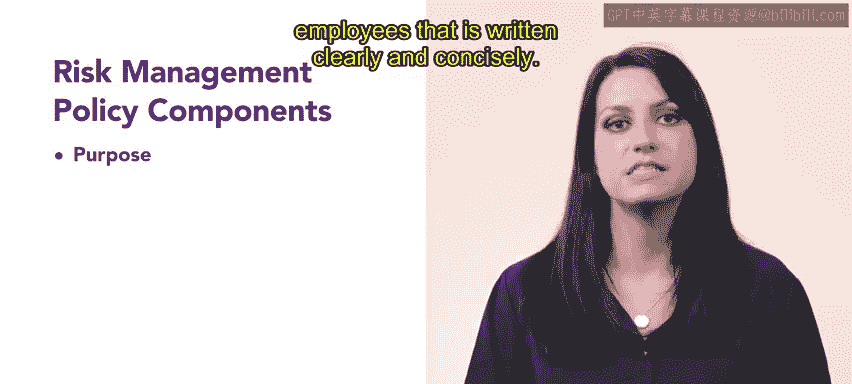
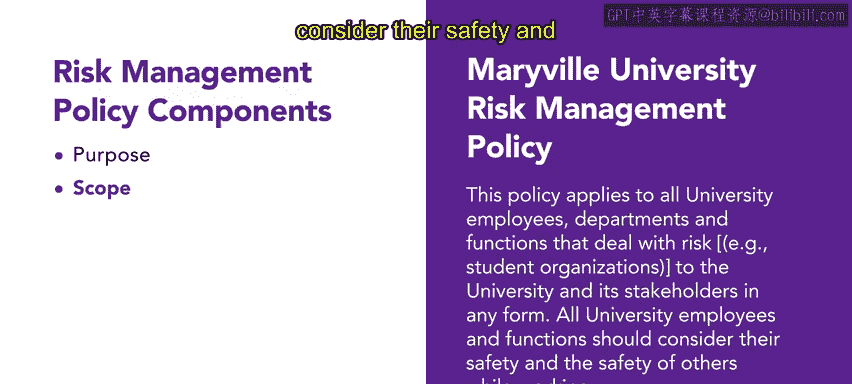
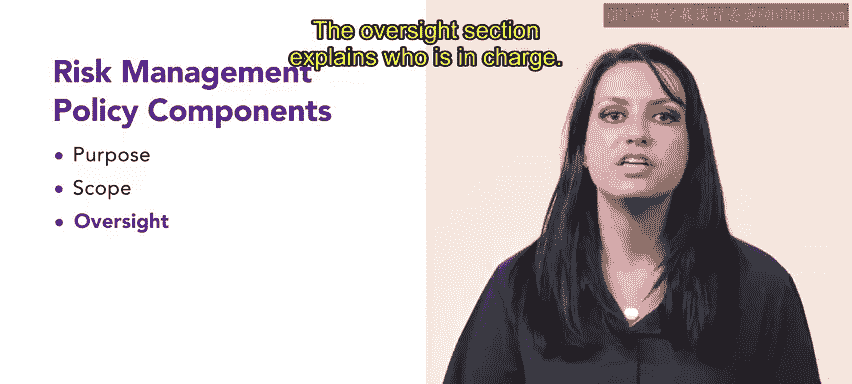
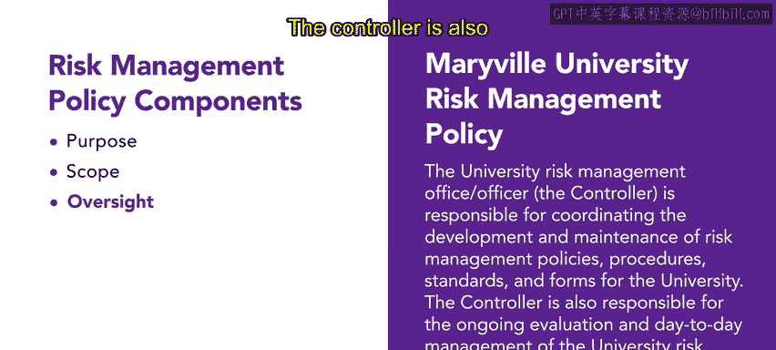
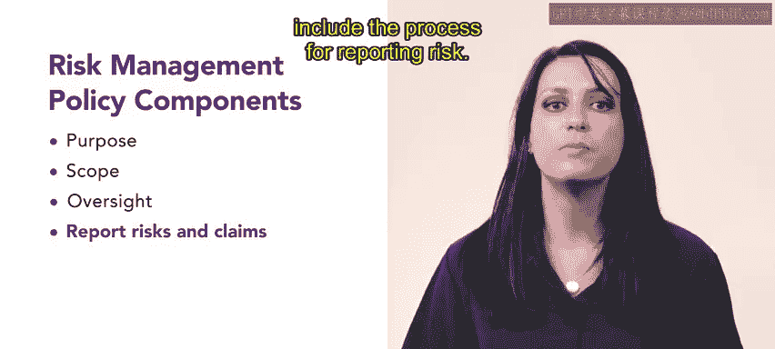

# 150：正式风险管理政策 📋

在本节课中，我们将学习风险管理的基本概念，并了解如何创建一份正式的书面风险管理政策。风险管理是人力资源专业人员的一项核心任务，旨在保护组织及其利益相关者。

## 什么是风险管理？🛡️

人力资源专业人员的一项常见任务是在工作场所解释和应用风险管理政策。风险管理是一个分析潜在威胁并决定如何预防这些威胁的过程。人力资源部门被要求执行多项任务以实现风险管理，这些任务包括：
*   促进员工健康与福祉。
*   保护组织资产免受损失和责任影响。
*   识别并遵守法律法规。
*   专注于预防对利益相关者的风险。

上一节我们介绍了风险管理的定义，本节中我们来看看如何通过制定政策来落实它。

## 风险管理政策的重要性 📄

虽然不可能完全消除组织中的所有风险，但拥有一份易于获取和理解的风险管理政策有助于降低风险发生的可能性。让我们回顾一个风险管理政策的例子，并学习如何撰写一份。

## 风险管理政策的组成部分 🧩

尽管各组织的风险政策各不相同，但其组成部分是相似的。一份风险管理政策通常应包含以下部分：
*   **目的**：阐述政策的目标。
*   **范围**：说明政策适用于谁。
*   **政策**：核心规定。
*   **目标**：希望达成的具体成果。
*   **业务规划**：如何将风险管理整合到运营中。
*   **程序与定义**：具体步骤和术语解释。

其他部分可以根据每个组织的具体情况进行定制和添加。一份政策可以短至一页，也可以长达50页。然而，重要的是要记住，政策越简短精炼，员工阅读的可能性就越大。

## 详解政策各部分 ✍️

以下我们来详细看看政策中几个关键部分应包含的内容。

### 目的部分

风险管理政策的“目的”部分应如其名，清晰陈述政策的目标。它应以清晰简洁的语言为员工提供基本信息。例如，玛丽维尔大学的风险管理政策包含一个目的部分。该部分着重说明了政策的意图，特别是：**本政策通过指定风险识别与分析、规划风险缓解措施以及概述计划管理与监督的职责，为正式的风险管理计划建立了框架。** 拥有这样一份政策，将这些信息明确告知组织中的每个人，是非常重要的。

### 范围部分

“范围”子类别是一个简短的声明，用于解释政策适用于哪些人以及他们的责任。例如，该政策声明：**本政策适用于所有大学员工、部门和职能，以处理任何形式下对大学及其利益相关者构成的风险（例如学生组织）。所有大学员工和职能在工作时都应考虑自身及他人的安全。**

### 监督与职责部分

风险管理政策中另一个重要的部分是明确谁对政策负有监督责任。任何风险管理政策都必须清晰定义管理风险的角色和职责。“监督”部分解释了谁是负责人。在这份政策中，**大学风险管理办公室/官员、财务总监负责协调大学风险管理政策、程序、标准和表格的制定与维护。** 财务总监还负责对大学风险管理计划进行持续评估和日常管理。

### 风险报告流程部分

风险管理政策还应包含风险报告流程。在这份政策中，**大学的每位员工和/或处理风险的大学职能都有责任及时向财务总监报告任何财产损失、潜在责任索赔、和/或潜在犯罪行为，或其他违规行为。** 政策接着会说明由谁负责调查任何索赔，以及应向谁提出索赔。

## 政策的适用性与总结 📝

每个组织对其风险管理政策都有不同的需求。上述政策是为大学设计的，但工厂、餐厅或日托中心都需要考虑不同的风险。即使风险和具体政策内容会变化，风险管理的基本目的——理解、缓解和报告风险——是相同的。

回顾一下，风险管理是一个评估和预防工作场所威胁的过程。组织应创建并分发一份风险管理政策。该政策应书写清晰、简洁，并且应便于所有员工获取。接下来，您将学习常见的风险管理政策。