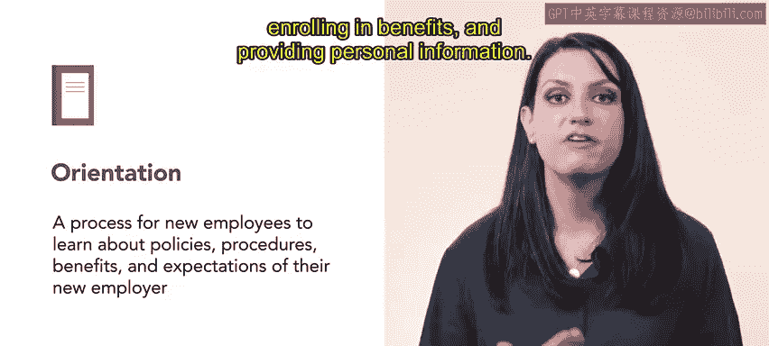

# 153：70_新员工入职

## 🎯 课程概述
在本节课中，我们将要学习如何在新员工入职过程中，有效地传达安全与风险管理政策。我们将探讨入职引导和融入计划的重要性，并了解如何通过这两个关键流程，确保新员工理解并重视组织的健康与安全文化。

---

## 📋 入职引导中的安全沟通
如果新员工入职时，仅仅收到一本员工手册，而没有任何解释或支持，这并非传达安全计划和程序的有效方式。在本节中，你将了解到在入职引导和融入过程中，与新员工沟通所有安全与风险管理政策的重要性。

---

## 🔄 入职引导的定义与作用
上一节我们提到了安全沟通的重要性，本节中我们来看看入职引导的具体内容。入职引导是一个让新员工了解新雇主的政策、程序、福利和期望的过程。入职引导通常在一两天内完成，包括设置工资单、打印员工ID、登记福利和提供个人信息等常规任务。然而，入职引导也是介绍安全与风险管理政策的绝佳时机。

---

## 🎓 引导期的培训目标
入职引导过程的众多目标之一，是完成组织、地方或联邦要求的培训。此时，组织也可以选择增加介绍性的健康与安全培训。让员工理解健康与安全在组织内受到高度重视至关重要，尤其是在制造业或建筑业等风险较高的行业。

以下是引导期培训的一个具体例子：
*   **案例**：在SliciceU公司，所有员工都必须在第一天完成基础食品与安全课程。这门课程通常耗时不到一小时，内容涵盖清洁卫生、食品处理和正确的烹饪温度等信息。

---

## 🚀 从引导到融入
上一节我们介绍了入职引导，本节中我们来看看与之相似的员工融入过程。员工融入是一个欢迎新招募人员加入组织的过程。如果执行得当，融入过程应是一个精心设计的方法，持续时间从一个月到一整年不等。

一个有效的融入计划应包括对组织程序（包括安全与风险管理）的简明介绍。一个积极且信息丰富的融入过程对于员工留任至关重要。

---

## 📚 融入期的深入培训
为了延续前面的例子，SliciceU公司的融入过程持续两个月。它涉及关于食品安全、厨房安全、急救、热病和客户服务等深入的虚拟培训，以及其他重要培训。

新员工还必须参加一项名为“保护餐饮业工人健康与安全指南”的OSHA培训。该培训使用一本工作手册，其中包含关于工人权利和常见工作安全隐患的信息，例如使用锋利工具、防止烧伤以及滑倒和坠落伤害等。

以下是SliciceU员工需要完成的工作手册内容：
*   **完成要求**：SliciceU员工必须完成整本工作手册，包括情景提示、检查清单和其他活动。

---

## ✅ 总结与最佳实践
在本节课中，我们一起学习了如何将风险管理实践通过健康与安全培训，整合到入职引导和融入两个过程中。这些培训可以是正式的，也可以是非正式的。总而言之，让新员工理解健康与安全是组织内的优先事项至关重要。