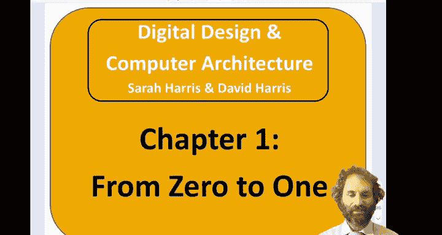
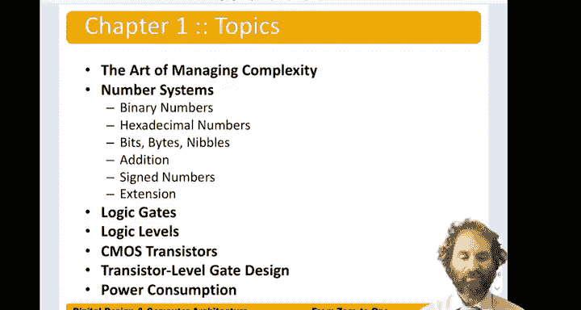

# 001：从0到1 🚀

在本章中，我们将学习如何仅使用0和1来表示和处理信息。我们将探讨数字系统的基础，包括二进制和十六进制数制、逻辑门以及构成现代计算机核心的晶体管。

---

## 概述 📋

数字设计的世界建立在两个简单的状态之上：0和1。本章的目标是理解如何用这两个数字构建复杂的系统。我们将从数字表示开始，逐步深入到实现这些表示的物理组件。

---

## 数字表示：二进制与十六进制 🔢

上一节我们介绍了数字设计的基础是0和1。本节中，我们来看看如何用它们来表示更大的数字。

二进制是基数为2的数制系统。这意味着每一位（称为一个比特）只能是0或1。一个二进制数的值是其各位乘以2的幂次的总和。例如，二进制数 `1011` 表示：

`1*2³ + 0*2² + 1*2¹ + 1*2⁰ = 8 + 0 + 2 + 1 = 11`

然而，书写长串的二进制数非常繁琐。为了简化，我们引入了十六进制（基数为16）作为一种简写方式。十六进制使用数字0-9和字母A-F（代表10-15）来表示数值。每4位二进制数可以直接转换为1位十六进制数。

以下是相关术语：
*   **比特**：一个二进制位，是信息的最小单位。
*   **半字节**：4个比特的组合。
*   **字节**：8个比特的组合，是计算机中常见的数据单位。

---

## 二进制运算与有符号数 ➕➖

现在我们已经能用0和1表示数字，本节中我们来看看如何对它们进行运算。

二进制加法遵循与十进制加法类似的规则，但逢2进1。例如：

`  1011 (11)`
`+ 0110 (6)`
`= 10001 (17)`

为了表示负数，计算机使用特定的编码方式。最常见的是**二进制补码**。在这种表示法中：
*   正数的表示与普通二进制相同。
*   负数的表示方法是：取其绝对值的二进制形式，**按位取反**，然后**加1**。
*   最高位（最左边的位）是符号位：0表示正数，1表示负数。

有时我们需要将一个数扩展到更多比特（例如从8位扩展到16位）。对于有符号数（补码），我们进行**符号扩展**：将符号位复制到所有新的高位。对于无符号数，我们进行**零扩展**：在所有新的高位填充0。

---

## 逻辑门：处理0和1的组件 ⚙️

数字系统不仅需要表示0和1，还需要对它们进行操作。逻辑门就是实现这些基本逻辑功能的电子组件。

逻辑门将输入的0和1（作为电信号）进行组合，根据其内部功能产生一个输出的0或1。最基本的逻辑门包括：
*   **与门**：仅当所有输入都为1时，输出才为1。公式：`Y = A · B`
*   **或门**：只要有一个输入为1，输出就为1。公式：`Y = A + B`
*   **非门**：将输入取反。如果输入是1，输出是0，反之亦然。公式：`Y = A'`

逻辑电平定义了电压范围到逻辑值（0和1）的映射。例如，在一个系统中，0V到0.8V可能被解释为逻辑0，2V到5V被解释为逻辑1。中间的电压区域是不确定状态，应避免。

---

## 晶体管：逻辑门的基石 🔌

逻辑门是抽象的构建块。在物理层面，它们是由晶体管构成的。本节我们将深入一层，看看这些基础开关是如何工作的。

最常用的数字晶体管类型是**CMOS晶体管**，特别是MOSFET。我们可以将其理想化为受电压控制的数字开关：
*   **NMOS晶体管**：当栅极电压为高（1）时，开关闭合（导通）；为低（0）时，开关断开。
*   **PMOS晶体管**：与NMOS行为相反，当栅极电压为低（0）时导通。

通过将NMOS和PMOS晶体管以互补的方式组合，我们可以构建出高效且功耗极低的逻辑门电路，例如CMOS反相器（非门）、与非门、或非门等。

---

## 数字系统的功耗 ⚡

构建数字系统时，功耗是一个关键考量因素。CMOS电路的主要功耗来源包括：
*   **动态功耗**：在逻辑状态切换（0->1或1->0）时，对电路中的电容进行充放电所消耗的能量。功耗与切换频率和电压的平方成正比。
*   **静态功耗**：即使电路处于空闲状态，由于晶体管微小的漏电流而产生的功耗。

降低功耗的技术包括降低供电电压、优化电路设计以减少不必要的切换活动，以及使用电源门控在模块空闲时完全关闭其电源。

---

## 总结 🎯

在本章中，我们一起学习了数字设计的基石。我们从最简单的0和1出发，探索了用二进制和十六进制表示数字的方法，学习了二进制运算和有符号数的补码表示。接着，我们了解了处理这些比特的逻辑门及其功能，并深入到物理层面，看到了CMOS晶体管如何作为开关来构建这些逻辑门。最后，我们讨论了数字系统中功耗的来源。理解这些从抽象到物理的基础概念，是掌握复杂数字系统设计的第一步。在后续课程中，我们将反复运用这些概念来构建更大型、更功能强大的系统。