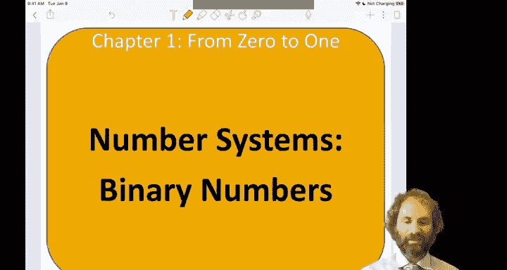
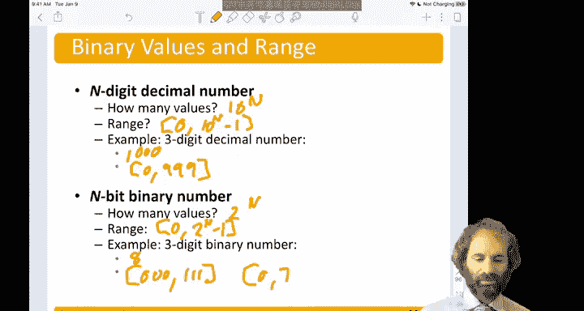

# 003：无符号二进制数 🔢

在本节中，我们将学习数字系统的基础，特别是无符号二进制数。我们将了解二进制数的表示方法、如何与十进制数相互转换，以及二进制数的表示范围。

---

我们习惯于使用十进制数，即基数为10的数制。在十进制中，每一位的权重是前一位的10倍。例如，数字 **5374₁₀** 表示：
*   千位：5 × 1000
*   百位：3 × 100
*   十位：7 × 10
*   个位：4 × 1
因此，其值为 5×1000 + 3×100 + 7×10 + 4×1 = 5374。

理解了十进制后，我们来看看二进制。二进制只使用两个数字：0和1。在二进制中，每一位的权重是前一位的2倍。例如，数字 **1101₂** 表示：
*   八位（2³）：1 × 8
*   四位（2²）：1 × 4
*   二位（2¹）：0 × 2
*   个位（2⁰）：1 × 1
因此，其值为 8 + 4 + 0 + 1 = **13₁₀**。

在二进制运算中，2的幂次方非常常用，熟记它们会很有帮助：
*   2⁰ = 1
*   2¹ = 2
*   2² = 4
*   2³ = 8
*   2⁴ = 16
*   2⁵ = 32
*   2⁶ = 64
*   2⁷ = 128
*   2⁸ = 256
*   2⁹ = 512
*   2¹⁰ = 1024

---

上一节我们介绍了二进制的基本概念，本节中我们来看看如何进行二进制与十进制之间的转换。

**从二进制转换到十进制**
转换方法是将每一位的值乘以其权重（2的幂次方），然后求和。
例如，将 **10011₂** 转换为十进制：
*   从右至左，权重分别为：1（2⁰）， 2（2¹）， 4（2²）， 8（2³）， 16（2⁴）。
*   计算：1×16 + 0×8 + 0×4 + 1×2 + 1×1 = 16 + 0 + 0 + 2 + 1 = **19₁₀**

**从十进制转换到二进制**
有两种常用方法。

**方法一：减法法（适合人工计算）**
此方法是从最大的、小于目标数的2的幂次方开始，依次减去。
例如，将 **47₁₀** 转换为二进制：
1.  找到小于47的最大2的幂：32（2⁵）。置该位为1，剩余 47 - 32 = 15。
2.  下一个幂是16，15 < 16，所以该位置0。
3.  下一个幂是8，15 ≥ 8，置该位为1，剩余 15 - 8 = 7。
4.  下一个幂是4，7 ≥ 4，置该位为1，剩余 7 - 4 = 3。
5.  下一个幂是2，3 ≥ 2，置该位为1，剩余 3 - 2 = 1。
6.  最后一个幂是1，1 ≥ 1，置该位为1，剩余 0。
因此，47₁₀ = **101111₂**（即 32 + 8 + 4 + 2 + 1）。

**方法二：除2取余法（适合计算机算法）**
此方法是不断将十进制数除以2，记录余数，直到商为0。余数序列从后往前读就是二进制结果。
例如，将 **53₁₀** 转换为二进制：
1.  53 ÷ 2 = 26 ... 余数 **1** （最低位）
2.  26 ÷ 2 = 13 ... 余数 **0**
3.  13 ÷ 2 = 6 ... 余数 **1**
4.  6 ÷ 2 = 3 ... 余数 **0**
5.  3 ÷ 2 = 1 ... 余数 **1**
6.  1 ÷ 2 = 0 ... 余数 **1** （最高位）
将余数从最后一个到第一个排列，得到 **110101₂**。验证：32 + 16 + 4 + 1 = 53。

---

了解了转换方法后，最后我们探讨一下二进制数的表示范围。

对于一个 **n** 位的十进制数，它可以表示 **10ⁿ** 个不同的数，范围是从 **0** 到 **10ⁿ - 1**。
例如，一个3位十进制数可以表示 10³ = 1000 个数，范围是 0 到 999。

类似地，对于一个 **n** 位的二进制数，它可以表示 **2ⁿ** 个不同的数，范围是从 **0** 到 **2ⁿ - 1**。
例如，一个3位二进制数可以表示 2³ = 8 个数，范围是 **000₂** (0₁₀) 到 **111₂** (7₁₀)。

用公式表示，n位无符号二进制数的范围是：
**范围：0 ≤ N ≤ 2ⁿ - 1**

---

本节课中我们一起学习了无符号二进制数。我们首先回顾了十进制系统作为对比，然后引入了二进制系统，解释了其每一位的权重是2的幂次方。接着，我们详细讲解了二进制与十进制相互转换的两种主要方法：减法法和除2取余法。最后，我们定义了n位二进制数所能表示的数值范围，即从0到2ⁿ - 1。掌握这些基础知识是理解后续计算机中数据表示和运算的关键。