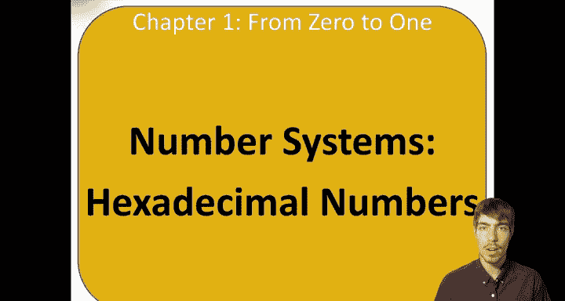
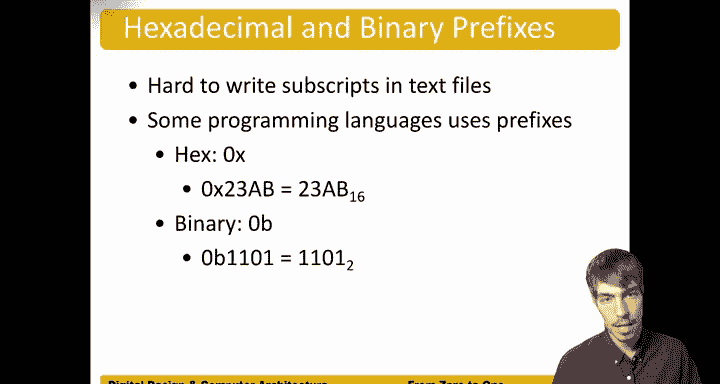

# 004：十六进制数 🔢

在本节中，我们将学习十六进制数系统。十六进制在数字系统中非常常见，因为它是一种高效表示二进制数的方式。

## 概述

上一节我们讨论了二进制数。本节中，我们将探讨十六进制数系统，了解其构成、与二进制和十进制的转换方法，以及它在计算机系统中的常见表示方式。

## 十六进制数基础

十六进制是一种基数为16的数制。这意味着它使用16个不同的符号来表示数值。

以下是十六进制数的构成：
*   **数字 0-9**：与十进制中的含义相同。
*   **字母 A-F**：用于表示十进制中的10到15。

| 十六进制数字 | 十进制等价 | 二进制等价 (4位) |
| :--- | :--- | :--- |
| 0 | 0 | 0000 |
| 1 | 1 | 0001 |
| 2 | 2 | 0010 |
| 3 | 3 | 0011 |
| 4 | 4 | 0100 |
| 5 | 5 | 0101 |
| 6 | 6 | 0110 |
| 7 | 7 | 0111 |
| 8 | 8 | 1000 |
| 9 | 9 | 1001 |
| A | 10 | 1010 |
| B | 11 | 1011 |
| C | 12 | 1100 |
| D | 13 | 1101 |
| E | 14 | 1110 |
| F | 15 | 1111 |

十六进制数的优势在于，它能用一个数字方便地表示四位二进制数。例如，二进制数 `1010`（基数为2）等于十进制数10，在十六进制中则表示为 `A`。这使得十六进制成为表示长二进制数的一种更紧凑的方式。

## 进制转换

理解了十六进制的基础后，我们来看看如何进行不同进制间的转换。

### 十六进制转二进制

从十六进制转换到二进制非常简单。以下是具体步骤：
1.  将十六进制数的每一位单独取出。
2.  将每一位转换为其对应的四位二进制数。
3.  将所有四位二进制数按顺序拼接起来。

**示例**：将十六进制数 `0x4AF` 转换为二进制。
*   `4` (十六进制) -> `0100` (二进制)
*   `A` (十六进制) -> `1010` (二进制)
*   `F` (十六进制) -> `1111` (二进制)
*   拼接结果：`0100 1010 1111` (二进制)

因此，`0x4AF` 的二进制表示为 `010010101111`。

### 二进制转十六进制

从二进制转换到十六进制是上述过程的逆过程。以下是具体步骤：
1.  从二进制数的最右侧开始，向左每四位分成一组。如果最左侧一组不足四位，则在前面补零。
2.  将每一组四位二进制数转换为其对应的十六进制数字。
3.  将所有十六进制数字按顺序拼接起来。

### 十六进制转十进制

要将十六进制数转换为更直观的十进制数，可以遵循与二进制转十进制类似的位权展开法。

**示例**：将 `0x4AF` 转换为十进制。
1.  确定每一位的位权（从右向左，以16为底）：
    *   最右侧 `F` 的位权是 \(16^0\)
    *   中间 `A` 的位权是 \(16^1\)
    *   最左侧 `4` 的位权是 \(16^2\)
2.  将每一位的值乘以其位权，然后求和：
    *   `4` (十进制值4) × \(16^2\) = 4 × 256 = 1024
    *   `A` (十进制值10) × \(16^1\) = 10 × 16 = 160
    *   `F` (十进制值15) × \(16^0\) = 15 × 1 = 15
3.  总和：1024 + 160 + 15 = 1199

因此，`0x4AF` 的十进制表示为 `1199`。

## 编程中的表示法

在文本文件和编程语言中，通常难以使用下标来表示数字的基数。因此，形成了以下约定俗成的前缀表示法：
*   **十进制数**：通常没有前缀。例如，`123` 默认为十进制。
*   **十六进制数**：使用前缀 `0x` 或 `0X`。例如，`0x4AF`、`0X1F`。
*   **二进制数**：使用前缀 `0b` 或 `0B`。例如，`0b1010`、`0B1100`。

这种表示法在计算机编程中非常常见，用于明确指示数字的基数。

## 总结

本节课中，我们一起学习了十六进制数系统。我们了解到十六进制使用0-9和A-F共16个符号，它能高效地表示二进制数（每四位对应一个十六进制数字）。我们掌握了十六进制与二进制、十进制之间相互转换的方法。最后，我们还学习了在编程中区分不同进制数的前缀表示法（`0x` 代表十六进制，`0b` 代表二进制）。掌握十六进制对于理解和操作数字系统至关重要。