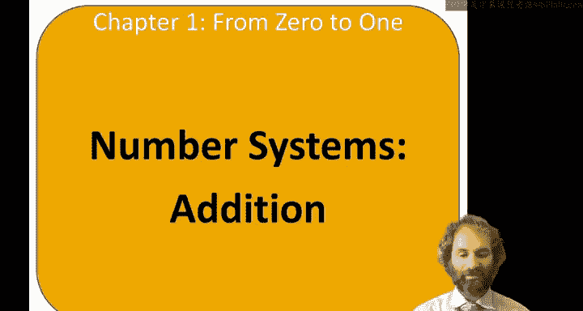
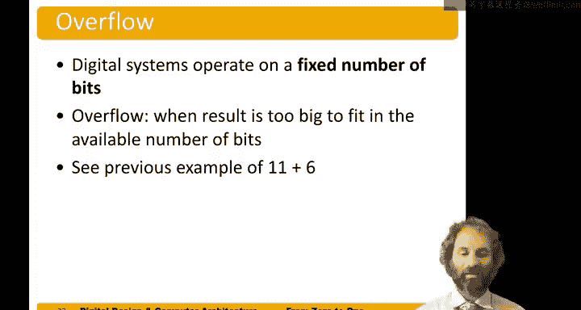

数字设计与计算机架构：1.5：二进制加法 🔢

在本节课中，我们将要学习二进制数的加法运算。我们将从熟悉的十进制加法开始，逐步过渡到二进制加法，并理解其工作原理、进位规则以及一个重要的概念——溢出。

---

上一节我们介绍了数字系统的基础，本节中我们来看看二进制数的加法是如何进行的。二进制加法的规则与十进制类似，但只涉及两个数字：0和1。

以下是二进制加法的基本规则：
*   **0 + 0 = 0**
*   **0 + 1 = 1**
*   **1 + 0 = 1**
*   **1 + 1 = 0**，并产生一个进位 **1** 到更高位

让我们通过一个例子来演示这个过程。假设我们要计算二进制数 `1011` 和 `0011` 的和。

就像小学学的竖式加法一样，我们从最低位（最右边）开始：
1.  第一列：`1 + 1 = 10`（二进制）。我们写下 **0**，并将 **1** 进位到下一列。
2.  第二列：`1（进位）+ 1 + 1 = 11`（二进制）。我们写下 **1**，并将 **1** 进位到下一列。
3.  第三列：`1（进位）+ 0 + 0 = 1`。我们写下 **1**，没有进位。
4.  第四列：`1 + 0 = 1`。我们写下 **1`。

因此，`1011 + 0011 = 1110`。我们可以验证：`1011` 是十进制的 11，`0011` 是十进制的 3，它们的和 14 在二进制中正是 `1110`。

---

然而，当加法的结果超过了我们用来表示数字的固定位数时，就会出现一个关键问题。数字系统通常使用固定数量的比特（位）进行操作。

以下是溢出的定义：
*   **溢出** 发生在运算结果太大，无法用给定的比特位数表示时。

例如，如果我们用4位二进制数（范围是0到15）计算 `1011`（11）加 `0110`（6），结果是 `10001`（17）。这个结果需要5位来表示。如果我们只保留低4位 `0001`（1），就会得到一个错误的结果。这个被丢弃的额外高位就是溢出位。

---

溢出在现实世界中可能导致严重后果。一个著名的例子是1996年阿丽亚娜5号火箭的首次发射失败。

火箭的惯性参考系统软件将一个64位浮点数转换为16位有符号整数时，发生了溢出。这个数值代表了火箭的水平速度，但由于新引擎更强大，速度值超出了16位整数能表示的范围。溢出导致控制系统接收到错误数据，进而发出错误的转向指令，最终使火箭在发射后约40秒偏离轨道并自毁。

这个案例表明，在设计数字系统时，充分考虑数值范围并预防溢出至关重要。

---

本节课中我们一起学习了二进制加法。我们从回顾十进制加法入手，掌握了二进制加法的基本规则和进位机制。接着，我们探讨了“溢出”的概念，即当运算结果超出指定比特位数表示范围时发生的情况，并通过阿丽亚娜5号火箭的例子了解了溢出可能带来的实际风险。理解这些基础是进行可靠数字系统设计的关键。