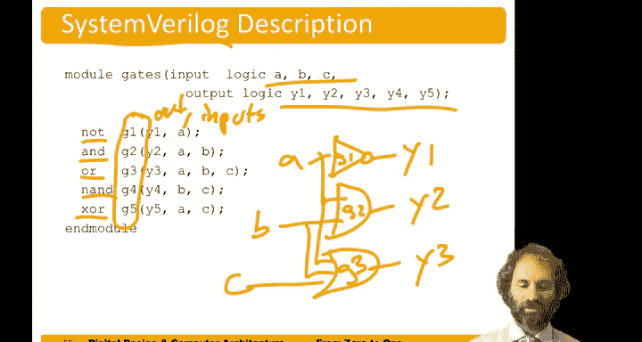

# 009：逻辑门 🧠


在本节课中，我们将要学习数字电路的基本构建模块——逻辑门。我们将了解不同类型的逻辑门，它们的功能、符号表示以及如何用布尔方程和硬件描述语言来描述它们。

---

## 逻辑门概述

逻辑门是接收0和1作为输入，并输出0和1的电路元件。它们可以实现各种不同的逻辑功能。

最简单的逻辑门只接收单个输入并产生单个输出。

---

## 单输入逻辑门

以下是两种基本的单输入逻辑门。

### 非门

非门有一个输入A和一个输出Y。其符号是一个三角形加一个圆圈，圆圈表示取反操作。

其布尔方程为：
**Y = A'** （通常读作“Y等于非A”）

非门的输出与输入相反。如果输入是0，则输出是1。如果输入是1，则输出是0。

### 缓冲器

缓冲器的输出直接跟随输入。如果输入是0，则输出是0。如果输入是1，则输出是1。

其布尔方程为：
**Y = A**

从纯逻辑的角度看，缓冲器似乎没有作用。但从电气角度看，缓冲器可能很有用。例如，它们可以输出相同的逻辑值，但提供不同的电压电平，或者以更大的功率驱动电机或灯泡等负载。

---

## 双输入逻辑门

上一节我们介绍了单输入逻辑门，本节中我们来看看更常见的双输入逻辑门，它们的功能更加丰富。

以下是几种主要的双输入逻辑门。

*   **与门**：仅当两个输入都为真（1）时，输出才为真（1）。
    *   布尔方程：**Y = A · B** （写作乘法形式）
    *   真值表：0 AND 0 = 0；0 AND 1 = 0；1 AND 0 = 0；1 AND 1 = 1。

*   **或门**：如果任意一个或两个输入为真（1），则输出为真（1）。
    *   布尔方程：**Y = A + B** （写作加法形式，但注意：1 OR 1 = 1）
    *   真值表：0 OR 0 = 0；0 OR 1 = 1；1 OR 0 = 1；1 OR 1 = 1。

*   **异或门**：当且仅当一个输入为真（1）而另一个为假（0）时，输出为真（1）。如果两个输入相同，则输出为假（0）。
    *   布尔方程：**Y = A ⊕ B**
    *   真值表：0 XOR 0 = 0；0 XOR 1 = 1；1 XOR 0 = 1；1 XOR 1 = 0。

*   **与非门**：这是与门的取反。其输出与与门相反。
    *   布尔方程：**Y = (A · B)'**
    *   真值表：0 NAND 0 = 1；0 NAND 1 = 1；1 NAND 0 = 1；1 NAND 1 = 0。

*   **或非门**：这是或门的取反。其输出与或门相反。
    *   布尔方程：**Y = (A + B)'**
    *   真值表：0 NOR 0 = 1；0 NOR 1 = 0；1 NOR 0 = 0；1 NOR 1 = 0。

*   **同或门**：这是异或门的取反。其输出与异或门相反。
    *   布尔方程：**Y = (A ⊕ B)'**
    *   真值表：0 XNOR 0 = 1；0 XNOR 1 = 0；1 XNOR 0 = 0；1 XNOR 1 = 1。

---

## 多输入逻辑门

逻辑门可以扩展到两个以上的输入。以下是多输入逻辑门的定义。

*   **多输入与门**：仅当所有输入都为真（1）时，输出才为真（1）。
*   **多输入或门**：如果任意一个或多个输入为真（1），则输出为真（1）。
*   **多输入或非门**：仅当所有输入都为假（0）时，输出才为真（1）。
*   **多输入异或门**：其定义与双输入略有不同。多输入异或门的输出为真（1），当且仅当输入中为真（1）的数量是奇数。例如，对于三输入异或门，当恰好有一个输入为真，或所有三个输入都为真时，输出为真。

---

## 用硬件描述语言描述逻辑门

绘制原理图很有帮助，但在键盘上操作不便。因此，我们经常需要用文本来描述逻辑门。

在本课程中，我们将使用一种称为SystemVerilog的硬件描述语言。这是一种行业标准，广泛用于描述硬件。

以下是一些描述逻辑门的示例。假设我们想定义一些逻辑门，有输入A、B、C和来自五个不同门的五个输出。

```systemverilog
module example_gates (
    input logic A, B, C,
    output logic Y1, Y2, Y3, Y4, Y5
);
    // 非门，名为g1，输入A，输出Y1
    not g1(Y1, A);
    // 与门，名为g2，输入A和B，输出Y2
    and g2(Y2, A, B);
    // 或门，名为g3，输入A、B和C，输出Y3
    or g3(Y3, A, B, C);
    // 与非门，名为g4，输入A和B，输出Y4
    nand g4(Y4, A, B);
    // 异或门，名为g5，输入A和B，输出Y5
    xor g5(Y5, A, B);
endmodule
```



这段代码是对之前讨论的逻辑门原理图的文本描述。

---

## 历史背景：乔治·布尔

与、或、非这些操作可以追溯到英国数学家乔治·布尔。他生活在19世纪上半叶。布尔出身于工人阶级家庭，父母无力送他上学。但令人瞩目的是，他自学了数学，并且学得非常好，以至于后来在爱尔兰女王学院获得了教职。

布尔撰写了一篇名为《思维规律的研究》的论文。他认为，人类思维运作的方式是，我们考虑那些非真即假的命题，并通过组合这些命题来得结论。事后看来，人脑的运作方式可能并不像布尔认为的那样理性。但他为二进制变量、真与假的概念奠定了基础，并引入了与、或、非这三种基本的逻辑运算。

---

本节课中我们一起学习了逻辑门，它们是数字设计的基石。我们了解了各种单输入和双输入逻辑门的功能与表示方法，探讨了多输入逻辑门的扩展，并初步接触了用SystemVerilog硬件描述语言来描述这些门电路。最后，我们还回顾了逻辑运算的历史起源。掌握这些基本概念是理解更复杂数字系统设计的第一步。