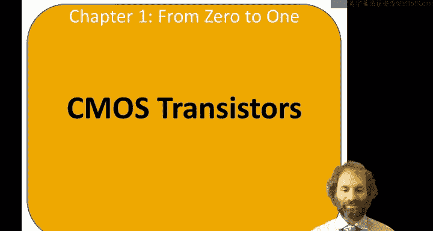
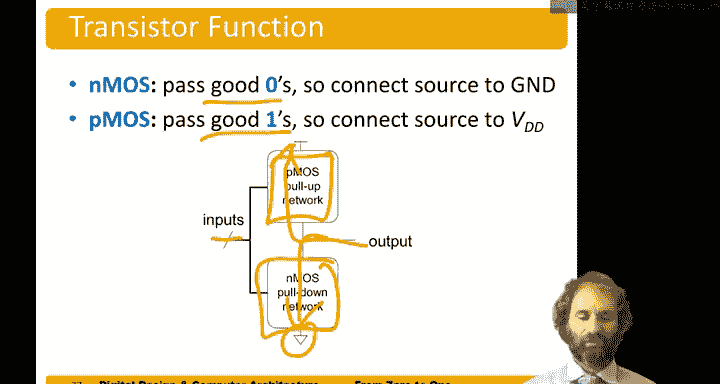

# 010：晶体管 🔌

在本节课中，我们将学习CMOS晶体管。逻辑门是由晶体管构建的，而晶体管可以被视为一种三端口、电压控制的开关。

## 晶体管概述

一个普通的开关（如电灯开关）是一个两端设备，其两侧根据开关的拨动状态连接或断开。晶体管则拥有第三个端口，它接收一个电压，用于控制开关的导通或关断。

这种晶体管被称为**MOS晶体管**。它有两个称为**源极**和**漏极**的端口，它们是否连接取决于**栅极**的控制电压。

*   当栅极为低电平时，源极和漏极断开，晶体管**关断**。
*   当栅极为高电平时，源极和漏极连接，晶体管**导通**。

## 集成电路与硅的化学性质

集成电路由罗伯特·诺伊斯等人共同发明。诺伊斯被称为“硅谷市长”，他于1957年共同创立了仙童半导体公司。许多早期仙童的工程师后来创立了硅谷其他重要的公司，其中最著名的是英特尔。诺伊斯和他的同事于1968年离开仙童，创立了后来成为英特尔的公司。

晶体管由**硅**制成，硅是一种**半导体**。纯硅本身导电性很差。它形成金刚石晶格结构，每个硅原子在其价电子层有四个电子，并与四个相邻原子成键。由于所有键都被占用，晶格中没有自由电子可以轻易移动。

但是，如果我们引入一些杂质，这个过程称为**掺杂**，硅就可以变成良导体。

以下是两种主要的掺杂类型：

*   **N型硅**：如果添加第五族元素（如砷），砷有五个价电子，会有一个电子变得松散，可以在晶格中自由移动，留下带正电的砷离子。这种由带负电的电子导电的半导体称为N型硅。
*   **P型硅**：如果添加第三族元素（如硼），硼只有三个价电子，它会从邻近原子“借”一个电子，产生一个带负电的硼离子和一个带正电的“空穴”。这个空穴可以像正电荷一样在晶格中移动。这种半导体称为P型硅。

## MOS晶体管的工作原理

当今最常见的晶体管类型是**金属氧化物半导体场效应晶体管**。它由多层结构堆叠而成。

*   **栅极**：顶部的终端，历史上由金属制成，后来使用多晶硅，现在又开始使用金属。
*   **绝缘层**：中间是二氧化硅层，它是一种优良的绝缘体。
*   **衬底**：底部是硅衬底，通常为P型。
*   **源极和漏极**：在栅极两侧的衬底中，通过掺杂形成N型区域。

当栅极电压为0时，源极、衬底和漏极之间没有导电路径，晶体管**关断**。

当在栅极施加正电压时，会在栅极上产生正电荷。由于栅极和衬底被绝缘层隔开，形成了一个电容器。正电压会吸引电子到栅极下方的沟道中。这样，源极（N型）、沟道（电子聚集）和漏极（N型）之间就形成了导电路径，电流可以流动，晶体管**导通**。

这种晶体管称为**N型MOS晶体管**，因为其导电是通过N型硅中的电子实现的。

## P型MOS晶体管

**P型MOS晶体管**则相反。它拥有P型源极和漏极，以及N型衬底。

*   当栅极为低电压时，晶体管**导通**。
*   当栅极为高电压时，晶体管**关断**。

其符号与NMOS类似，但在栅极上有一个小圆圈，表示它在栅极为0时导通。

## 晶体管特性总结

我们可以将晶体管视为一个三端开关，栅极控制开关状态，源极和漏极根据开关状态连接或断开。

以下是两种晶体管的特性总结：

*   **NMOS晶体管**：
    *   栅极 = 0：晶体管关断，源极和漏极断开。
    *   栅极 = 1：晶体管导通，源极和漏极连接。
*   **PMOS晶体管**：
    *   栅极 = 0：晶体管导通，源极和漏极连接。
    *   栅极 = 1：晶体管关断，源极和漏极断开。

从物理特性来看，NMOS晶体管擅长传递低电平（0），能很好地将输出拉低至地电位。PMOS晶体管则擅长传递高电平（1），能很好地将输出拉高至电源电压。

## 构建逻辑门

基于以上特性，我们可以构建逻辑门。逻辑门有输入和输出。

*   我们会在输出端和地之间构建一个**NMOS晶体管网络**。NMOS晶体管擅长将输出拉低至0。
*   我们会在输出端和电源之间构建一个**PMOS晶体管网络**。PMOS晶体管擅长将输出拉高至1。

通过组合这两种网络，我们可以实现各种逻辑功能。

---

本节课中，我们一起学习了晶体管的基础知识。我们了解了晶体管作为电压控制开关的基本概念，探讨了硅的半导体特性以及N型和P型掺杂的原理。我们详细分析了NMOS和PMOS晶体管的结构、工作原理和电气特性，并理解了它们各自在传递高、低电平方面的优势。最后，我们知道了如何利用这两种晶体管来构建实现逻辑功能的网络。这些知识是理解后续数字电路设计的基础。