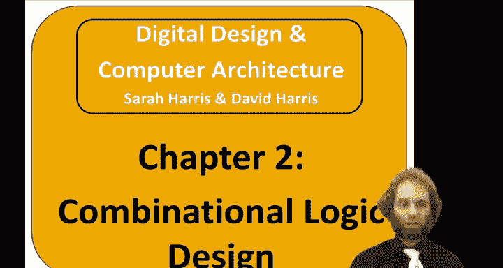
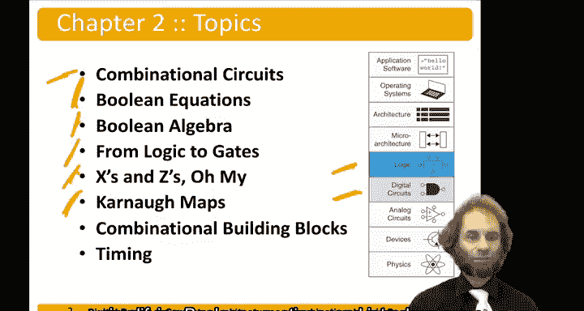

# 013：组合逻辑设计简介 🧠

在本章中，我们将学习组合逻辑设计。组合逻辑是数字系统的基础，其输出仅取决于当前输入的值。我们将从第1章介绍的逻辑门知识出发，逐步构建更复杂的逻辑功能。

---

## 概述 📋

本节课我们将要学习组合逻辑电路。这些电路的特点是，其输出完全由当前的输入值决定。我们将从布尔方程开始，学习如何描述和简化逻辑关系，然后探讨如何将这些方程转化为实际的逻辑门电路。此外，我们还会介绍一些用于简化和分析逻辑的工具与基本构件。

---

## 从布尔方程开始 ➕

上一节我们介绍了组合逻辑的基本概念，本节中我们来看看其数学描述的基础——布尔方程。

组合逻辑可以用布尔方程来描述。这些方程使用变量（代表输入和输出）以及逻辑运算符（如与、或、非）来定义0和1之间的关系。

例如，一个简单的与门功能可以表示为：
`Y = A · B`
其中 `Y` 是输出，`A` 和 `B` 是输入，`·` 代表逻辑与操作。

为了有效地处理这些方程，我们需要一套规则来简化它们。

---

## 布尔代数的公理与定理 📐

为了简化布尔方程，我们需要借助布尔代数的公理和定理。这些规则允许我们以数学方式操作逻辑表达式，从而得到更简单、更高效的电路实现。

以下是布尔代数的一些基本定律：

*   **恒等律**：`A + 0 = A`， `A · 1 = A`
*   **零元律**：`A + 1 = 1`， `A · 0 = 0`
*   **互补律**：`A + A' = 1`， `A · A' = 0`
*   **交换律**：`A + B = B + A`， `A · B = B · A`
*   **结合律**：`A + (B + C) = (A + B) + C`， `A · (B · C) = (A · B) · C`
*   **分配律**：`A · (B + C) = (A · B) + (A · C)`， `A + (B · C) = (A + B) · (A + C)`
*   **吸收律**：`A + (A · B) = A`， `A · (A + B) = A`
*   **德摩根定理**：`(A + B)' = A' · B'`， `(A · B)' = A' + B'`

---

## 从方程到逻辑门 ⚙️

在掌握了如何用方程描述逻辑后，下一步就是将其转化为由物理逻辑门组成的实际电路。除了表示真（1）和假（0）的信号，在实际电路中还会遇到其他两种重要的信号状态。

在数字电路设计中，我们除了处理0和1，还需要理解另外两种信号状态：
*   **X（未知/冲突）**：表示信号值未知或存在驱动冲突。
*   **Z（高阻态）**：表示输出端处于断开或“浮动”状态，常见于三态门。

---

## 卡诺图：图形化简化工具 🗺️

对于包含多个变量的复杂布尔方程，手动应用定理进行简化可能很繁琐。卡诺图提供了一种直观的图形化方法。

卡诺图是一种将真值表信息重新排列成网格的工具，通过识别相邻的“1”格（或“0”格）来直观地找到可以合并的乘积项，从而系统地简化布尔方程。

---

## 组合逻辑基本构件 🧱

除了基本门电路，设计者通常会使用一些预先定义好的、功能更复杂的组合逻辑模块作为“构件”。其中两个最常用的是多路选择器和译码器。

以下是两个关键组合逻辑构件的介绍：
*   **多路选择器**：根据选择信号的值，从多个输入中选择一个传送到输出。其功能类似于一个单刀多掷开关。
*   **译码器**：将输入的n位二进制代码，转换为2^n个输出线中的某一个有效（通常为1）。例如，一个2-4译码器可以将2位输入（00, 01, 10, 11）分别使能对应的4个输出。

---

## 时序分析 ⏱️

设计一个正确的电路还不够，我们通常还希望它运行得足够快。因此，理解信号通过逻辑门所需的传播时间至关重要。

最后，我们将关注时序问题。我们需要设计不仅能正确工作，还能快速工作的电路。这涉及到分析信号从输入传播到输出所需的时间（传播延迟），以及确保电路在时钟信号下能稳定工作。

---

## 总结 🎯

本节课中我们一起学习了组合逻辑设计的基础。我们从描述逻辑关系的布尔方程出发，学习了用于简化方程的布尔代数定理。接着，我们探讨了如何将方程映射到实际的逻辑门电路，并认识了X和Z两种特殊信号状态。我们介绍了用于简化逻辑的图形化工具——卡诺图，以及多路选择器和译码器这两个重要的组合逻辑构件。最后，我们指出了时序分析对于设计高速电路的重要性。这些知识为我们设计和分析更复杂的数字系统奠定了坚实的基础。