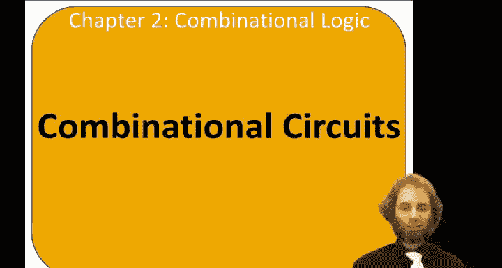
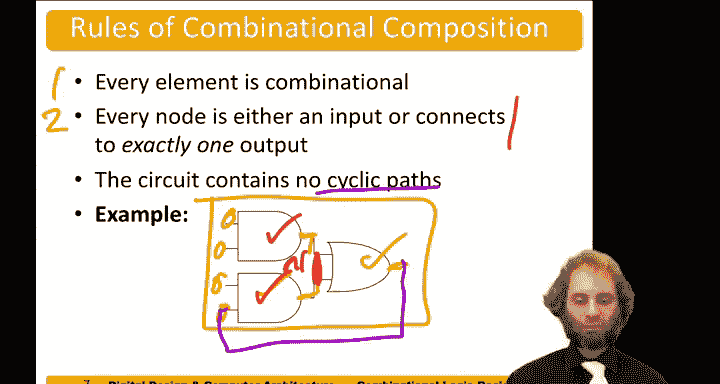

# 014：组合电路

在本节课中，我们将要学习组合电路的基本概念、定义及其必须遵守的规则。组合逻辑是数字系统的基础，它没有记忆功能，输出完全由当前的输入决定。

## 电路与组合电路的定义

上一节我们介绍了课程主题，本节中我们来看看电路和组合电路的正式定义。

一个逻辑电路是一个由输入、输出、功能规范和时序规范定义的设备。功能规范定义了输出与输入之间的关系。例如，当所有输入都为低电平时，输出可能为高电平。时序规范则说明了输出响应输入变化所需的时间。

我们可以将电路视为一个由节点和元件组成的图。例如，一个电路可能包含三个名为A、B、C的输入节点，两个名为Wanzi的输出节点，以及一个名为N1的内部节点。该电路包含三个元件：E1、E2和E3，每个元件本身也是一个电路。它们可以是一个逻辑门，也可以是由逻辑门网络构成的更复杂的电路。因此，电路是一个递归定义，其元件本身也是电路。

逻辑电路主要有两种类型：组合逻辑和时序逻辑。组合逻辑没有记忆功能，其输出完全由输入的当前值决定，这也是本章的重点。时序逻辑则包含其他所有情况，其输出依赖于输入的先前值和当前值，因此具有记忆功能。

## 组合电路的规则

为了使一个电路成为组合电路，它必须遵守以下规则。

以下是组合电路必须满足的三条核心规则：

1.  **每个元件本身必须是组合的**。如果电路由逻辑门构成，那么它们是组合的。但如果由触发器、静态RAM单元等构成，则不是组合元件，因此该电路也不是组合的。
2.  **电路中的每个节点必须是输入节点，或者必须恰好连接到一个输出**。输入节点连接到外部输入源。内部节点和输出节点都必须恰好连接到一个元件的输出端。
3.  **电路不能包含循环路径**。即不能存在从输出端返回到输入端的路径。

如果一个电路满足所有这些规则，那么它就是组合电路。

## 规则应用示例

让我们通过一个例子来理解这些规则。假设我们有一个由三个组合元件（如逻辑门）构成的电路，其输入、内部节点和输出节点的连接都符合上述规则，那么该电路是组合的。

反之，如果我们将两个元件的输出端短路连接在一起（形成一个共享节点），那么这个节点就连接到了两个输出，违反了第二条规则，因此电路不再是组合的。

同样，如果我们将一个输出信号反馈连接到一个输入，这就创建了一个从输出回到输入的循环路径，违反了第三条规则，该电路也不是组合电路。

## 总结

本节课中我们一起学习了组合电路的核心概念。我们明确了组合逻辑的定义，即输出仅取决于当前输入的无记忆逻辑。我们详细阐述了构成组合电路必须满足的三条规则：所有元件本身必须是组合的；每个节点必须是输入或仅连接到一个输出；以及电路中不能存在循环路径。理解这些规则是设计和分析更复杂数字系统的基础。