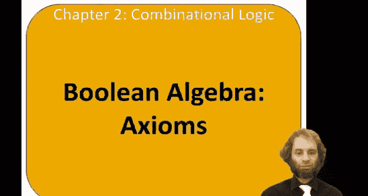
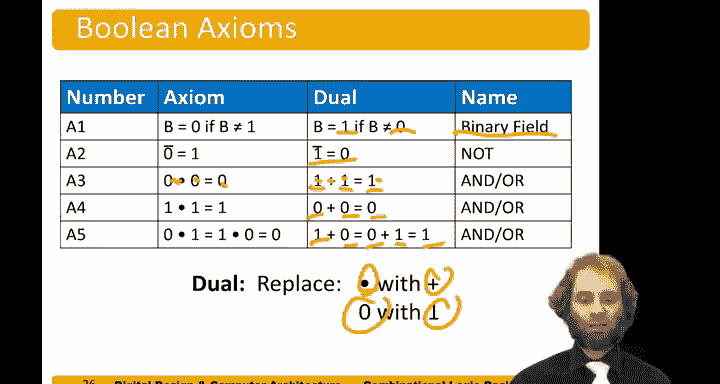

# 016：布尔公理 📚

在本节中，我们将学习布尔代数的基本公理。布尔代数与常规代数类似，但只对0和1进行操作。它同样有一套公理和定理，可以帮助我们简化布尔方程。布尔代数的公理和定理具有一种迷人的对偶性：如果将“与”和“或”互换，同时将0和1互换，公理或定理依然成立。这被称为对偶性。



接下来，让我们从布尔代数的公理开始。

## 公理一：二进制域

布尔代数定义在一个二进制域中，这意味着变量只能取两个值：0或1。其数学表达为：

**公式：** 如果 `B ≠ 1`，则 `B = 0`。

这个公理的对偶形式是：如果 `B ≠ 0`，则 `B = 1`。这两个公理共同定义了布尔代数的基本取值集合。

## 公理二：非运算

非运算（取反）的定义如下：

**公式：** `NOT 0 = 1`，记作 `0̅ = 1`。

这个公理的对偶形式是：`NOT 1 = 0`，记作 `1̅ = 0`。非运算将一个布尔值转换为其相反值。

## 公理三：与运算

与运算（AND）的定义需要三个部分。以下是其真值表：

**代码：**
```
0 AND 0 = 0
1 AND 1 = 1
0 AND 1 = 1 AND 0 = 0
```

这个公理的对偶形式定义了或运算（OR），我们将在下一部分看到。

## 公理四：或运算

或运算（OR）是“与”运算的对偶。其定义如下：

**代码：**
```
1 OR 1 = 1
0 OR 0 = 0
1 OR 0 = 0 OR 1 = 1
```

请注意，这正是将“与”运算公理中的0与1互换、AND与OR互换后得到的结果，完美体现了对偶性。

---



在本节课中，我们一起学习了布尔代数的四个基本公理：二进制域、非运算、与运算和或运算。我们了解了布尔代数中独特的对偶性原理，它使得公理和定理在交换运算符和常量后依然成立。这些公理是构建更复杂布尔表达式和进行逻辑简化的基石。