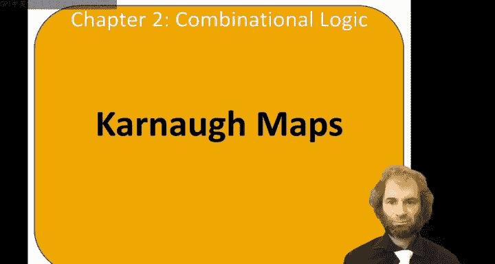
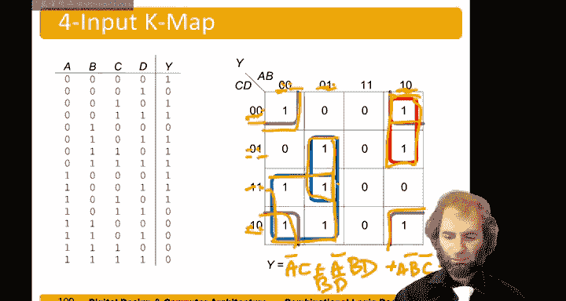

# 023：卡诺图 🗺️

在本节课中，我们将要学习一种用于简化布尔方程的图形化工具——卡诺图。我们将了解其基本概念、如何构建以及如何用它来高效地化简逻辑表达式。

## 概述

上一节我们讨论了通过积之和或直接观察法来简化真值表。然而，对于复杂的真值表，这些方法可能变得繁琐或困难。本节中，我们来看看卡诺图，它提供了一种直观的视觉方法来简化布尔方程。

卡诺图基于一个核心的布尔代数概念：对于任何表达式 **P**，**P·A + P·A' = P**。这意味着变量 **A** 的真值在此情况下无关紧要。卡诺图通过将变量以特定方式排列，使得相邻的方格仅在一个变量上不同（真或补），从而帮助我们识别并合并这些可以简化的项。

## 构建三变量卡诺图

让我们从一个三输入的真值表示例开始，学习如何构建卡诺图。

我们将画出八个方格，对应三输入真值表的八行。我们将变量 **A** 和 **B** 放在水平轴，变量 **C** 放在垂直轴。
*   **C** 的值很简单，只有 0 或 1。
*   **A** 和 **B** 的组合有四种：00, 01, 11, 10。

注意，**A** 和 **B** 的排列顺序是 **00, 01, 11, 10**，而不是自然的二进制顺序。这样排列是为了确保**相邻的列（或行）之间只有一个变量的值发生变化**。例如，从 00 到 01，只有 **B** 变化；从 01 到 11，只有 **A** 变化；从 11 到 10，只有 **B** 变化；并且从 10 绕回 00，只有 **A** 变化。

现在，我们可以将真值表中的输出值填入对应的方格中。例如，输入 `A=0, B=0, C=0` 对应左上角的方格，`A=0, B=0, C=1` 对应其正下方的方格，依此类推。

填好值后，我们可以圈出输出为 1 的方格。如果相邻的 1 可以组成一个矩形块，并且这个块的大小是 2 的幂（如 1, 2, 4 个方格），那么这些项就可以合并。合并时，在这个块内值保持不变的变量保留，值发生变化的变量则被消去。

在第一个简单例子中，两个为 1 的方格（`A'B'C'` 和 `A'B'C`）组成了一个 1x2 的块。在这个块中，**A** 和 **B** 始终为 0，而 **C** 的值在变化。因此，合并后的简化表达式为 **Y = A' B'**。

## 一个更复杂的三变量例子

现在，我们来看一个稍复杂的三变量卡诺图例子，以巩固理解。

同样，我们首先根据真值表将输出值填入卡诺图。填好后，我们观察哪些为 1 的方格可以合并。

在这个例子中，我们需要画两个圈来覆盖所有为 1 的方格。
*   第一个圈覆盖了两个垂直相邻的 1。在这个圈里，**B=1**，**C=1**，而 **A** 的值在变化。因此，这个圈对应的项是 **B C**。
*   第二个圈覆盖了两个水平相邻的 1。在这个圈里，**A=0**，**B=1**，而 **C** 的值在变化。因此，这个圈对应的项是 **A' B**。

最终的简化表达式是这两个质蕴涵项的逻辑或：**Y = B C + A' B**。

## 质蕴涵项与四变量卡诺图

我们引入两个重要概念：
*   **蕴涵项**：是文字（变量或其反变量）的乘积项。
*   **质蕴涵项**：是卡诺图中**可以画出的最大可能圈**所对应的蕴涵项。使用质蕴涵项能实现最大程度的简化。

现在，让我们将概念扩展到四变量卡诺图。四变量卡诺图有 16 个方格，行和列各代表两个变量。构建和简化的核心原则不变：相邻性（包括上下、左右以及**四边循环相邻**），圈出大小为 2 的幂的矩形块，并且每个圈应尽可能大。

以下是使用卡诺图进行简化的步骤：
1.  **填图**：根据真值表，将所有输出值填入对应方格。
2.  **画圈**：圈出所有包含“1”的方格，每个圈必须是矩形，且包含 1、2、4、8 或 16 个方格。
3.  **规则**：
    *   每个“1”至少被一个圈覆盖。
    *   每个圈应尽可能大（即寻找质蕴涵项）。
    *   圈可以跨越图的边界（循环相邻性）。
    *   允许重叠覆盖。
4.  **读图**：对于每个圈，写出对应的乘积项。在圈范围内值保持不变的变量保留（为真则取原变量，为假则取反变量），值发生变化的变量则省略。

让我们分析一个四变量卡诺图的例子。按照上述步骤填图后，我们开始画圈寻找质蕴涵项。

以下是可能画出的圈及其对应的布尔项：
*   **一个 2x2 的绿色块**：在这个块中，**A** 始终为 0，**C** 始终为 1，而 **B** 和 **D** 在变化。因此，该项为 **A' C**。
*   **一个 2x1 的蓝色块**：在这个块中，**A=0**，**B=1**，**D=1**，而 **C** 在变化。因此，该项为 **A' B D**。
*   **一个 2x1 的红色块**：在这个块中，**A=1**，**B=0**，**C=0**，而 **D** 在变化。因此，该项为 **A B' C'**。
*   **一个覆盖四个角的特殊圈（利用循环相邻）**：在这个圈中，**B=0**，**D=0**，而 **A** 和 **C** 在变化。因此，该项为 **B' D'**。

最终，将这些所有质蕴涵项相加（逻辑或），就得到了最简的积之和表达式。

## 总结

本节课中，我们一起学习了卡诺图这一强大的图形化工具。我们了解了它基于 `P·A + P·A' = P` 的简化原理，掌握了如何为三变量和四变量逻辑函数构建卡诺图，并学习了通过画圈（寻找质蕴涵项）来合并相邻最小项，从而导出最简布尔表达式的系统化步骤。卡诺图通过其视觉直观性，使得逻辑化简过程变得清晰且高效，是数字逻辑设计中的一项基础且重要的技能。