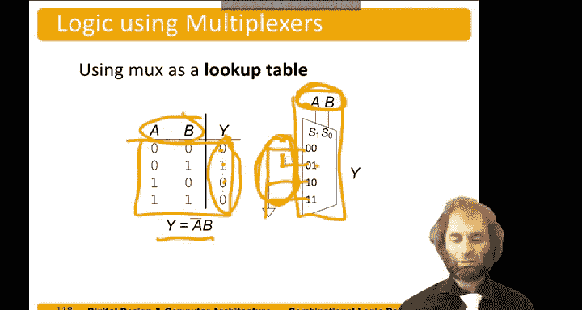

# 025：多路复用器 🧩

在本节中，我们将学习组合逻辑中的一个重要构建模块：多路复用器。多路复用器是一种能从多个输入信号中选择一个并传递到输出的电路。我们将探讨其工作原理、符号表示以及多种实现方式。

## 多路复用器简介

多路复用器，常简称为 **Mux**，其功能是从 **n** 个不同的输入中选择一个连接到输出端。

例如，一个 **2选1多路复用器** 有两个输入（D0 和 D1）、一个输出（Y）和一个选择信号（S）。其功能如下：
*   当选择信号 **S = 0** 时，输出 **Y = D0**。
*   当选择信号 **S = 1** 时，输出 **Y = D1**。

其简化的真值表如下：

| S | Y |
|---|---|
| 0 | D0 |
| 1 | D1 |

对于一个 **n选1多路复用器**，需要 **log₂(n)** 个选择位来进行选择。例如，一个4选1多路复用器需要2个选择位，一个8选1多路复用器则需要3个选择位。

## 多路复用器的实现

既然我们已经了解了多路复用器的功能，接下来我们看看如何用逻辑门来构建它。

### 方法一：积之和（SOP）实现

我们可以根据真值表，通过卡诺图化简或直接推导出逻辑表达式。对于2选1多路复用器，其输出逻辑为：
**Y = (S' · D0) + (S · D1)**

这个表达式可以直接转换为门级电路：一个反相器、两个与门和一个或门。

### 方法二：三态门实现

另一种有趣的实现方式是使用一对三态缓冲器。每个三态缓冲器连接一个输入，并由选择信号控制其使能端。当 **S=0** 时，连接 D0 的三态门导通；当 **S=1** 时，连接 D1 的三态门导通。两个三态门的输出端被连接在一起。

> **注意**：这种将两个输出端直接连接的做法，在组合逻辑的常规规则下是违规的。但由于在任何时刻只有一个三态门处于有效输出状态，所以这种设计是可行的，并且在实际中很常见。

## 构建更大的多路复用器

上一节我们介绍了基础的2选1多路复用器，本节中我们来看看如何构建输入更多的多路复用器，例如4选1多路复用器。

一个4选1多路复用器的符号有四个输入（D0, D1, D2, D3），一个2位的选择信号（S1, S0），以及一个输出（Y）。其功能如下：
*   当 **S1S0 = 00** 时，选择 D0。
*   当 **S1S0 = 01** 时，选择 D1。
*   当 **S1S0 = 10** 时，选择 D2。
*   当 **S1S0 = 11** 时，选择 D3。

以下是几种实现4选1多路复用器的方法：

1.  **两级逻辑实现**：使用积之和表达式，需要四个与项（每个对应一个输入被选中的条件）和一个或门。
2.  **三态门实现**：使用四个三态门，其输出端连接在一起，通过一个2-4译码器根据选择信号使能其中一个。
3.  **层次化实现**：使用三个2选1多路复用器分两级构建。第一级用两个2选1 Mux分别处理奇数位（D1, D3）和偶数位（D0, D2）输入，由最低位选择信号（S0）控制；第二级用一个2选1 Mux从第一级的两个输出中选一个，由最高位选择信号（S1）控制。

## 多路复用器作为查找表

多路复用器的一个巧妙用途是实现查找表，从而构建任意的真值表。

如果我们想实现一个具有四行的真值表（对应两个输入变量A和B），我们可以使用一个4选1多路复用器。具体做法是：
*   将输入变量 **A 和 B** 连接到多路复用器的**选择端**。
*   根据目标真值表每一行的输出值（0或1），将多路复用器的**数据输入端**相应地连接到**地（GND，逻辑0）** 或**电源（VDD，逻辑1）**。

例如，要实现函数 **Y = A' · B**，其真值表为：
| A | B | Y |
|---|---|---|
| 0 | 0 | 0 |
| 0 | 1 | 1 |
| 1 | 0 | 0 |
| 1 | 1 | 0 |

连接方式如下：
*   当 AB=00（选择00）时，Y应为0，所以 D0 接 GND。
*   当 AB=01（选择01）时，Y应为1，所以 D1 接 VDD。
*   当 AB=10（选择10）时，Y应为0，所以 D2 接 GND。
*   当 AB=11（选择11）时，Y应为0，所以 D3 接 GND。

通过这种方式，只需改变输入端的0/1连接，就可以重新编程该多路复用器以实现任何两变量的逻辑函数。同理，要实现一个三变量表达式的真值表，则需要一个8选1多路复用器。

## 总结

本节课中我们一起学习了多路复用器。我们首先了解了多路复用器的基本功能：根据选择信号从多个输入中选通一个到输出。然后，我们探讨了用积之和逻辑以及三态门来实现2选1多路复用器。接着，我们学习了如何构建更大的多路复用器（如4选1），并介绍了层次化设计方法。最后，我们发现了多路复用器的一个强大应用：通过将其数据输入端固定为常量0或1，选择端接入输入变量，可以将其配置为一个可编程的查找表，用于实现任意的组合逻辑函数。多路复用器是数字系统中用于数据选择和路由的基础且关键的组件。